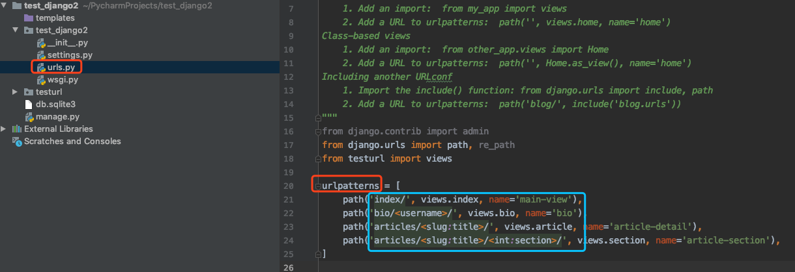

Django是一个开放源代码的Web应用框架，由Python写成。采用了MVC的软件设计模式，即模型M，视图V和控制器C。它最初是被开发来用于管理劳伦斯出版集团旗下的一些以新闻内容为主的网站的，即是CMS（内容管理系统）软件。并于2005年7月在BSD许可证下发布。


## url控制器

项目中的`urls.py` 文件是路由的配置。通过匹配URL来跳转到不同的view中。

可通过`path`, `re_path`将`url` 与`view`进行关联。



## `path`函数

> path(route, view, kwargs=None, name=None)

对URL进行匹配。如果要获取URL中的数据，需要用尖括号括起来，随后这个参数将会被传递给view函数。尖括号里可以加上`converter`。比如`<slug:title>` 表明获取`url`字段给`title`变量，并将它转为`slug`格式。

### Django 获取URL内容 converter

- `str` - 匹配非空字符串，不包括'/' 这是默认模式。如果没有加入converter的话。
- `int` - 匹配并返回int类型
- `slug` - 匹配ASCII字母或数字，包括连字符和下划线。
- `uuid` - Matches a formatted UUID. To prevent multiple URLs from mapping to the same page, dashes must be included and letters must be lowercase. For example, `075194d3-6885-417e-a8a8-6c931e272f00`. Returns a [`UUID`](https://docs.python.org/3/library/uuid.html#uuid.UUID) instance.
- `path` - Matches any non-empty string, including the path separator, `'/'`. This allows you to match against a complete URL path rather than just a segment of a URL path as with `str`.

> 可以注册自定义的converter，详见Django文档。

### view获取URL中数据的例子

```python
# urls.py 中的设置：
path('articles/<slug:title>/<int:section>/', views.section, name='article-section'),

# 匹配的URL：
http://127.0.0.1:8000/articles/this_article/123/

# 调用的view：
def section(request, **kwargs):
    print(kwargs)
    return HttpResponse("this is section")

# kwargs:
{'title': 'this_article', 'section': 123}
```

通过修改converter，能获取处理不同的内容。


## re_path

与`path`用法类似，只是它第一个参数接收正则表达式。

```
from django.urls import include, re_path

urlpatterns = [
    re_path(r'^index/$', views.index, name='index'),
    re_path(r'^bio/(?P<username>\w+)/$', views.bio, name='bio'),
    re_path(r'^weblog/', include('blog.urls')),
    ...
]
```

> `?P`似乎就是匹配模式

### `urls.py`中的 `path` 与 `url`

在Django2.0 中，`url`是`re_path`的别名，将来可能会被弃用。 

## view处理函数

Views (视图函数) 逻辑处理，最终是围绕着两个对象实现的：


> http请求中产生两个核心对象：http请求：HttpRequest对象  http响应：HttpResponse对象

### HttpRequest对象

逻辑处理函数的第一个形式参数，接收到的就是HttpRequest对象，这个对象里封装着用户的各种请求信息，通过HttpRequest对象的方法或者属性，可以获取到响应的请求信息

- path属性，获取请求页面的全路径，不包括域名

- method属性，获取请求中使用的HTTP方式的字符串表示。全大写表示

- get_full_path()方法，获取HTTP GET方式请求传参的URL地址
- 更多：POST，COOKIES，FILES，user，session等

### HttpResponse响应对象

对于HttpRequest请求对象来说，是由django自动创建的，但是，HttpResponse响应对象就必须我们自己创建。每个view请求处理方法必须返回一个HttpResponse响应对象

HttpResponse类在django.http.HttpResponse

**在HttpResponse对象上扩展的常用方法：**

- render(request，'html文件和路径')方法，将指定页面渲染后返回给浏览器

- render_to_response('index.html')方法，将指定页面渲染后返回给浏览器

- redirect('baidu.com')方法，页面跳转

- locals(变量名称)可以直接将逻辑处理函数中的所有变量传给模板

## models

> django默认支持sqlite，mysql, oracle,postgresql数据库

数据表的设计、增删改查都比较简单。

一对多、一对一、多对多、链表结构https://www.cnblogs.com/adc8868/p/7170976.html

F、Q() 运算符


## Centos服务器安装Nginx

Nginx官网有教程，稍微记录一下：

```
$ sudo yum install yum-utils

/etc/yum.repos.d/nginx.repo # 创建这个文件，并写入下面内容

[nginx-stable]
name=nginx stable repo
baseurl=http://nginx.org/packages/centos/$releasever/$basearch/
gpgcheck=1
enabled=1
gpgkey=https://nginx.org/keys/nginx_signing.key

[nginx-mainline]
name=nginx mainline repo
baseurl=http://nginx.org/packages/mainline/centos/$releasever/$basearch/
gpgcheck=1
enabled=0
gpgkey=https://nginx.org/keys/nginx_signing.key

$ sudo yum install nginx
$ sudo systemctl start nginx.service
$ sudo systemctl enable nginx.service
```


