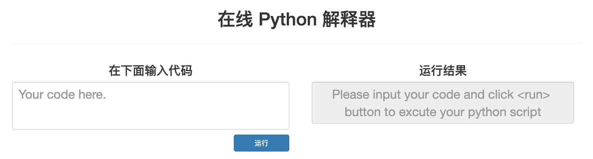
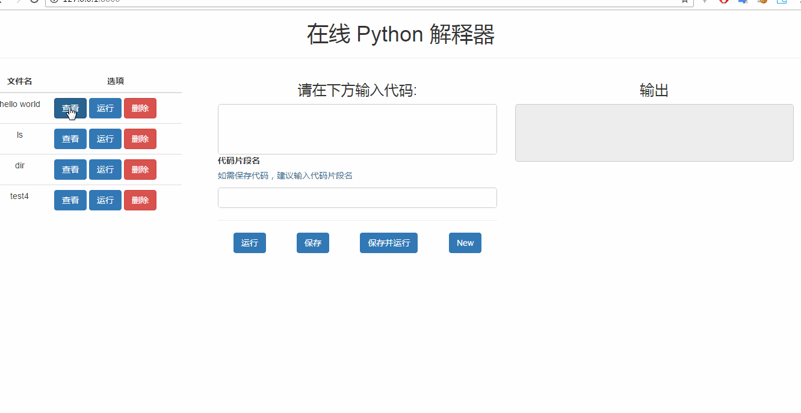

[简书系列](https://www.jianshu.com/p/4d532214d6e0)文章，简直神文。我将使用最新的python 3.7.4 及 Django 2.2重复这个教程。

## 教程一

## 本章概要

很多的 web 框架都以方便使用而著称，特别是 `flask` ，一个文件就可以做一个 Hellow world 了，那 `django` 可以吗？答案时肯定的。同时，我们将会简单的了解下 REST 的概念 。最后，我们将会利用我们才学的知识来编写我们的第一个 REST 项目。

> 单文件 **django**
>
> REST 是什么
>
> 第一个 Django REST 项目

## 单文件Django

建立一个文件夹`test`，并创建文件，此时目录为：

```
test/
    test.py
```

在文件中引入需要的包：

```python
from django.conf import settings
from django.http import HttpResponse
from django.urls import path
```

这三行的意思：

**from django.conf import settings**：

`settings` 是 django 的配置文件钩子，你可以在项目的任何地方引入它，可以通过 `.` 路径符来访问项目的配置。比如 `settings.ROOT_URLCONF` 就会返回根 url 配置。关于钩子，我需要多说两句。讲道理，如果需要引用项目配置，标准的写法难道不应该是 `import project.settings as settings` 吗，这样才能连接到项目的配置啊，为什么我只是引入 django 自己的配置就可以了呢。这就是 django 的神奇之处了，在一切都还没有运行之前，django 首先做的就是加载配置文件，并且把 `settings` 对象的属性连接到各个配置上。注意，`settings` 是个对象，所以像 `from django.conf.settings import DEBUG` 之类的语法是错误的。因为它不是个模块。所以在访问配置时，只能以 `settings.<key>` 的形式来调用配置。

首先加载配置文件是一件天经地义的事情，只有知道了各个部分的配置如何，相应的功能才能按照需求运转。请大家记住这一点，这非常重要。在 django 中，加载配置文件有两种方式：

> 第一种是使用 `settings.configure(**settings)`
> 手动的写每一项配置，这样做的好处是，如果你需要配置的东西不多，那就不单独再建个文件作为配置文件了。
>
> 第二种是使用 `django.setup()`
> 这是通过环境变量来配置的方法。
> `django.setup()` 方法会自己查询环境变量 'DJANGO_SETTINGS_MODULE` 的值，会把它的值作为配置文件的路径，并读取这个文件的配置。

以上两种方法都可以用来配置 django 。我们这里采用第一种。注意，两种方式必须用一种，也就是说，想要使用 django ，必须对 django 进行配置。

**from django.http import HttpResponse** 用于返回一个响应。

**from django.urls import path** 用于配置 urlpatterns 。

---

首先，让我们来编写配置，在 `test.py`下一行接着写: test.py

```python
setting = {
    'DEBUG':True,
    'ROOT_URLCONF':__name__
}

settings.configure(**setting)
```

我们只是进行了简单的配置，设置 `DEGUB` 为 `True` 是因为我们想要在出错时能看到错误报告。设置 `ROOT_URLCONF` 为 `__name__` 也就是这个文件本身，也就是说，我们打算把 `urlpatterns` 这个变量写进这个文件中。

接下来让我们编写视图，在 `test.py` 加入以下代码

```python
def home(request):
    return HttpResponse('Hello world!')
urlpatterns = [path('',home,name='home')]
```

该如何运行呢？一般情况下，我们是用 `manage.py` 来运行的。那 `manage.py` 又是怎么运行的？在 `manage.py` 内部，它调用了 django 的 `exute_from_command_line(**command_line_args)` 方法来运行我们的应用，所以，把这部分代码添加到最后（实际上，这是从 `manage.py` 复制粘贴过来的，去掉了不必要的部分，大家也可以这么做，嘿嘿嘿）：

到目前为止，你的代码应该是这样的：

```python
from django.conf import settings
from django.http import HttpResponse
from django.urls import path

setting = {
    'DEBUG': True,
    'ROOT_URLCONF': __name__
}
settings.configure(**setting)

def home(request):
    return HttpResponse('Hello world!')

urlpatterns = [
    path('', home, name='home'),
]


if __name__ == '__main__':
    import sys
    from django.core.management import execute_from_command_line
    execute_from_command_line(sys.argv)
```

回到 `test` 目录下，在终端运行 `python test.py runserver` ，然后在浏览器访问 `127.0.0.1:8000` ，不出意外的话，你会看到浏览器上有个 `hello world`。

我们仅仅用了 19 行代码就完成了一个单文件的 django 应用。其实它的原理很简单，就是把以前分开的代码给放在了一起，`urls.py`是 `tes.py` ,·`settings.py`是 `test.py` ，`views.py`是`test.py`，甚至连 `manage.py` 也是 `test.py` 。
这个小 demo 意义在于让大家了解 django 在运行的时候都发生了些什么，了解 django 的运行流程，为以后的开发打下基础。

## REST 是什么

### **先有个印象**

**REST**的种种好处我不再赘述。简单的说说为什么我们需要用 **REST** 。相信写过模板的同学都知道，只要哪怕页面中的数据有一丝丝变动，那整个页面都需要重新渲染，这对性能无疑是巨大的浪费，并且页面中只有一些元素会和数据相联系，比如列表中的 `<li>` 元素，如果数据有变化，能直接只更新 `<li>` 元素就好了，**REST** 就是为此而生。
提到 **REST** ，很多人可能知道一些概念，比如我们将要做的前后端分离的项目会用到它，大概明白它可以用用 **json** 来交换数据。**REST** 不是什么具体的软件或者代码，而是一种思想。这么说就太抽象了，**REST** 刚出来的时候是以论文的形式提出的，是一种设计的形式。对它的概念我们就先了解到这里。在本章，我们就把 **REST** 简单的当作是不再让 django 来渲染我们的前端，而是用 JS 在前端请求数据，用 JS 来渲染我们的页面。让 django 专注于后端的数据处理。

### **我们的 REST**

为了明确我们的 **REST** 开发，我们的前后端的分工大概如下：

客户端（浏览器）----> 前端页面-----> 后端处理数据，并把数据以 json 形式发送到前端


我们的 **REST** 设计目前就是这样，实际上，**REST** 的抽象架构也就是这样的，

## **第一个REST项目**

这个项目的意义在于让大家了解 **REST** 的大致开发流程，踩踩需要踩的坑。这次我们会做一个简单的在线代码执行系统，由于不会用到数据库和模版，所以我们就使用刚才学习的单文件 django 来开发这个应用。

> 注意，在开发这个应用时，需要你对 `JavaScript` 和 `JQuery` 有最基本的了解，要是你对他们还不了解，那就在敲代码时多多查阅文档，在练习当中学会他们。同时我们还会使用 `Bootstrap` 。在跟随教程敲代码时，注意多翻翻文档，一边敲一边查看文档，搞明白每一行代码是是什么意思。同时，代码注释也是很好的文档搜索关键词。

### **设计应用**

我们希望在用户访问我们的主页，并能在页面中编写python代码，在点击执行按钮时，主页上能返回程序执行的结果。

```html
<!DOCTYPE html>
<html lang="zh-CN">
  <head>
    <meta charset="utf-8">
    <meta http-equiv="X-UA-Compatible" content="IE=edge">
    <meta name="viewport" content="width=device-width, initial-scale=1">
    <title>在线 Python 解释器</title>
    <link rel="stylesheet" href="https://cdn.bootcss.com/bootstrap/3.3.7/css/bootstrap.min.css" integrity="sha384-BVYiiSIFeK1dGmJRAkycuHAHRg32OmUcww7on3RYdg4Va+PmSTsz/K68vbdEjh4u" crossorigin="anonymous">
  </head>
  <style type="text/css">
    #run {
        width: 20%; /*规定按钮的宽度*/
        margin-top: 10px; /*留出和输入框的间距*/
    }
    #code {
        font-size: 25px;
        resize: none;
    }
    #output {
        font-size: 25px;
        resize: none;
    }
  </style>
  <body><!--在下面的注释中 bs 代表 bootstrap -->
  <div class="container"><!-- 页面的整体布局 -->
      <div class="row"> <!-- 这一行单独用来放标题 -->
        <div class="col-lg-12"> <!-- 根据 bs规定，所有内容应放在 col 中。这一列占满一行 -->
          <p class="text-center h1"> <!-- text-center 是 bs 中央排版类，h1 是 bs 一号标题类 -->
            在线 Python 解释器
          </p>
        </div>
      </div>
      <hr><!-- 标题和真正内容的分割线 -->
      <div class="row"><!-- 这一行用来放置主要内容 -->
        <div class="col-lg-6"><!-- 代码输入部分 -->
          <p class="text-center h3">
            在下面输入代码
          </p>
          <textarea id="code" placeholder="Your code here." class="form-control"></textarea>
          <div class="text-right"><button id="run" type="button" class="btn btn-primary ">运行</button></div>
        </div>
        <div class="col-lg-6"><!-- 结果显示部分 -->
        <p class="text-center h3">运行结果</p>
        <div class="col-lg-12"><textarea id="output" disabled placeholder="Please input your code and click <run> button to excute your python script" class="text-center form-control"></textarea></div>
        </div>
      </div>
  </div>
    <script src="https://cdn.bootcss.com/jquery/1.12.4/jquery.min.js"></script>
    <script src="https://cdn.bootcss.com/bootstrap/3.3.7/js/bootstrap.min.js" integrity="sha384-Tc5IQib027qvyjSMfHjOMaLkfuWVxZxUPnCJA7l2mCWNIpG9mGCD8wGNIcPD7Txa" crossorigin="anonymous"></script>

    <script>
        // 改变大小函数
        function changeSize(ele) {
            $(ele).css({'height': 'auto', 'overflow-y': 'hidden'}).height(ele.scrollHeight)
        }
        // 应用到输入框
        $('#code').each(function(){
            this.oninput = function(){
                changeSize(this)
            }
        })
    </script>
  </body>
</html>
```

页面效果为：



现在重头来了，我们将实现前端页面和后端的交互部分。
同样的，我们先来完成对交互的设计。我们希望这样来交互：
用户点击 `运行` 按钮时，js 自动发送输入框的代码，待后端处理完之后，接收来自后端的结果，然后再把结果显示在输出框内。我们希望我们用 `POST` 方法向后端的 `/api/` 路径发送用户代码。

在真正开始开发之前，在这里我们会用到一个东西，叫做 `ajax`，它相当于前端的 `requests` ，为我们提供了 js 向 URL 发送请求的功能，只是功能没 `requests` 那么强大，jquery 提供了 ajax 支持，所以我们直接使用就好了。不过我建议，对 ajax 不了解的的同学，现在最好打开 jquery 的 ajax 部分的文档，在跟随代码时对照着看。

先获取用户输入框代码:

```js
//获取输入框代码
function getCode(){
    return $('#code').val()
}
//打印结果到输出框并改变输出框大小
function print(data){
    var ele = document.getElementById('output')
    output.value = data['output']
    changeSize(output)
}
```

需要注意的是，我们的打印函数最终是作为 ajax 请求成功之后的回调函数来使用的，ajax 会自动往里面传入一个 data 参数，这个 data 是响应数据。我们并没有直接就打印 data ，因为万一后端需要对数据做进一步的分类，比如多一个 status 字段来表示代码执行状态（成功或者失败），那么直接打印 data 就是不合适的做法了。所以我们选择的是提取 data 的 `output` 字段，这样不管 data 怎么变，只要有 `output` 参数，我们展示结果的代码就能正常执行。

最后，把发送代码的动作绑定到点击按钮：

```js
// 点击按钮发送代码
$('#run').click(function(){
    $.ajax({
        url:'/api/', //代码发送的地址
        type:'POST', // 请求类型
        data: {'code':getCode()},//调用代码获取函数，获得代码文本
        dataType: 'json', //期望获取的响应类型为 json
        success: print // 在请求成功之后调用 pprint 函数，将结果打印到输出框
    })
})
```

到这里，我们前端的所有内容就算完成了。完整的前端代码大家可以在 [github](https://link.jianshu.com/?t=https%3A%2F%2Fgithub.com%2FUcag%2Fdjango-rest) 中找到，就不贴在这里了。接下来，让我们进入后端开发。

## 后端开发

经过了漫长的前端开发，我们终于来到了后端。

在`test.py`中添加：

```python
from django.views.decorators.http import require_POST # 目前的 API 视图只能用于接收 POST 请求
from django.http import JsonResponse # 用于返回 JSON 数据

@require_POST
def api(request):
    code = request.POST.get('code')
    output = run_code(code)
    return JsonResponse(data={'output':output})
    
urlpatterns = [
    path('', home, name='home'),
    path('api',api,name='api'),
]
```

下面需要实现`run_code`模块：

现在我们来实现 `run_code` 函数。这个函数会用到你可能不熟悉的模块 `subprocess` ，我们只是在这里简单的使用 `subprocess` 封装好了的功能

考虑 `run_code` 会遇到的情况：

1. 能够正确执行来自客户端的代码。也就是说，如果客户端的代码是正确的，那么 `run_code` 的输出结果也应该是预期的那样。
2. 当用户代码发生错误时，能够返回错误信息。来自客户端的代码难免会有错误，我们需要像 python 解释器一样返回详尽的错误跟踪信息。
3. 当用户的代码执行时间过长时，自动中断代码的执行，并在前端给出执行超时提示。有的时候，客户端的代码可能陷入死循环，为了提早让用户知道代码异常，我们应该主动中断代码执行。有的时候用户代码可能是正确的，但是执行时间真的太长，我们也需要中断执行，不能让这个进程一直占用系统资源。一旦用户过多，系统资源很快就会支撑不住

在`test.py`中添加：

```python
import subprocess

# 执行客户端代码核心函数
def run_code(code):
    try:
        output = subprocess.check_output(['python','-c',code],
                universal_newlines=True,
                stderr=subprocess.STDOUT,
                timeout=30)
    except subprocess.CalledProcessError as e:
        output = e.output
    except subprocess.TimeoutExpired as e:
        output = '\r\n'.join(['Time Out!!!',e.output])
    return output
```

> universal_newlines 将binary转为字符串输出， stderr=subprocess.STDOUT 将标准错误重定向到标准输出，这样就能传递给`output`

现在就完成了第一个REST APP，在下一章，我们将会深入 REST ，我们将会制作一个符合 REST 标准的 APP ，以此来熟悉 REST 标准，同时了解 REST 最核心的概念————一切皆资源。

## 第二章

> REST 的一般规范
>
> Django 的项目结构设计
>
> Mixin 的编写与应用
>
> 了解并运用 UI “状态” 概念
>
> 建立起前端模块化思想



我们可以很明显的看到，虽然我们进行了诸多操作，但是页面从来没有刷新过。左边的列表 UI 是动态刷新的。大家可以自己先运行着玩玩。代码在[这里](https://link.jianshu.com/?t=https%3A%2F%2Fgithub.com%2FUcag%2Fdjango-rest%2Ftree%2Fmaster%2FChapter-two%2Fonline_intepreter_project)

### REST 是什么？

在网上能找到很多的资料，但是大多的 REST 相关的资料都显得诘屈聱牙，晦涩难懂。其实这也不怪那些作者，因为 REST 这个名字就很让人感觉到头痛。 让我们来慢慢梳理下这个在我们教程标题中的重要概念。

REST 是用来干什么的？ REST 这个晦涩的概念如同其它计算机概念一样，有的时候我们根本不知道它到底是怎么一回事，但是我们却可以熟练的使用它。最典型的例子就是，虽然我们大家都在写 Django ，但是又有多少人能清楚的解释 MTV 模式是什么呢？这就像是做数学题，虽然我不明白解方程中的换元思想，但是我在不知不觉中就用到了它。 当我们提到 REST 的时候，后面通常会跟一个词——API 。所以在一般的概念里，大家都把 REST 作为一种 API 的设计规范来理解。 所以 REST 就是用来设计 API 的吗？至少到目前为止，我们所了解的 REST 就是用来设计 API 的。它规定了一堆很烦人的规矩，让你去遵守它的规则，把你的代码约束在一个固定的格式里。甚至在有的公司里，他们对 REST 的态度是完全不理睬的。好吧，这是人的天性，不喜欢被各种规矩所束缚，也不能怪他们。正如我不喜欢按时起床一样，虽然起得来，但是我就是想要躺在床上。感觉自己冥冥之中在和什么东西作斗争。我们在编写 API 的时候也在作斗争，想要清晰明确的表达 API 的语义，又不想将代码写的太繁琐。有的时候为了解析参数，如果设计不当，你还会不得不自己手写一个 parser 来解析你的 URL 参数。真是烦人。

REST 就是将我们从灾难中解救出来的东西。现在让我们来正式的认识一下它。REST ，全称是 Representational State Transfer，中文翻译是： 资源的表现层状态转换。好了，我想你看到这第一句就已经不想看了。WTF！ 感觉中文都不通啊，这还理解个什么？？？淡定淡定。仅仅是为了尊重下将这个概念提出来的作者 Roy Felding ，他在他的论文《基于网络的软件架构》 中提出了这个概念。 我也不打算把这个概念解释给你听。我对于学习的哲学是：知识的习得来源于知识对你的启发。所以，我会带着大家来探索下，这个概念是个什么东西。现在，请你忘记 REST 这个概念。 忘记你曾经对 REST 的任何了解。

假设你是个仓库管理员，管着一个巨大的仓库。不仅看守着大门，还管理着从库的进进出出，虽然仅仅是个小小的管理员，但你已经俨然是个仓库经理的样子了。为了更好的管理仓库，你决定，每个进来拿货的人，都必须出示相关的凭证。凭证上必须有身份证明，如果你是来取货，那就还必须要有取货证明，如果是来运货，那就必须有运货证明。你每天守在大门前，兢兢业业的工作，但是却发现，随着生意到了旺季，每天来来往往的人多起来，你一个人恨不得分身成 8 个，4 个负责管进货的，4 个管出货的。仓库门前那惟一一条路都快被来往的汽车车轮上的泥给染成黄色了。累得够呛。感觉身体透支了。你必须想办法解决下这个问题。

为了能够快速的检查凭证，你在仓库入口的最前面搭了个小棚，专门检查他们的凭证。而且，为了节约时间，不让他们一拿就拿一堆资料出来，你规定所以的凭证相关信息都必须分门别类的写到一张纸上。你现在只看他们一张纸！是的，管理员就是可以为所欲为，通过了验证就盖个章；等他们凭证检查通过之后，再根据他们凭证上提供的信息，看看他们是要干什么。你多开了两个仓库进出口，进货的人就从左边走，出货的从右边走，来打理仓库的从中间走。不让他们都挤到一条路上。统一从后门出去。进货的顺着左边那条路只能到一个空空的仓库间，供给他们卸货；出货的顺着右边的路只能到一个小小的出货间，他们把车后面的仓库门对准出货间的出口，货物就会顺着流水线自己划到他们的车上。当然，哪些货物可以被运到车上都是由在门口小棚的你来通过电脑全权控制的。打理仓库的人只能进到自己的仓库间，随便他们在仓库间里做什么，做完了就从后门走；所有的货物都用大纸箱包装，进行统一的管理。这样，你每天就坐在小棚里，既没有以前那没累了，工作也更加的有条理。效率提高了一大截。

这个小故事编的有些蹩脚，不过它还是完美诠释了对于 REST 的理解。我们的数据库就是小故事中的仓库，而 URL 就是我们的大门。 在以前，对数据库做增加或者修改的操作都是由 POST 来完成的。 正如你改革仓库之前的那样，大家都走一条路。 在改革之后，大家各走各的路。 我们的 URL 也需要各走各的路。 往数据库增加东西，请你用 POST 方法请求，修改请你用 PUT 方法来访问。
查询数据库，请你用 GET 请求。 当然，最重要的是，把凭证都写到一张纸上。 这张纸是什么呢？就是我们的请求头，请不要 POST 里面有你的 UserAgent 信息，也不要把你的验证信息放在 POST 里，把你是谁，你想干什么，你的权限有哪些都放到请求头里。好让我一看你的请求头就知道你要干什么。

到这里，你可能还是会没多大感觉。不就是 POST 增加, PUT 修改， GET 获取详细信息吗？看看我们在故事里还遗漏了什么？那就是我们多开了出口。出口是什么？就是个管进出的大门吗？请你换种思维。进出口，也是一种资源。进出口也是你管理的众多资源之一。同样的道理，请求头也是资源。
你修路增加进出口，是在改变“进出口”这个资源，你给凭证上面盖个章，是在改变凭证这个资源。所以，URL 的 Header 也是资源。在用户访问一次之后，你给用户的 cookie 做变动的时候，就是在改变 cookie 这个资源。当你决定用 PUT 来修改资源的时候，是在改变请求方式这个资源。 不仅仅只有数据库是资源。把仓库里的货物规定统一用大纸箱包装，不管这些货物原来是什么样子，在他们从仓库里运出来的时候看到的就是一个个个大纸箱。统一他们的规格。我们的 API 也是同理，不管你后端的资源是什么形式，我可以用 JSON ，可以用 XML 来表示他们。这些资源可能原来是在数据库里的二进制数据，也可能是文本文档，也可能是一个 excel 表格。但是当他们被展示在前端时，他们都统一转化为了一模一样的形式。

所以 REST 是什么，REST 是一套对资源进行操作和展示的规范。这套规范虽然出生于一篇关于网络的论文，但是这并不妨碍将它运用到仓库管理上。

## 设计 API

在了解 REST 的核心概念——一切皆资源之后，让我们来看看，它是怎么具体运用到 API 上的。
很简单，就以下几个点。

- 一切皆是资源。不仅仅是对数据库的请求是资源。包括网页中的图片，音乐， cookie ，session 都是资源。
- 展示资源。原来的资源可能是表格，可能是文本。但是可以用 XML, JSON 等方式来展示他们
- 每一个资源的每一个状态都应该有唯一的操作方式。
  - POST 增加资源
  - GET 请求资源
  - PUT 修改资源
  - DELETE 删除资源
- 所以，资源——视一切为资源，展示——不管资源原来是什么形式，可以用 XML、JSON 等来展示他们，状态——被增加、被修改、被查看、被删除。连起来就是 资源的表现层状态转换。 这下就清晰多了。

在 API 的设计共识里，我们的 API 应该包含以下几点：

- 版本信息。让 API 的使用者清晰的知道使用的 API 是什么版本。
- 使用名词的复数形式。比如： `http://example.com/users/`
- 请求动词分工明确。GET 就仅仅是请求资源，不会对被请求的资源有任何影响。 POST 就是增加资源，不能修改资源。
- 命名规范统一，不能混用。
  - 驼峰式。`http://www.example.com/oldMan/`
  - 蛇形。`http://www.example.com/old_man/`
- 内容协商。内容协商就是，用户希望以什么形式来展现资源。可以是 JSON 可以是 XML 可以是 IMAGE ，可以是 text 。
- 请求的所有元信息都放在请求头。
- 当有其它资源动作时，在不违背基本的资源操作前提下，以 URL 参数的形式传递动作。比如：`http://www.example.com/users/?age=18&sex=girl`
- 返回正确的状态信息。比如大家最常见的 404 。

根据以上的知识，我们将要为我们的在线 Python 解释器应用设计 API 。

其中，`<arguement>` 代表 URL 参数 arguement 。

- 添加代码：
  - POST `/v1/codes/`
- 获取所有 code 实例：
  - GET `/v1/codes/`
- 获取指定 code 实例：
  - GET `/v1/codes/<pk>/`
- 修改指定 code 实例：
  - PUT `/v1/codes/<pk>/`
- 删除指定 code 实例：
  - DELETE `/v1/codes/<pk>/`
- 运行代码：
  - POST `/v1/codes/run/`
    为什么用 POST ？ 因为运行代码也是向后台传送新的代码资源的方式。
- 运行特定代码实例：
  - GET `/v1/codes/run/<pk>/`
- 运行并保存代码实例：
  - POST `/v1/codes/run/?save=true`
- 修改并运行特定代码实例：
  - PUT `/v1/codes/run/<pk>/?save=true`

要是用 Django 的方式把我们的 URL 写出来的话，就是这个样子的：

```python
code_api = [
    url(r'^$', generic_code_view, name='generic_code'),  # code 集合操作
    url(r'^(?P<pk>\d*)/$', detail_code_view, name='detail_code'),  # 访问某个特定对象
    url(r'^run/$', run_code_view, name='run_code'),  # 运行代码
    url(r'^run/(?P<pk>\d*)/$', run_code_view, name='run_specific_code')  # 运行特定代码
]
api_v1 = [url('^codes/', include(code_api))]  # API 的 v1 版本
api_versions = [url(r'^v1/', include(api_v1))]  # API 的版本控制入口 URL
urlpatterns = [url(r'^api/', include(api_versions))],  # API 访问 URL
```

 感觉 URL 的复杂度一下子就提升了不少。淡定，仔细看看它的结构，这样的结构随时可以供我们随时进行修改。比如，我们的 API 升级换代了，随时可以添加一个 `api_v2` 版本进去，而不用去硬编码的修改原来的 API 。这样既可以做到向后兼容，也可以方便的拓展。
当然，你可以先去体验一下。本章的代码我已经写好。大家可以直接运行试试看，我已经准备好了几个数据进去，运行 `python manage.py runserver` ，访问 `http://127.0.0.1:8000`。打开控制台，看看在不同操作下都发送了哪些请求。代码在[这里](https://link.jianshu.com/?t=https%3A%2F%2Fgithub.com%2FUcag%2Fdjango-rest%2Ftree%2Fmaster%2FChapter-two%2Fonline_intepreter_project)。

## 开发应用

## 前期的知识准备

上部分只会讲解最基本的技术和知识，正式的动手写代码会在下部分进行。

### Mixin

Mixin 技术是面向对象编程的一个重要技能。它使得代码的结构更加灵活，提高了代码的复用性。在实现一个功能时，根据需要的 Mixin 搭积木就好了，特别的方便。在我们的应用中，我们将会大量的使用 Mixin 技术，并且，Mixin 技术在 Django 中也被频繁的应用。所以掌握 Mixin 是很必要的。

Mixin 技术能够产生，还是得益于对象的可继承性。

```python
# 比如我有一个对象叫做 Man
class Man:
    def __init__(self,name, age, height):
        self.name = name
        self.age = age
        self.height = height

# 我想让他会抽烟，于是我写了个抽烟 Mixin:
class SmokeMixin:
    def smoke(self):
        print('饭后一支烟，赛过活神仙！')

# 我还想让他会挣钱，于是写了个挣钱 Mixin：
class MakeMoneyMixin:
    def make_money(self):
        print('面向工资编程中')

# 我想让他有个老婆：    
class WifeMixin:
    wife = None
    def get_wife(self):
        return '我的老婆叫{}'.format(self.wife)

# 最后，这个 Man 成了这样的人      
class MyMan(SmokeMixin, WifeMixin, MakeMoneyMixin, Man):
    wife = '王翠花' 

my_man = MyMan(name='老王',age=30,height=170)
my_man.smoke() # 饭后一支烟，赛过活神仙！
my_man.make_money() # 面向工资编程中
my_man.get_wife() # 我的老婆叫王翠花


# 但是每个男人都是不同的，因为有的男人也单身：
class SingleMan(SmokeMixin, MakeMoneyMixin):
    pass
sig_man = SingleMan(name='老李',age=25,height=165)
sig_man.smoke() # 饭后一支烟，赛过活神仙！
sig_man.make_money() # 面向工资编程

```

这样我们就可以创造出很多个不同的男人，他们有相同点，也有不同点，我们要做的仅仅是把 Mixin 积木搭上去。我们的第二个男人的定义甚至只有一个 `pass` 。这种写法在大型工程里非常常见，只有一个 `pass` ，但是却有着丰富的功能。我们项目的视图就使用了 Mixin 技术：

```python
class APICodeView(APIListMixin,  # 获取列表
                  APIDetailMixin,  # 获取当前请求实例详细信息
                  APIUpdateMixin,  # 更新当前请求实例
                  APIDeleteMixin,  # 删除当前实例
                  APICreateMixin,  # 创建新的的实例
                  APIMethodMapMixin,  # 请求方法与资源操作方法映射
                  APIView):  # 记得在最后继承 APIView
    model = CodeModel  # 传入模型

    def list(self):  # 这里仅仅是简单的给父类的 list 函数传参。
        return super(APICodeView, self).list(fields=['name'])
```

这已经是 CodeAPI 完整代码了，我们并没有在视图中手动的编写功能，只是简单的继承了 Mixin ，我们甚至都没有写 `get`，`post`, 等方法，在 Mixin 中也没有写！这些神奇的功能和特性都是由 Mixin 提供的。具体的编写方法我们将会在第二章的下部分进行讲解。保持你的好奇心，或者现在翻到文章开头，去 github 看看这些神奇的 Mixin 是如何编写的。

## 状态

这是前端的知识点。在大家编写前端的时候，一定要把逻辑思维转换为视觉思维。比如，当你看到一盏灯亮了的时候，你的第一反应一定是“灯亮了”，而不是“电流通过导线，让灯丝发热发光了”。你看到一辆汽车从禁止变成了运动的状态，你不可能想到的是“摩擦力反作用于车轮让汽车动了起来”。所以，当页面中的 UI 发生变化时，**变化的是 UI 的状态**。一盏灯有熄灭和点亮两种状态，一辆车有发动和禁止的状态，一个人有吃饭，睡觉，走路等状态。拿我们应用中的表格来说，它的状态就是有多少行。比如，原来只有 5 行，你添了一行上去，就变成了 6 行，此时这张表格从有 5 行的状态变成了 6 行的状态。 这就是状态。
UI 的状态，就是它的样子，UI 的样子是由它相关联的数据决定的。这是很重要的概念，在我们编写我们项目的前端时会发挥巨大作用。同时，这也是为讲解 flux 和 Vuex 打下基础。
