#  Affymetrix芯片原理

Affymetrix芯片公司的芯片包含了`RNA表达量分析（表达谱芯片）`、`SNP检测(基因分型)`、`拷贝数变异(Copy Number Variation,CNV)`、`small RNA`、`甲基化`等多种芯片。

应用最广的芯片:`表达谱芯片`和`SNP分型芯片`。

<!--truncate-->

Affymetrix在售的仪器：主要有**四个机型**，从小到大分别是：

+ GeneAtlas：是一个小型系统，可以扫描4张芯片一组的小芯片条。
+ GeneChip Scanner 3000 7G(简称：7G) 和 
+ GeneChip System 3000 DX2(简称：DX2)：这两个是一个机器的两个版本，其中“7G”是科研型版本，“DX2”是临床版本。
+ GeneTitan：新的机型，通量更大。

## 芯片制造原理

Affymetrix芯片制造过程，类似于半导体芯片的制造过程，是通过光蚀刻来完成的。生物芯片的`基片是一张大的玻璃片，称为“wafer”`.

+ 首先在玻璃基片上加上`保护基团`

> 保护基团可以阻止接下来的DNA延长反应；这些保护基团是对光敏感的，受到紫外线的照射，这些基团会从所连接的羟基上掉下来。暴露羟基。

+ 接下来进行光蚀刻。

以玻璃基片上的`3*2`个小格子为例，说明光刻过程：

+ 先用一个光罩（mask 1）来遮住一部分的玻璃板区域，进行紫外光照射。

>在光罩上是一系列排列整齐的小方格，有些小方格是透明的，有些是不透明的，紫外光透过光罩照到透明格子对应的玻璃基片上，光敏的保护基团会从羟基脱落，而不透明的格子保护基团还在。(蓝色为保护基团，紫外光照将会使其脱落)

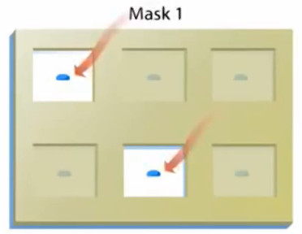

+ 接下来把要连接的碱基底物加到玻璃基片上。

>这里第一个要加的碱基是‘A’，玻璃基片上，刚才被光照射的格子就会与A结合。而另一部分没被光照射的还仍然带有保护基团。
>
>!注意：`加的A碱基也带有保护基团`。

+ 下一步，进行光刻，用另一张光罩（mask2）盖在玻璃基片上，紫外光再次透过光罩，去掉**一部分**保护基团，第二章透明、不透明格子的分布与第一张不同。再将T碱基铺到玻璃基片上， 在第二轮去掉了保护基团的位置就会加上T。

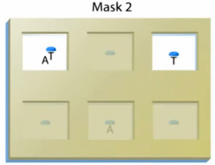

+ 然后，用Mask 3 进行下一轮遮盖，紫外光照，然后加上C碱基...

这样就会根据设计者的意图，长出DNA链来，`这就是探针`。

> Affymetrix公司的芯片都是3‘端连在玻璃基片上的。
>
> 做`表达谱的芯片`，也就是测RNA表达量的芯片，探针的长度是`25个碱基`；`SNP分型的芯片`，探针长度是`30个碱基`。
>
> Affymetrix芯片上，长有相同DNA链的一个小点被称为一个`Feature`，这也是未来芯片扫描图上的一个光点。一张芯片上最多可以有`680万个Feature`，每个Feature上会有几百万条相同序列的DNA探针。

+ 一个大的玻璃基片，在种好所有的DNA链之后会被裁切成一个一个小玻璃片，每个小玻璃片都有一套完整的探针。每张小玻璃片加上辅助液流的外壳，再打上相应的标识，就成了一张生物芯片。

> Affymetrix公司的芯片，它所有设计的探针，都在确定的位置，在最后的芯片判读过程中，也是通过光点的空间位置，来知道测到的是哪个探针。

## 表达谱芯片实验原理

Affymetrix的表达芯片，分为传统的`In Vitro Transcription` 芯片和新一代的`Whole Transcriptome`芯片。

### IVT芯片原理
+ 其中`IVT芯片`使用`Oligo dT引物`和`T7逆转录酶`来得到`cDNA链`的：

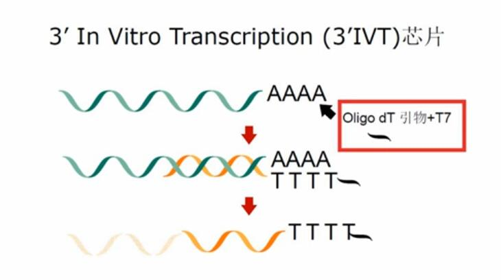

所以，它得到的cDNA主要是靠近mRNA3’位末端的cDNA，相应的，它的探针也`主要针对每个基因的最后一、二个外显子`来进行设计。

> 比较著名的IVT芯片，有经典的`U133芯片`，和较为经济的`PrimeView芯片`。

### WT 芯片原理

+ 而`WT芯片`是用`随机引物`和`T7逆转录酶`来得到cDNA的:

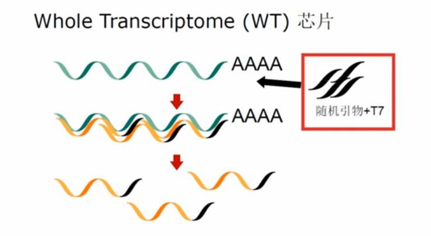

所以，它得到的cDNA会覆盖转录本上更多的区域。相应的，它的探针也是针对基因的整个转录本来进行设计的。

**WT芯片的好处：**

1. 可以覆盖转录本上更多的区域，实验结果的代表性就更好。

2. 可以针对因为差异剪接所形成的不同转录本分别设计探针,这样就可以知道不同转录本表达量的情况了。

3. 可以检测到长链非编码RNA

> 比较著名的WT芯片有`HTA 2.0`、`Exon 1.0`、`Gene 2.0/2.1`等

1. 实验过程中，先通过逆转录得到第一链的cDNA，紧接着就合成第二链的cDNA

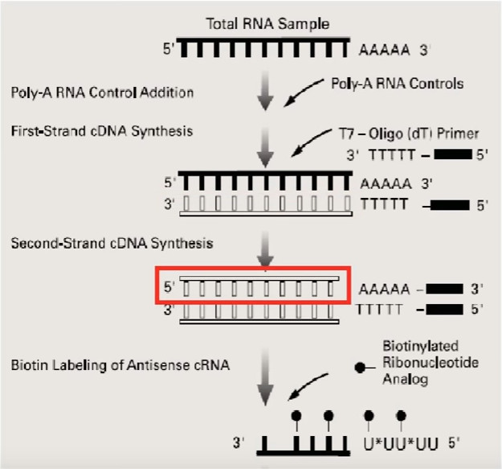

2. 变成双链cDNA之后，这个双链cDNA就可以作为接下来的转录模板了。
3. 接下来，用掺有生物素标记的UTP的聚合反应底物，也就是ATP、 CTP、TTP， 再加上生物素标记的UTP， 形成的4个 单核苷酸的 混合物进行体外转录， 转录得到 `cRNA (comple- mentary RNA)`

>因为转录的 原料中含有 被生物素标记的UTP，所以转录出来 的cRNA片段 就是带有生物素标签，然后用这些cRNA片段与芯片进行杂交，

4. 之后，用标记了`藻红蛋白的链霉亲和素（SAPE）`对芯片进行染色：

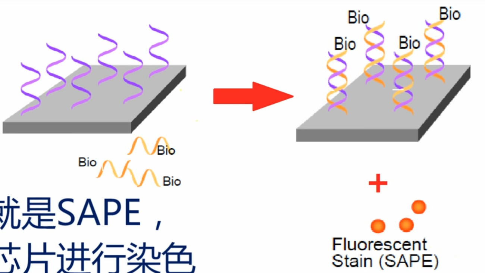

>`链霉亲和素`会与cRNA上的`生物素`特异性的结合;
>（SAPE上的）`藻红蛋白`在激发光的照射下，可以发出`红色荧光`

5. 再加入`标记了生物素`的`抗链霉亲和素抗体`，抗体就亲和吸附到那些已经吸附在cRNA上的链酶亲和素上。

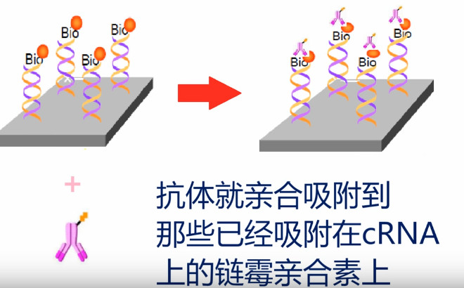

6. 亲和吸附完成之后，再加入SAPE对芯片二次染色，SAPE就吸附到那些生物素上。

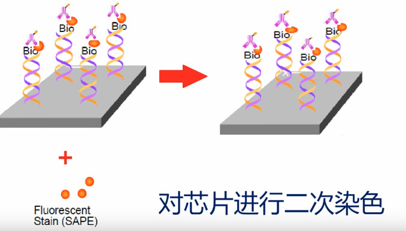

7. 通过上述的再次染色，可以把更多的藻红蛋白吸附到目标cRNA片段上以增加荧光强度。
8. 化学反应完成之后，就可以把芯片拿到扫描仪上进行激光扫描了，激光扫描之后，得到一张有着密密麻麻光点的图片，这张图也就是荧光信号的矩阵。

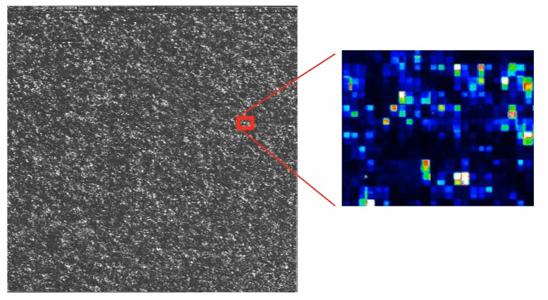

> 光点的x轴，y轴的位置，也就是探针的ID号，光点的强度，对应着被杂交的cRNA的量。而这个cRNA的量，就反映了对应基因特定mRNA转录本的表达量。

## SNP分型芯片原理（基因分型芯片）

Affymetrix公司的SNP分型芯片有两种实验原理：
+ 新的是Axiom芯片，是基于`连接反应的`
+ 老的卡式芯片，是基于目标DNA片段与探针序列进行杂交，看序列是否完全匹配。

### Axiom方法及检测原理

有两种探针在起作用，第一种探针是芯片上的捕获探针，30个碱基长，作用是把目标DNA片段固定到芯片表面，第二种探针是显色探针，它负责对SNP芯片进行显色：

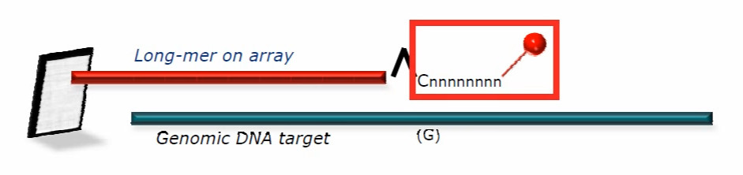

+ 显色探针的设计：

显色探针共分为四组，`A/C/G/T`各一组探针，它们都是9个碱基的长度，它们的3‘末端的第一个碱基是特异的，而从第二个碱基到第九个碱基都是`简并的`，这其中，3’末端C，或者G的，设计成5‘端带一个生物素标签，也就是最后会被染成红色荧光。而3’端是A或者T的，5‘端被设计成带另一种标签，最后被染色成绿色荧光。

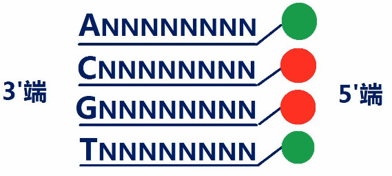

* 以下，以一个`G:T`型的SNP位点为例，进行说明：  

在设计这个SNP位点的探针的时候，所设计的捕获探针，是正好到SNP位点**旁边**的一个碱基，实验过程进行两轮杂交：

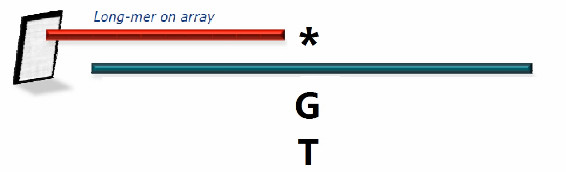

第一轮杂交：目标DNA与芯片进行杂交，结果是芯片上的捕获探针会抓到相匹配的目标DNA片段。

接着加入显色探针，进行第二轮杂交，这一轮杂交，把显色探针杂交到目标DNA片段上。

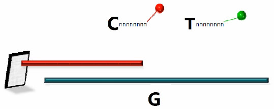

然后用连接酶进行连接，因为连接酶会对连接前后几个碱基进行识别，只有前后几个碱基都完全匹配连接才会发生。利用连接酶这种识别作用，让只有与目标DNA片段互补的显色探针才会被连接酶连接到捕获探针上。

连接反应后，把游离的显色探针洗掉，再用带荧光标记的染色试剂进行染色，

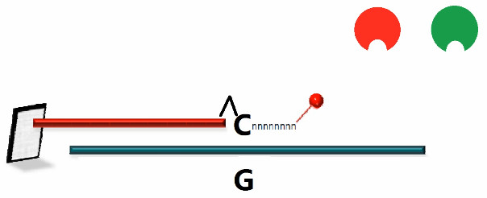

刚才连到捕获探针上的生物素标签就在这个染色过程中被染上红色荧光染料。

反之，如果目标DNA片段上，这个位点是“T”，则会被染成绿色荧光基团。

染色完成后，就可以在激光扫描仪下对芯片进行扫描了。

> 扫描过程中，探针发出的光是单纯的红色，则该位点是`G型纯合子`
>
> 如果是单纯的绿色，则是`T型纯合子`
>
> 如果有红有绿，光强接近，则是`G，T杂合子`

同样的道理，对于以下四种SNP情况，因为不同基因型会发出不同的光，只要看荧光颜色和强度就可以分辨SNP型了。

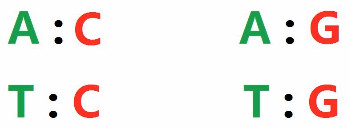

 而对于`A/T`和`C/G`这种荧光相同的，就需要另外的检测方案：

以`A/T`型为例进行说明:

+ 针对A设计一个探针，再针对T设计一个探针，而这些探针，是**覆盖到SNP位点的**。

  
  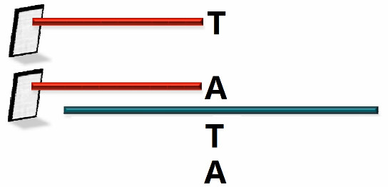

这里以一个`5'`端最后一个碱基为`A`的捕获探针为例：

+ 经过第一轮捕获杂交，目标DNA与之杂交，如果目标DNA是`T`碱基，则两个片段完美匹配.
+ 经过第二轮杂交，一个显色探针杂交到它的旁边，在经过连接反应，显色探针上的标签就连到了这个捕获探针上。

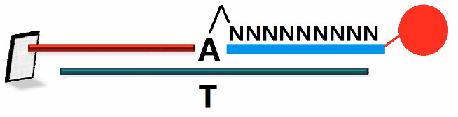

+ 反之，如果目标片段该SNP位点为`A`，则与探针上`A`是不完全匹配的，第二轮杂交过程中，虽然有显色探针停在它的附近，但是不会发生连接反应。随后会被洗脱下来。
+ 这样，在随后的激光扫描过程中，如果探针发出荧光，则说明对应SNP位点有`T碱基`,如果不发出荧光，则说明无`T碱基`
+ 然后再看芯片上最后一个为`T碱基`的捕获探针，如果发光，说明有A，如果不发光，说明没有`A`
+ 综合两个探针的情况来看，都发光就说明是`A/T`杂合子；如果只有捕获探针末位为A的发光，则说明该位点为`T纯合子`；如果只有末位为T的发光，说明是`A纯合子`

> 在Axiom芯片中，`CHB1`和`CHB2`是两款很常用的针对中国人的SNP分型芯片，它们有130万个SNP位点。

### 卡式SNP芯片原理

而卡式SNP芯片的原理与Axiom检测原理略有不同。

+ 卡式芯片不是以连接反应是否发生作为检测依据，而是检测目标DNA片段与捕获探针之间的杂交结果。
+ 在探针设计过程中，对SNP两种情况都设计相应的探针。实验过程中，先把基因组DNA分成2份，

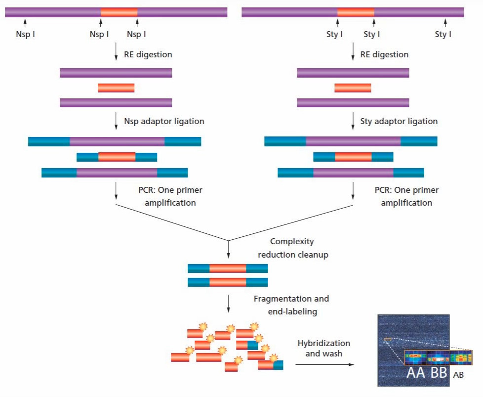

一份用`Nsp I` 酶进行消化;另一份用`Sty I`酶进行消化，基因组DNA被消化成片断之后，在两头加上接头，进行PCR扩增。

+ PCR扩增完成后，会得到长度主要分布在`200BP ~ 1100BP`之间的扩增片段，然后再用酶把PCR扩出来的DNA片段再次片段化，所得到的的，应该是平均长度小于`180bp`的片段。

+ 接着用末端核苷酸转移酶(Terminal Deoxy- nucleotidyl Transferase)将带有生物素的单核苷酸加到目标片段上

+ 然后把这些带生物素标签的目标DNA片段与芯片进行杂交，在染色、扫描。

  > 目标DNA片段与捕获探针杂交过程中，如果完全匹配，则杂交率高，杂交到捕获探针上的目标片段就多，反之，如果有一个碱基不匹配，则杂交效率就会低很多，杂交到捕获探针上的目标片段就会少许多。

+ 接下来在进行染色，染色完成后，进行激光扫描。

**结果说明：**
扫描过程中，能发出荧光的探针，说明样本中有对应基因型的DNA；如果探针不能发出荧光信号或荧光信号很弱，说明样本中没有对应基因型的DNA；如果一个SNP的两种荧光探针都发光，且强度差不多，说明样本在该位置为杂合子。

>在卡式SNP芯片当中，`SNP 6.0`是一款很经典的芯片，上面有90多万个SNP位点的探针，并且同时还有94万个拷贝数变异探针。

## 分析软件

Affymetrix **分析表达谱的软件**主要是用`Transciptome Analysis Console`软件，简称`TAC软件`；**分析基因分型的软件** 主要是用`Genotyping Console`软件。

除了上面两种芯片，Affymetrix公司还提供了：microRNA芯片、基因调控芯片、拷贝数变异芯片、分子细胞遗传学芯片、药物遗传学芯片等。

from 陈巍学基因：Affymetrix芯片原理
