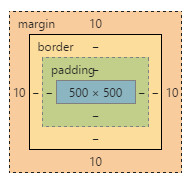

# CSS层叠样式表

<!--truncate-->

## 1. 使用CSS样式的方式

### 1. HTML `<!DOCTYPE>`声明标签
**定义和用法：**`<!DOCTYPE>`声明必须是HTML文档的第一行，位于<html>标签之前
<!DOCTYPE>声明不是HTML标签；它是指示web浏览器关于页面是使用哪个HTML版本进行编写的指令。
在HTML 4.01中，<!DOCTYPE>声明引用DTD，因为HTML 4.01基于SGML。DLD规定了标记语言的规则，这样浏览器才能正确的呈现内容。
HTML5不基于SGML，所以不需要引用DTD

**各版本的声明**：
+ HTML5

  ```
  <!DOCTYPE html>
  <meta charset="utf-8">
  ```

+ HTML 4.01

  `<!DOCTYPE HTML PUBLIC "-//W3C//DTD HTML 4.01 Transitional//EN" "http://www.w3.org/TR/html4/loose.dtd">`

  该DTD包含所有HTML元素和属性，包括展示性的和弃用的元素(比如font)，不允许框架集(framesets)

  `<meta http-equiv=Content-Type content="text/html;charset=utf-8">`

  注意的规则：

  单标记必须闭合：比如`<br>`必须写为`<br/> ``<input />`

  单属性必须添加属性值：比如:`<input type="radio" checked>`必须写为`<input type="radio" checked="checked"/>`

  标记和属性必须使用小写：`<Body>`、`<BODY>`是错误的，必须写为`<body>`

  属性的属性值必须使用`""`:在HTML4.01之前可以使用`<body bgcolor=red>`,HTML 4.01必须写为`<body bgcolor="red">`

### 2. 内链样式表

```
<body style="background-color:green;margin:0;padding:0;"><body>
```

### 3. 嵌入式样式表
**需要将样式放在<head></head>中**
```
<style type="text/css"></style>
<!--例如：-->
<head>
  <title>CSS的使用方式</title>
  <style type="text/css">
    body{
      background-color: green;
      color: red;
    }
    p{
      background-color: red;
      color: green;
    }
  </style>
</head>
```
### 4. 引入式样式表

```
<link rel="StyleSheet" type="text/css" href="style.css">

<!--例如：-->
<!DOCTYPE html>
<html>
<head>
  <title>CSS的使用方式</title>
  <link rel="stylesheet" type="text/css" href="style.css">
</head>
<body>
<h1 style="color:white;">CSS的使用方式</h1>
</body> 
</html>

<!--在当前文件夹下存在文件style.css,内容如下-->
body{background-color: red;color:#fff;}
```

## 2. 定义CSS样式表

*俗称：CSS选择器*

### 1. HTML标记定义

   比如HTML文档中有`<p>...</p>`标记，我们可以直接写下面的来定义<p>的样式：

   `p{属性:属性值;属性1:属性值1;}`

   > p可以叫做选择器，定义那个标记中的内容执行其中的样式
   >
   > 一个选择器可以控制若干个样式属性，它们之间需要用英语的`","`隔开，最后一个可以不加`","`

   ```
   <!--在head中定义-->
   <style type="text/css">
      p{color:red;font-size:28px;}
   </style>

   <!--而在body中定义了<p>-->
   <p>这句话将会使用CSS的设置</p>
   ```

### 2. Class定义
   ```
   <p class="p">...</p>
   class 定义是以"."开始
   .p{属性：属性值；属性1：属性值1}
   ```

   ```
   <!--比如-->
   <!--在head中定义-->
   <style type="text/css">
      .p{color:green;font-size:28px;}
      .p p{color:red;}
   </style>

   <!--在body中定义了<p>-->
   <div class="p">
      这个将会使用.p的标记
      <p>这句话将会使用.p p的设置</p>
   </div>
   ```
   >`.p p{color:red;}`这个叫做子选择器;选择了`class="p"`下一层的`"p"`.
   >
   >当然也可以:`<div><p class="pp">这个...</p></div>`然后在<style>中定义`.pp`


### 3. ID定义
```
<p id="p">...</p>

ID 定义是以"#"开始的

p{属性：属性值；属性1：属性值1}
```

> **!注意**ID选择器是唯一选择器，通常只允许出现一次。
>
> 而上面的class的方法定义，允许出现多次。

### 4. 优先级问题

+ ID>Class>HTML
+ 同级时选择离元素最近的一个的

### 5. 组合选择器(同时控制多个元素)

`h1,h2,h3{font-size:14px;color:red}`
选择器组合可以使用","隔开
```
<head>
<style type="text/css">
   h1,h2{color=red;}
</style>
</head>
<div>
<h1>这是..</h1>
<h2>这是..</h2>
```

### 6. 伪元素选择器(超链接样式)
就是定义**超链接的样式**

1. `a:link` 正常链接的样式
2. `a:hover` 鼠标放上去的样式
3. `a:active` 选择链接时的样式
4. `a:visited` 已经访问过的链接的样式

```
<style type="text/css">
a:link{color:red;}
a:hover{color:green;}
a:active{color:yellow;}
a:visited{color:blue;}
</style>

<body>
<a href="https://www.baidu.com" target="_blank">百度</a>
</body>
```
## 3. 常见属性

### 1. 颜色属性

color属性定义文本的颜色

1. color：green

2. 十六进制的颜色值color:#ff6600
   简写式：color:#f60

   >color:#ff(红) 66(绿) 00(蓝)
   >如果红绿蓝这三个颜色值都是重复的`aa`的形式，那么则可以简写。

3. 红(R)绿(G)蓝(B)每个的取值范围0-255 `color:rgb(255,255,255)`

   > color:rgb(红(r),绿(g),蓝(b))
   >
   > 比如：红色rgb(255,0,0)

4. color:rgba(255,255,255,1)

   RGBA是代表Red(红色)Green(绿色)Blue(蓝色)和Alpha的(色彩空间)透明度

   > p{color:rgba(182,22,206,0~1)}
   >
   > 1就是百分百显示，0.6就是透明度百分之六十

### 2. 文字属性

1. font-size:字体大小
   + `px`：设置一个固定的值
   + `%`：父元素的百分比
   + `smaller`：比父元素更小
   + `larger`：比父元素更大
   + `inherit`：继承父元素的

2. font-family：定义字体

   + `font-family:微软雅黑,serif`;
   + 可以使用`,`隔开，以确保当前字体不存在的时候直接使用下一个
   + 可以搜索"微软雅黑英文名称"，这样就可以替换掉中文名称了。

3. font-weight：字体加粗

   + normal(默认值)

   + bold(粗)

   + bolder(更粗)

   + lighter(更细)

   > 400=normal，而700=bold.取值范围为**`100~900的整百数`**

4. font-style:字体样式

   + normal：正常(标准)
   + italic：斜体
   + oblique：倾斜
   + inherit：继承

5. font-variant：小型大写字母显示文本

   *针对于字母*

   + normal：标准
   + small-caps：小型大写字母显示文本
   + inherit：继承

**实例：**

```
<head>
<style type="text/css">

h1{
  font-size:40px;
  font-family:"宋体","微软雅黑"；
  font-weight:lighter;

}
.hh{
  font-weight:400;
  font-style:normal;
}

</style>
</head>

<body>
<h1>一级标题</h1>
<h2 class="hh">二级标题</h2>
</body>
```


### 3. 背景属性

1. 背景颜色:background-color

   颜色取值跟上面的`颜色属性`一致。

2. 背景图片:background-image

   `background-image:url(图片路径)`
   `background-image:none`

3. 背景重复:background-repeat

   + repeat:重复平铺满
   + repeat-x:向x轴重复
   + repeat-y:向y轴重复
   + no-repeat:不重复


4. 背景位置:background-position

   + 横向(left,center,right)

   + 纵向(top,center,bottom)

   > 参数其实是两个值：`background-position:left center;`
   > 但是要是居中，就可以缩写成`background-position:center;`
   > 居左边中部，就是`background-position:left;`,默认会添加`center`

   + 用数值表示位置

   >`background-position:20px 20px;`
   >
   >background-position:(x)(y);#以左上角为原点。
   >
   >这也是两个参数，表示距离左边20px，距离上边20px。如果只有一个参数，第二个参数默认是`center`

5. 简写方式

   ```
   background:背景颜色 url(图像) 重复 位置
   background:#f60 url(images/bg.jpg) no-repeat top center;
   ```

```
<head>
<style type="text/css">

body{
  <!--background-color:green;-->
  background-image:url(image/bg.gif);
  background-repeat:repeat;
}
body{
  background:#f2f2f2;url(images/bg.jpg) no-repeat top center;
}

</style>
</head>

<body>
</body>
```


### 4. 文本属性

1. text-align横向排列
   + left
   + center
   + right ：右对齐

2. line-height文本行高
   + `%`基于字体大小的百分比行高
   + `数值`来设定固定值
   >当行高小于字体大小时，就可能会发生文字行的重叠。

3. text-indent 首行缩进

   + `%`父元素的百分比
   + `px`固定值，默认0
   + `inherit`继承

4. letter-spacing *字符*间距

   + normal 默认
   + length设置具体的数值(可以设置负值)
   + inherit继承

5. word-spacing *单词* 间距

   + normal 标准间距

   + px固定值

   + inherit继承

   >定义单词英文状态下的距离

6. direction文本方向

   + ltr从左到右，默认值

   + rtl从右到左

   + inherit继承

   >跟右对齐差不多

7. text-transform文本大小写

   + none：默认
   + capitalize：***每个单词***以大写字母开头
   + uppercase：定义仅有大写字母
   + lowercase：定义仅有小写字母
   + inherit：规定应该从父元素继承text-transform属性值

```
<head>
<style type="text/css">

div{
  width:300px;
  height:300px;
}
p{
  text-align:left;
  font-size:20px;
  line-height:40px;
  text-indent:50%;
  letter-spacing:10px;
  word-spacing:14px;
  direction:rtl;
}

</style>
</head>

<body>
<div>
  <p>测试字体</p>
</div>
</body>
```
### 5. 边框属性

1. 边框风格border-style

   + 统一风格(简写风格):border-style
   + 单独定义某一方向
     + border-bottom-style下边边框样式
     + border-top-style上边边框样式
     + border-left-style左边边框样式
     + border-right-style右边边框样式
   + **边框风格样式**的属性值
     1. `none`无边框

     2. `solid`直线边框

     3. `dashed`虚线边框

     4. `dotted`点状边框

     5. `double`双线边框

     6. `groove`凸槽边框

     7. `ridge`垄状边框

     8. `inset` inset边框

     9. `outset` outset边框

        > 6-9 是依托于border-color的属性值

     10. inherit继承

2. **边框宽度`border-width`**

   + 统一风格：border-width
   + 单独风格
     + border-top-width：上边边框宽度
     + border-bottom-width：下边边框宽度
     + border-left-width：左边边框宽度
     + border-right-width：右边边框宽度
   + 边框宽度的属性值 
     1. thin： 细边框
     2. medium ：中等边框
     3. thick ：粗边框
     4. px：固定值的边框
     5. inherit：继承

3. **边框颜色`border-color`**

   + 统一风格 border-color

   + 单独风格：

     + border-top-color:上边边框颜色

     + border-bottom-color：下边边框颜色

     + border-left-color：左边边框颜色

     + border-right-color：右边边框颜色

   + 属性值

     1. 颜色值的名称:`green`

     2. RGB`rgb(255,255,0)`

     3. RGBA`rgba(255,255,0,0.2)`

     4. 十六进制` #ff0`、`#ff0000`

     5. 继承

4. 小结：属性值的四种情况
   + 只有 一个值：border-color：(上、下、左、右)，比如`border-color:rgb(0,0,255);`
   + 两个值：border-color：(上下)(左右)，比如`border-color:green red;`
   + 三个值：border-color：(上)(左，右)(下)，同上
   + 四个值：border-color:(上)(右)(下)(左)，同上。

5. 简写方式

   border:solid 2px #f60

   > 边框样式，边框宽度，颜色值

```

<head>
<style type="text/css">
div{
  width:50px;
  height:50px;
  float:left;
  margin-right:10px;
  background-color:#f60;
}
.div1{border-style:solid;}
.div2{border-style:dashed;}
.div3{
  border-top-style:dotted;
  border-left-style:solid;
  border-bottom-style:groove;
  border-right-style:ridge;
  }
</style>
</head>

<body>
<div class="div1">solid</div>
<div class="div2">dashed</div>
<div class="div3">dotted</div>
</body>
```

### 6. 列表属性

> 回顾：列表定义方式
>
> ```
> <ul>
>    <li>无序列表</li>
>    <li>无序列表</li>
>    <li>无序列表</li>
> </ul>
> <ol>
>    <li>有序列表</li>
>    <li>有序列表</li>
>    <li>有序列表</li>
> </ol>
> ```

1. 标记的类型：`list-style-type`

   | none                 | 无标记                              |
   | -------------------- | -------------------------------- |
   | disc 默认              | 标记是实心圆                           |
   | circle               | 标记是空心圆                           |
   | square               | 标记是实心方块                          |
   | decimal              | 标记是数字                            |
   | decimal-leading-zero | 0开始的数字标记(01,02,03等)              |
   | lower-roman          | 小写罗马数字                           |
   | upper-roman          | 大写罗马数字                           |
   | lower-alpha          | 大写英文字母                           |
   | upper-alpha          | 大写英文字母                           |
   | lower-greek          | 小写希腊字母                           |
   | lower-latin          | 小写拉丁字母                           |
   | upper-latin          | 大写拉丁字母                           |
   | hebrew               | 传统的希伯来编号方式                       |
   | armenian             | 传统的亚美尼亚编号方式(an,ban,gan,等)        |
   | cjk-ideographic      | 简单的表意数字                          |
   | hiragana             | 标记是：a,i,u,e,o,ka,ki,等(日本片假名)     |
   | hiragana-iroha       | 标记是：i,ro,ha,ni,ko,he,to等(日本片假名)  |
   | katakana-iroha       | 标记是：I,RO,HA,NI,HO,HE,TO,等(日文片假名) |

   ```
   <style type="text/css">
      ul{
        list-style-type:decimal-leading-zero;
      }
      ol{
        ...
      }
   </style>
   ```

2. 标记的位置：`list-style-position`

   `inside` 列表项目标记放置在文本以内，且环绕文本根据标记对齐。(差不多就是在每行前面放置了两个空格进行缩进)

   `outside` 默认值，保持标记位于文本的左侧，列表项目标记放置在文本以外，且环绕文本不根据标记对齐。

   `inherit` 规定应从父元素继承list-style-position 属性值。

3. 设置图像列表标记：list-style-image

   URL 图像的路径

   none 默认，无图形被显示

   inherit 规定应从父元素继承list-style-image属性的值

   > list-style-image:url(image/1.gif)

4. 简写方式：list-style

   `list-style:square inside url('/i/arrow.jpg');`


## 4. DIV+CSS 布局

### 1. div和span

DIV和SPAN在整个HTML标记中，没有任何意义，他们的存在就是为了应用CSS样式。
DIV和span的区别在于，span是内联元素，div是块级元素

```
<style type="text/css">
div{
  background-color:green;
  color:#fff;
}
span{
  background-color:green;
  color:#fff;
}
</style>

<div>这里是div</div>
<span>这里是span</span>
```

> 结果将能看到，span块中，只有文字部分是绿色的，而div中，整个一行都是绿色的。

### 2. 盒模型

margin 盒子外边距

> margin-left:10px;margin-right:10px;...

padding 盒子内边距

border 盒子边框宽度 `border:solid 10px;`

width 盒子宽度

height 盒子高度

```
<!DOCTYPE html>
<html>
<head>
	<title>CSS的使用方式</title>
	<!--可以这样引用css的定义。
	<link rel="stylesheet" type="text/css" href="style.css">
	-->
	<style type="text/css">
		div{
			width: 500px;
			height: 500px;
			margin: 10px;
			padding: 0px;
			border: 10px;
		}
	</style>
</head>
<body>

<div>
	这里是测试属性
</div>

</body> 
</html>
```


> 上面代码的盒子模型，可以在Chrome中`右键-检查`。

### 3. 布局相关的属性

1. 定位方式 position

   1. relative 正常定位

   2. absolute 根据父元素进行定位

      > 如果你想设定子元素相对于父元素进行定位，那么父元素要设置为正常定位。

   3. fixed 根据浏览器窗口进行定位*下拉窗口这个块位置不变*

   4. static 没有定位

   5. inherit 继承

2. 定位：left，right，top，bottom离页面定点的距离

3. z-index 层覆盖先后顺序(优先级)：可以解决后定义的层覆盖先定义的层的问题。

   z-index默认为0；在先定义的层里定义z-index:1;这样就会显示在其他层上面。z-index值越大，越在上面。

4. display 显示属性

   display:none 层不显示
   display:block 块状显示，在元素后面换行，显示下一个块元素
   display:inline 内联显示，多个块可以显示在一行内

   >块元素可以定义其宽度，而内联不可以。

5. float 浮动属性

   left 左浮动

   right 右浮动

   > 当浮动和div紧邻的时候，浮动会影响div，所以要对div清除浮动，使用clear:both; 

   ```
   <style type="text/css">
   body{
     padding:0;
     margin:0;
   }
   .div{
     width:960px;
     height:600px;
     margin:0 auto;
     background-color:#f1f1f1;
   }
   .left{
     float:left;
     width:260px;
     height:460px;
     background:#ccc;
   }
   .right{
     float:right;
     width:700;
     height:460px;
     background:#ddd;
   }
   .bottom{
     margin-top:10px;
     clear:both;
     width:960px;
     height:200px;
     background:#eee;
   }
   </style>

   <div class="div">
      <div class="left"></div>
      <div class="right"></div>
      <div class="bottom"></div>
   </div>
   ```

6. clear:both 清除浮动

7. overflow 溢出处理：比如设置的`div`比较小，但是文字比较多，就会发生溢出。

   `hidden` 隐藏超出层大小的内容

   `scrow` 无论内容是否超出层大小都添加滚动条

   `auto` 超出时添加滚动条

```
<style type="text/css">
body{
  padding:0;
  margin:0;
}
.div{
  width:300px;
  height:300px;
  background-color:green;
  position:relative;
  left:10;
  top:10;
}
span{
  position:absolute;
  background-color:#ff6600;
  color:#fff;
  top:10px;#相对于父元素下移10px；
  right:0px;#相对于父元素右边距离为0，也就是到右上角；
}

.fixed{
  position:fixed;
  background-color:green;
  color:#fff;
  top:100px;#距离浏览器窗口上面100px；当我们的浏览器很长很长，我们往下拉网页的时候，这个块离浏览器位置不变！
  z-index:1;
}
</style>

<div class="div">
<span>今日浏览次数100次</span>
</div>

<div class="fixed">
<p>联系电话：</p>
<p>联系qq：</p>
</div>
```

### 4. 兼容问题

1. 兼容性测试工具：`IE Tester`和`Multibrowser`

2. 常用的浏览器

3. 高效的开发工具

   1. notepad++
   2. sublime Text
   3. 记事本
   4. WebStorm
   5. Dramweaver

4. 网页设计工具

   1. fireworks
   2. photoshop

5. 判断IE的方法

   > 判断条件只有在IE下才有效果！放在`<body>`中。

   条件判断格式：`<!--[if 条件 版本]>那么显示<![endif]-->`

   不等于：除了IE8都可以显示：`[if !IE 8]`

   小于：如果IE浏览器版本小于5.5的显示：`[if lt IE 5.5]`

   大于：如果IE浏览器版本大于5的显示：`[if gt IE 5]`

   小于或等于：如果浏览器版本小于6的显示：`[if lte IE 6]`

   大于或等于：如果浏览器版本大于7 的显示：`[if gte IE 7]`

   大于和小于之间：如果IE浏览器版本大于IE5小于7的显示：`[if (gt IE 5)&(lt IE 7)]`

   或：如果IE6或者IE7：`[if (IE6)|(IE7)]`

   仅：如果是IE8：`<!--[if IE 8]>`


