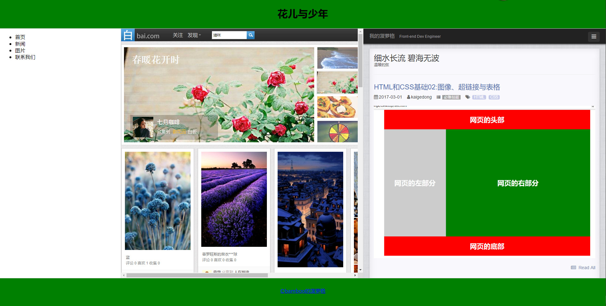

# WEB框架

框架将浏览器划分为不同的部分，每一部分加载不同的网页，实现在同一浏览器窗口中加载多个页面的效果。


<!--truncate-->

## `<frameset>`划分框架标记:

1. 语法格式

   <frameset>...</frameset>

2. 属性：

   1. `cols` ：使用“像素数”和%分隔左右窗口，“*”表示剩余部分

      如果使用`"*","*"`表示框架平均分成2个

      如果使用`"*","*","*"`表示框架平均分成3个

   2. `rows`:使用像素数和%分隔上下窗口，`"*"`表示剩余部分
   3. `frameborder`:指定是否显示边框，0不显示，1显示 
   4. `border`：设置边框的大小，默认值5像素

3. `<frame>`子窗口标记，**单标记**，该标记必须放在`<frameset>`中使用，在`<frameset>`中设置了几个窗口，就必须对应使用几个`<frame>`框架，而且还必须使用`src属性`指定一个网页

      1. `src`：加载网页文件的URL地址
      2. `name`：框架名称，是链接标记的target所要参数
      3. noresize：表示不能调整框架大小，没有设置时就可以调整
      4. scrolling：是否需要滚动条：加在顶层`"frameset"`不管用，必须要加在每一个`<frame>`进行控制。
         + auto：根据需要自动出现
         + yes：
         + no：无
      5. frameborder：是否需要边框
         + `(1)`显示边框
         + (0)不显示边框

```
<!DOCTYPE html>
<html>
<head>
  <title>HTML框架</title>
  <meta charset="utf-8">
</head>

<frameset rows="90,*,90" frameborder="1" border="1">
  <frame name="top" src="top.html" />
  <frameset cols="20%,80%">
    <frame name="left" src="left.html"/>
    <!-- 其中几个框架的html代码没有显示。 -->
    <frameset cols="50%,50%" frameborder="1" border="1">
      <frame name="right1" src="http://bai.com"></frame>
      <frame name="right2" src="https://kaigedong.github.io" scrolling="no"></frame>
    </frameset>
  </frameset>
  <frame name="bottom" src="bottom.html" />
</frameset>>
</html>
```
效果：


