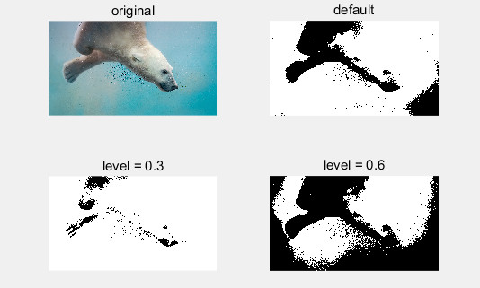

# MATLB 学习笔记 01：绪论

数字图形是用数字信号来表示的图像。数字图像相当于一个m x n的矩阵，其中，m x n被称为图像的分辨率。

每个网格颜色只能是一种，这个过程被称为图像颜色的离散化。

<!--truncate-->

+ 数字图像处理研究的内容包括：

  + 图像获取和输出

  + 图像压缩和编码

  + 图像增强和复原

  + 图像变换

  + 图像分割

  + 图像信息安全

  + 图像的识别和检测
+ matlab 发布时，伴随有新版的Simulink，它是matlab最重要的组件之一。是与matlab配套的仿真工具，提供了一个动态系统建模、仿真和综合分析的集成环境。只需通过简单的鼠标操作，即可构造复杂的系统。
+ 特点：
  + matlab具有高效完善的数值计算及符号计算功能，使用户从繁杂的数学运算分析中彻底解脱出来：有一套工具箱，涵盖信号处理、控制系统、神经网络、模糊逻辑、小波分析、系统仿真等。
  + matlab拥有友好的用户界面，以及接近数学表达式的自然化语言，易于学习和掌握。
  + matlab具有完备的图形处理功能，实现了计算结果和编程的可视化。

## matlab的结构

1. 开发环境：像vs或Eclipse一样简单直接的界面 
2. 数学函数库：大量的计算方法。从基本的算术运算、三角函数运算等，到复杂算法，如矩阵求逆、快速傅里叶变换等。
3. 语言：语法与C/C++类似，包括流程控制、函数调用等语法规则。支持布尔值、数值型、文本类型和函数句柄等数据类型，每一种都定义为矩阵或阵列的形式。
4. 图形处理系统：包括二维/三维图形函数、图像处理和动画显示等函数
5. 应用程序接口：API能与C/C++、java等其他高级编程语言进行交互的函数库。

## 图像存储

各种图像文件格式的差异，主要体现在它们采用的编码方式。其编码往往带有一定数据压缩成分的编码。

压缩方式分为有损压缩和无损压缩两种。如PNG是无损压缩，JPEG是有损压缩。

**共性** ：图像文件一般由文件头、调色板数据、像素数据三部分组成。

> 其中头文件用于存储图像文件的各种参数，这些参数表征了图像本身的许多特性
>
> 调色板是图像的颜色索引表
>
> 像素数据是图像信息的实体所在，存储了图像矩阵各个点的像素信息。一般压缩是针对这些像素数据进行的。

+ 文件头：包括图像的类型、图像的宽度、高度、每个像素所占的位数、压缩类型、像素数据的首地址和有无调色板等。

  > 文件头参数可以使固定格式，也可以是灵活格式。如BMP文件，参数形式是固定格式的。

+ 图像调色板使图像显示具有真正的意义。

  > 调色板仅存在于二值、16色、256色图像之中，并指导这些图像正确的呈现色彩。但真彩色图像中没有调色板。
  >
  > 并不是每一种图像都能够完全支持二值、16色、256色到真色彩图像范围内的所有图像。如GIF不支持真色彩，因此GIF必存在调色板。

+ 像素可以使压缩的，也可以是非压缩的。

  > 不压缩的像素数据在不同图像文件中具有基本相同的存储结构。
  >
  > 对于压缩：有有损压缩和无损压缩两种

+ 任何图像在被计算机输出设备呈现时，都经过了解码步骤，呈现出用户看到的二维网格。


### 计算机中颜色表示方法

+ RGB yanse kongjian （red，green，blue）

  > RGB对应笛卡尔坐标系中一个立方体，R、G、B分别代表三个轴，当都取0时，表示黑色，都取最大值即255时，表示白色。黑白连线之间，介于黑、灰、白之间。对角线表示的就是灰度级。

+ `单色`、`16色`、`256色`和`24位真彩色`(根据存储一个像素所占的空间)：

  > 二值图像：这种图像中的每个像素只能在黑色和白色两者之间选一个。
  >
  > 16色图像：像素组中每4个比特代表一个像素
  >
  > 256色的图像：像素数组中每个字节代表一个像素，也就是8个比特来表示一个像素颜色。
  >
  > 对于24位`真彩色`图像来说，3个字节代表一个像素颜色，每个字节分别代表RGB中的一个分量。
  >
  > matlab中数值一般采用double（64）位存储和运算，matlab还提供了特殊的数据类型unit8(8位无符号整数)，依此来存储的图像成为8位型图像。
  >

+ matlab中的图像类型包括`灰度图像`、`RGB图像`、`二值图像`和`索引图像`4种。

  + `灰度图像`，从白到黑，灰度级别最多有256级，也就是0到255

  + `RGB图像`也就是真色彩图像，以红、绿、蓝3个`亮度值`为一组，代表每个像素的颜色。这些亮度值直接存储在图像数组矩阵中，图像数组矩阵大小为`mxnx3`,m,n 代表图像像素的行列数，3代表R/G/B三个分量。

  + `二值图像`，只能显示黑或白两种颜色。每个像素取1或0.

  + `索引图像`包括一个`数据矩阵X`和一个`颜色映射矩阵Map`。Map是一个包含3列和若干行的数据矩阵，其中每个元素的均值是[0,1]之间的double型数据。Map矩阵的每一行分别为红、绿、蓝(R/G/B)的颜色值。颜色矩阵是按图像中颜色值进行排序后的数组。对于每个像素，图像矩阵包含一个值，这个值就是颜色图数组中的索引。在Matlab中，索引图像是从像素值到颜色映射表值的直接映射。**像素颜色由数据矩阵X作为索引指向矩阵Map进行映射。**

  + 函数`image()`可以直接显示8位图像，但8位型数据和double型数据在image()中意义不一样。因为索引图像数值为1时，表示的是第二行颜色。

    ```
    image(x);
    colormap(map);
    ```

  + 灰度图像：uint8型表示范围[0,255],double型表示范围[0,1].double型和unit8型灰度图像是不一样的，二者的格式转换如下：

    ```
    I8 = unit8(round(I64*255)); %double转成uint8
    I64 = double(I8) / 255;     %uint8转成double
    ```

  + imread()根据文件中的图像种类进行不同的处理。当文件中的图像是灰度图像时，imread()把图像存入一个8位矩阵中，把色图矩阵转换为双精度矩阵，矩阵中的每个元素都在0至1之间取值；当图像为RGB图像时，imread()则把数据存储在一个8位的RGB矩阵中。

  + 注意！matlab读入图像的数据是uint8，而在矩阵中使用的数据是double。所以需要将数组转成double类型，否则对uint8型数据进行加减可能会发生溢出。图像数据类型转换函数如下

    + im2double():将图像数组转换成double型
    + im2uint8():将图像数组转换成uint8型
    + im2uint16():将图像数组转换成uint16型
    + mat2gray():把一个double型的任意数组转换成取值范围0~1之间的数组，讲一个矩阵转换成灰度图像的数据格式。
    + isgray():来判定矩阵是否为一个图像数据矩阵。

+ 图像数据在进行计算前要转换成double型的，这样可以保证图像数据运算的精度。

## MATLAB中的图像转换

包括：1.不同图像文件格式之间的转换、2.MATLAB中不同图像存储形式之间的转换(例如将灰度图像转换成二值图像)。

1. 索引图像与灰度图像之间的相互转换

   + 灰度图像像索引图像转换：`gray2ind()`

   ```
   [X,MAP] = gray2ind(I, [n])
   ```

   > I 表示存储灰度图像的变量，n表示颜色值(默认是64)

   + 将索引图像转换为灰度图像函数：`ind2gray()`

   ```
   I = ind2gray(X, MAP)
   ```

   > X表示图像矩阵变量，MAP表示颜色图数组变量

2. RGB彩色图像与索引图乡之间的相互转换

   + RGB彩色图像像索引图像转换的函数为rgb2ind()

   ```
   [X, MAP] = rgb2ind(RGB)
   ```

   > 其中参数RGB表示存储RGB图像数据的变量。

   + 将索引图像转换为RGB彩色图像的函数为ind2rgb()

   ```
   RGB = ind2rgb(X, MAP)
   ```

   > X表示图像矩阵变量，MAP表示颜色图数组变量。

3. RGB彩色图像与灰度图像之间的转换

   将RGB彩色图像转换为灰度图像所使用的函数是`rgb2gray()`,

   ```
   I = rgb2gray(I_RGB);
   ```

   上述语句完成的任务是将真色彩图像I_RGB转换为灰度图像I。

   在计算机中或网络上看到的大部分是彩色图像，但**在数字图像处理中所需要使用的都是灰度图像** 。

4. 将索引图像、灰度图像和RGB彩色图像转换为二值图像

   ```
   BW = im2bw(X, MAP, level);
   BW = im2bw(I, level);
   BW = im2bw(RGB, level);
   ```

   > 参数level是用来控制二值化结果的阈值，取值范围0~1，表示对于输入图像而言，所有亮度值小于给定值(level)的像素点都被置为0，其他像素点则被置为1.在默认情况下，matlab会自动赋一个阈值。

   下面代码演示了该函数的使用：

   ```
   I = imread('lena.jpg');
   BW1 = im2bw(I);
   BW2 = im2bw(I,0.3);
   BW3 = im2bw(I,0.6);
   figure
   subplot(2,2,1),imshow(I);
   title('original');
   subplot(2,2,2),imshow(BW1);
   title('\default');
   subplot(2,2,3),imshow(BW2);
   title('level = 0.3');
   subplot(2,2,4),imshow(BW3);
   title('level = 0.6')
   ```

   

   ## MATLAB中图像的基本操作：

   1. 图像的读取

      **清除MATLAB工作平台中所有变量：** 

      ```
      clear
      ```

      然后用imread()函数来读取一幅图像。

      > 注意：文件名要用单括号括起来。末尾分号在MATLAB中用于取消输出，如果去掉末尾分号，MATLAB会显示改行运行的结果。

      ```
      I = imread = ('baboon.jpg')
      ```

      > 上面命令会从工作路径读取文件。还可以给出完整路径：

      ```
      I = imread = ('C:\baboon.jpg');
      ```

      函数size()可以求一幅二维图像的大小：

      ```
      I = imread = ('fruits.jpg');
      size(I);
      ```

      程序运行结果如下：

      ```
      ans = 
      480   512   3
      ```

      > 图像宽为480个像素，高为512个像素，因为是彩色图像，所以有3个分量。如果是灰度图像，上述输出结果中将不包含最后一项“3”

      使用下面这种语法形式也可以自动确定一幅图像的大小：

      ```
      I = imread('fruits.jpg');
      [R,C,D] = size(I)
      ```

      运行结果：

      ```
      R = 
          480
      C = 
          512
      D = 
          3
      ```

      函数whos可以用于显示一个数组的附加信息，对一个图像数组来说，这些附加信息指存储方式。

      ```
      whos I
      ```

      运行结果：

      ```
        Name         Size                  Bytes  Class    Attributes

        I         1080x1920x3            6220800  uint8  
      ```

      > 表明图像采用了8位存储方式，并占用了...字节

   2. 图像写入

      使用`imwrite()`写入文件

      ```
      imwrite(I,'filename')
      ```

      filename必须是一种可识别的文件格式。如：

      ```
      imwrite(I,'snight.png')
      ```

      也可以写成

      ```
      imwrite(I,'snight','png')
      ```

      仅适用于JPEG：

      ```
      imwrite(I,'filename.jpg','quality',q)
      ```

      > q 是整数，取值范围0~100.表示图像质量

      仅用于TIF：

      ```
      imwrite(I,'filename.tif','compression','p','res',...[colres rowres])
      ```

      p可以是：none表示无压缩，ccitt表示用CCITT压缩(二值图像的默认参数)，packbits表示比特压缩。1x2的矩阵包含两个整数，分别表示以每单位的点数给出的图像列和行的分辨率默认[72 72]。

      另一种保存方式：file-另存为-

   3. 图像的显示

      imshow()来显示图像文件，自动创建句柄图形图像对象，并自动设置各句柄图形属性和图像特征。

      ```
      imshow(f,G)
      ```

      > f 表示一个二维图像数组，G表示该图像的灰度级数，默认的灰度级数是256.

      还可以写成：

      ```
      imshow(f,[low,high])
      ```

      > f 同前。low和high表示，小于low显示黑色，大于high显示白色，之间以默认级数显示为中等亮度值。

      subplot()用来在一个窗口显示多幅图形
      figure用来创建新的窗口
      ```
      subplot(m,n,p)   
      ```
      >m ，n表示图像排列成m行，n列，p表示图形所在的位置。


