# MATLAB 图像的点运算

## 灰度直方图


<!--truncate-->

1. 原理：对不同灰度的点进行数量统计

2. 编码实现:`imhist()`函数

   + 绘制直方图的一般方法

   ```
   imhist(I)
   imhist(I,n)
   [counts, x]=imhist(...)
   ```
   > I 是需要计算灰度图像的图像。
   >
   > 参数n是指定的灰度级数目，默认n等于256，也就是0~255。对于二值图像，n等于2
   >
   > 返回值counts为直方图的数据向量。counts(i)也就是第i个灰度区间中的像素数目，x是保存了对应的灰度小区间的向量。若采用第三种形式，需要配合stem()函数手动绘制直方图。

   ```
   i = imread('2017-03-16-1.jpg')
   g = rgb2gray(i)
   figure
   subplot(121),imhist(g);
   subplot(122),imhist(g,64);
   ```

   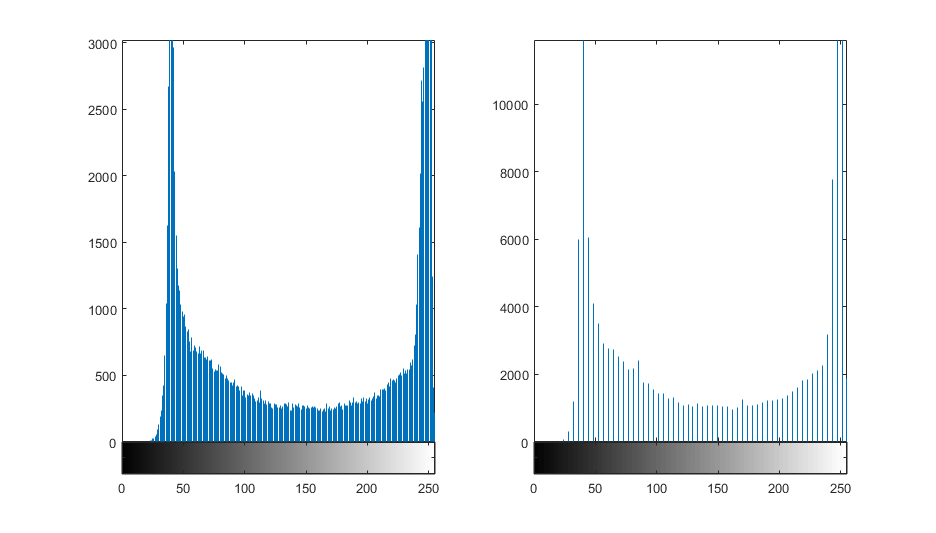

   + 绘制归一化灰度直方图：像素出现的概率

     ```
     i = imread('2017-03-16-1.jpg');
     i = rgb2gray(i);
     [m,n]=size(i);
     [counts1,x] = imhist(i,32)
     subplot(121),stem(x,counts1);
     counts2 = counts1/m/n;
     subplot(122), stem(x,counts2);
     ```

     

     > stem()是用来绘制针线图的函数
     >
     > 易知，归一化直方图所有取值之和为1
     >
     > 可用`sum(counts2)`进行查看

3. 彩色图像的分量直方图

   ```
   i = imread('2017-03-16-4.jpeg');
   [x,y,z]=size(i);

   figure
   subplot(221),imshow(i);
   title('original image')

   %提取红色分量
   r=i;
   %r(:,:,1)=a(:,:,1);
   r(:,:,2)=zeros(x,y);
   r(:,:,3)=zeros(x,y);
   r=uint8(r);
   subplot(222),imshow(r);
   title('R-component-image')

   %提取绿色分量
   g=i;
   g(:,:,1)=zeros(x,y);
   %g(:,:,2)=a(:,:,2);
   g(:,:,3)=zeros(x,y);
   g=uint8(g);
   subplot(223),imshow(g);
   title('G-component-image')

   %提取蓝色分量
   b=i;
   b(:,:,1)=zeros(x,y);
   b(:,:,2)=zeros(x,y);
   %b(:,:,3)=a(:,:,3);
   b=uint8(b);
   subplot(224),imshow(b);
   title('B-component-image')
   ```

   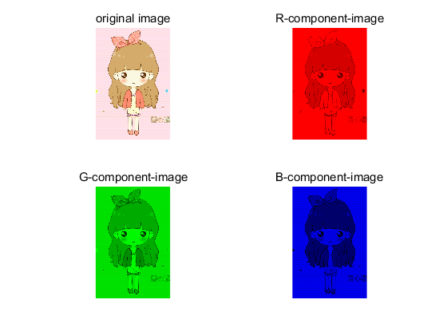

   

   彩色图像灰度化的方法：

   + 平均值法：每个像素的三原色值等于红、绿、蓝3个分量的平均值

   + 最大值法

   + 加权平均值法

     人眼对三原色的敏感度从高到低为绿、红、蓝。所以三原色权值取值关系也是这样。

`R=G=B=0.299R+0.587G+0.114B`时，能够得到最合理的灰度图像。


```
i = imread('2017-03-16-4.jpeg');
r=i(:,:,1);
g=i(:,:,2);
b=i(:,:,3);
subplot(1,3,1),imhist(r),title('R component');
subplot(1,3,2),imhist(g),title('G component');
subplot(1,3,3),imhist(b),title('B component');
```

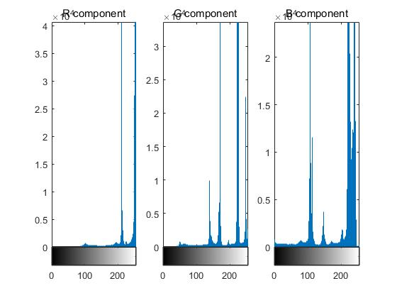


## 灰度线性变换

利用线性公式进行一维变换：

`y=kx+d`(0<=y<=255)

1. 当k>1时

   可用于增加图像对比度。在直方图中表现就是灰度分布被拉伸了。

2. 当K=1时

   用于调节图像亮度。就是将图像的各个像素值都增加或者减少一定量。

   通过改变d值，达到增加或者减少图像亮度的目的。

3. 当K<1时

   图像的对比度和整体效果都被削弱了。K值越小，图像的灰度分布越窄，图像看起来越暗。

4. K<0时

   图像较亮的地方区域会变暗，较暗的区域会变亮。k=-1，d=255时，可以让图像实现反色效果(或底片效果)

```
i=imread('2017-03-16-4.jpeg');
i = im2double(rgb2gray(i));
[m,n]=size(i);

%增加对比对
Fa=1.25;Fb=0;
O = Fa.*i + Fb/255;
figure(1),subplot(221),imshow(O);
title('Fa = 1.25,Fb=0,Contrast increasing');
figure(2),subplot(221),[H,x]=imhist(O,64);
stem(x,(H/m/n),'.');
title('Fa=1.25,Fb=0,contrast increasing');

%减小对比度
Fa = 0.5;Fb=0;
O=Fa.*i + Fb/255;
figure(1),subplot(222),imshow(O);
title('Fa = 0.5, Fb = 0, contrast decreasing');
figure(2),subplot(222),[H,x]=imhist(O,64);
stem(x,(H/m/n),'.');
title('Fa = 0.5,Fb=0,contrast decreasing');

%线性亮度增加
Fa=0.5;Fb=50;
O=Fa.*i + Fb/255;
figure(1),subplot(223),imshow(O);
title('Fa=0.5,Fb=50,brightness control');
figure(2),subplot(223),[H,x]=imhist(O,64);
stem(x,(H/m/n),'.');
title('Fa=0.5,Fb=50,brightness control');

%反相显示
Fa = -1;Fb=255;
O=Fa.*i+Fb/255;
figure(1),subplot(224),imshow(O);
title('Fa=-1,Fb=255,reversal processing');
figure(2),subplot(224),[H,x]=imhist(O,64);
stem(x,(H/m/n),'.');
title('Fa=-1,Fb=255,reversal processing');
```

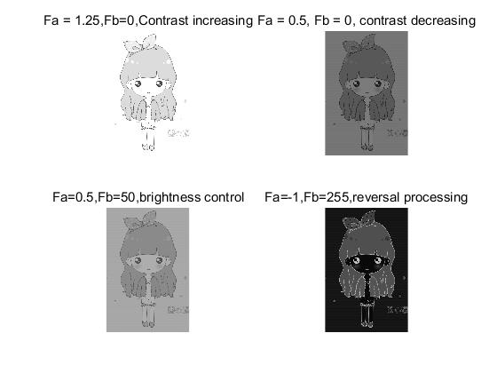

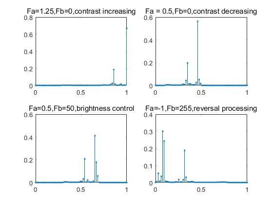


> 用其他软件进行线性变换：可以将256种灰度都先进性一次变换运算，结果保存在一个大小为256的数组中。这种方法对于任意图像都只进行了256次运算，大大提高了效率。


## 灰度非线性变换

### 1. 灰度对数变换

   对数变换的基本形式为：y=(log(1+x))/b

   > b为一个正常数，用以控制曲线的弯曲程度，b值越大，弯曲程度越小。x是原始灰度值，y是变换后的目标灰度值。在对数函数的曲线上，函数自变量较低时，曲线斜率很大；自变量较高时，曲线斜率变得很小。
   >
   > 对数变换实现了图像灰度的拓展和压缩功能。拓展了低灰度值而压缩了高灰度值，让图像的灰度分布更加符合人的视觉特征。

+    重要应用：用来增强图像中较暗部分的细节。

   ```
   i = imread('2017-03-16-4.jpeg');
   i = rgb2gray(i);
   i = double(i);

   out1 = log(1+i)/0.065;
   out2 = log(1+i)/0.035;
   out1(find(out1>255)) = 255;
   out2(find(out2>255)) = 255;
   out1 = uint8(out1);
   out2 = uint8(out2);

   subplot(221), imshow(out1),title('image, p = 0.065');
   subplot(222),imhist(out1),title('histgram p = 0.065');
   subplot(223),imshow(out2),title('image, p = 0.035');
   subplot(224),imhist(out2),title('histgram,p = 0.035');
   ```

   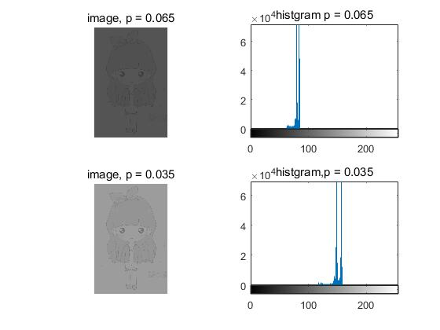

   > 亮的部分收缩在很小一部分区域，而暗的部分扩散的比较开。

### 2. 灰度幂次变换

1. 基本理论

   y = c(x的r次方)

   > 其中c、r均为正数。幂次变换将部分灰度变换映射到更宽的区域中。当r为1，幂次变换转变为线性变换。
   >
   > 输出灰度会随着指数的增加迅速扩大。指数稍大时(r>=2)整个变换曲线接近一条直线。就失去了变换的意义。
   >
   > 在实际运用中对x和y进行约束，让他们的值在0~1之间。

   `y=255c[(x/255)的r次方]`

   ```
   i = rgb2gray(imread('2017-03-16-4.jpeg'));
   i = double(i);
   y1 = 255*(i/255).^2.5;
   y2 = 255*(i/255).^0.4;
   y1 = uint8(y1);
   y2 = uint8(y2);
   subplot(221),imshow(y1),title('p=2.5');
   subplot(222),imhist(y1),title('p=2.5');
   subplot(223),imshow(y2),title('p=0.4');
   subplot(224),imhist(y2),title('p=0.4');
   ```

   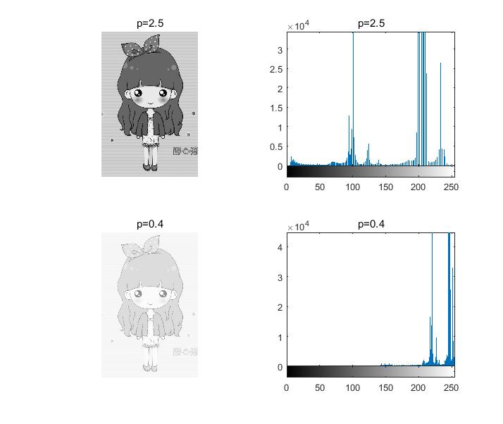

   > 上述变换互为伽马校正。
   >
   > 在MATLAB中还提供了实现灰度变换的基本函数`imadjust()`.借助该函数，我们也可以进行伽马校正：

   ```
   J = imadjust(I,[low_in;high_in],[low_out;high_out])
   J = imadjust(I,[low_in;high_in],[low_out;high_out],gamma)
   ```

   > 该函数将图像I中的亮度值映射到J中的新值，即将low_in和high_in之间的值映射到low_out和high_out之间的值。而low_in之下，high_in之上被剪切掉。
   >
   > 第二种语法，同样是将I中的亮度映射到J中的新值，但gamma制定了描述值I和J关系的曲线。如果gamma小于1，则映射被加权到更高的输出值，此时偏重更高数值(明亮)输出；如果gamma大于1，则映射被加权到更低输出值，此时偏重更低数值(灰暗)输出；省略参数则为线性映射。如果采用默认映射值对应范围，也就实现了伽马校正。

   ```
   i = rgb2gray(imread('2017-03-16-4.jpeg'));
   y1 = double(i);
   y1 = 255*(y1/255).^2.5;
   y2 = uint8(y1);
   y3 = imadjust(y2,[],[],0.4);
   subplot(131),imshow(i),title('original image');
   subplot(132),imshow(y2),title('power=2.5');
   subplot(133),imshow(y3),title('gamma=0.4');
   ```

   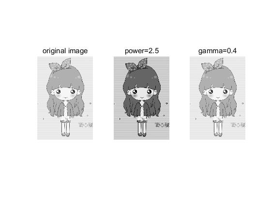

   > 可以看出，通过伽马校正，图像已经基本得到了复原。(图3在图2的基础上进行了校正，得到了原图)

### 3. 灰度指数变换

1. 基本理论

   `y=b[c(x-a) - 1` (b的c(x-a)次方)

   > b、c控制曲线形状，a控制曲线左、右位置。
   >
   > 指数变换作用是拓展图像的高级灰度，同时压缩低灰度级。

   ```
   i = rgb2gray(imread('2017-03-16-4.jpeg'));
   i = double(i);

   y1 = 1.5.^(i*0.070)-1;
   y2 = 1.5.^(i*0.050)-1;
   y1(find(y1>255)) = 255;
   y2(find(y2>255)) = 255;
   y1 = uint8(y1);
   y2 = uint8(y2);

   subplot(221),imshow(y1),title('c=0.070');
   subplot(222),imhist(y1),title('c=0.070');
   subplot(223),imshow(y2),title('c=0.050');
   subplot(224),imhist(y2),title('c=0.050');
   ```

   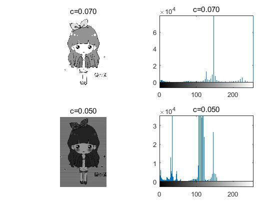


## 灰度拉伸

### 1. 基本原理

利用线性变换曲线建立映射，使集中于一较小区间的灰度拉伸至较大取值区间。

灰度拉伸又叫做对比度拉伸，与线性变换类似，不同点在于灰度拉伸使用分段线性变换。

y = {

​     f1(x);(x<x1)

​     f2(x);(x1<x<x2)

​     f3(x);(x>x2)

}

+ 中间线段斜率大于1：可以利用这类控制点进行灰度拉伸，增加图像对比度，加强整体显示效果
+ 中间线段斜率小于1：降低图像的对比度。
+ 中间线段斜率等于1：此时变换函数化为一个线性函数，将产生一个没有变化的图像。
+ x2=x1,y1=0,y2=255：此时变换函数变成阈值函数，产生二值图像。

```
i = imread('2017-03-16-4.jpeg');
i = rgb2gray(i);
L = imadjust(i,[],[50/255;150/255]);
J = imadjust(L,[50/255;150/255],[20/255;230/255]);
subplot(221),imshow(L),title('low contrast');
subplot(222),imhist(L),title('low contrast');
subplot(223),imshow(J),title('high contrast');
subplot(224),imhist(J),title('high contrast');
```

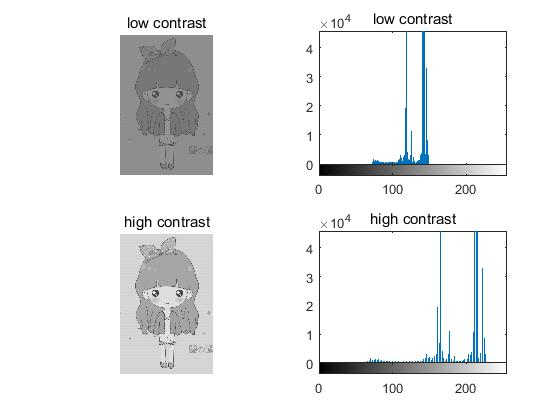

## 灰度均衡

灰度均衡又称直方图均衡化。以累计分布函数为基础的直方图修正法，可以产生一副灰度级分布概率均匀的图像。

变换后，每一级灰度上像素点的数量相差不大，对应灰度直方图每一级灰度高度也差不多。

可使用灰度均衡算法函数`histeq()`:

```
[J,T] = histeq(I,n)
J = histeq(I,n)
```

> I 表示原始图像，J是灰度均衡变化之后的输出图像，T是变换矩阵(即能将图像I的直方图变换成图像J的直方图的变换T)。参数n指定直方图均衡后的灰度级数，默认值为64

```
i = rgb2gray(imread('2017-03-16-4.jpeg'));
LC = imadjust(i,[],[50/255;150/255]);
figure(1),subplot(221),imshow(LC);
title('low contrast');
figure(1),subplot(222),imhist(LC);
title('low contrast');
HE1 = histeq(LC);
figure(1),subplot(223),imshow(HE1);
title('histogram equalization');
figure(1),subplot(224),imhist(HE1);
title('histogram equalization');
```

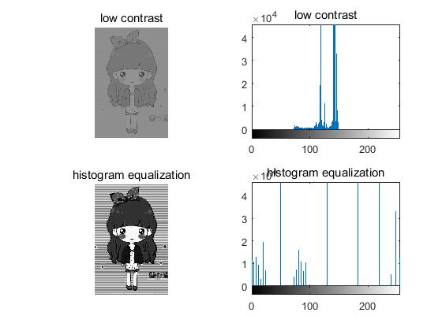

> 直方图均衡化是图像增强的有效手段。

## 直方图规定化

灰度均衡化可以自动确定灰度变换函数，从而获得拥有均匀直方图的输出图像。如果我们希望获得指定直方图的输出图像，就需要用到`直方图规定化`，又称为`直方图匹配`。

需要用到函数`histeq()`

```
[J,T] = histeq(I,hgram)
J = histeq(I,hgram)
```

> 此时函数会讲原始图像I的直方图编程用户指定的hgram(也就是参考图像的直方图)。参数hgram的分量数目就是直方图的收集箱数目，对于double类型的图像，hgram中各元素的值域是[0,1]；对于uint8类型的图像，hgram中各元素取值范围为[0,255].

```
img = rgb2gray(imread('2017-03-16-4.jpeg'));
img_ref = rgb2gray(imread('2017-03-18-10.jpg'));
[hgram,x] = imhist(img_ref);
J = histeq(img,hgram);
subplot(2,3,1),imshow(img),title('original image');
subplot(2,3,4),imhist(img),title('original image');
subplot(2,3,2),imshow(img_ref),title('reference image');
subplot(2,3,5),imhist(img_ref),title('reference image');
subplot(2,3,3),imshow(J),title('output image');
subplot(2,3,6),imhist(J),title('output image');
```

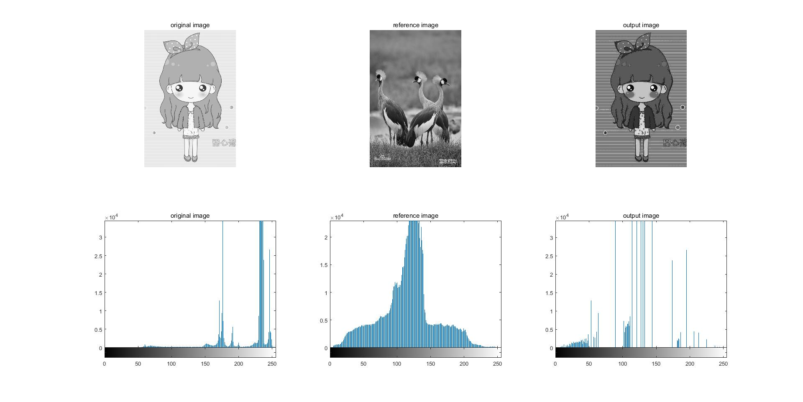
