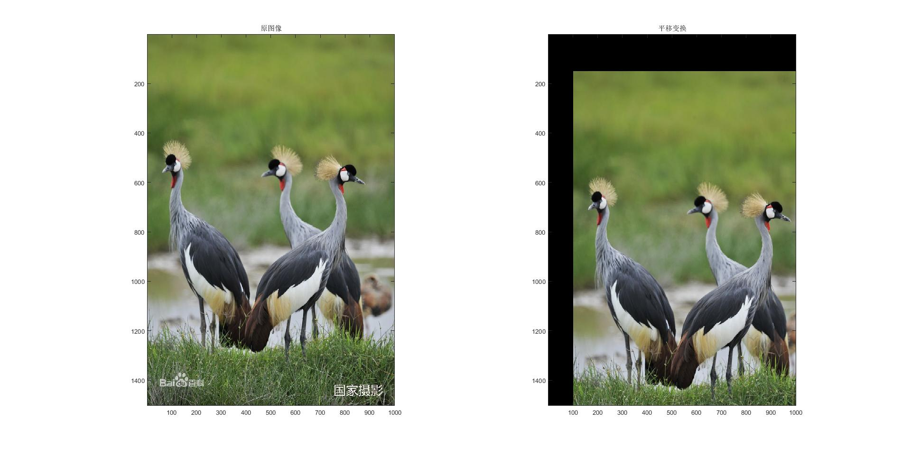
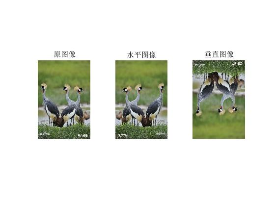
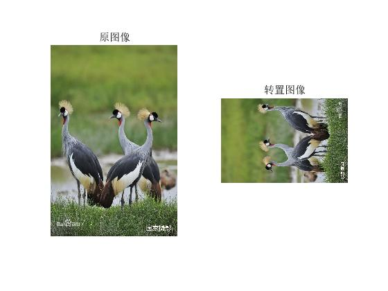
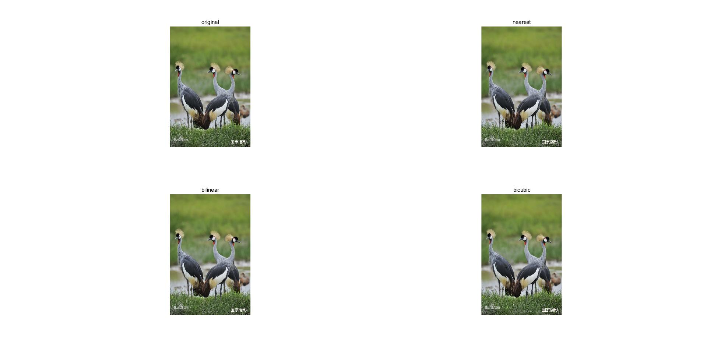
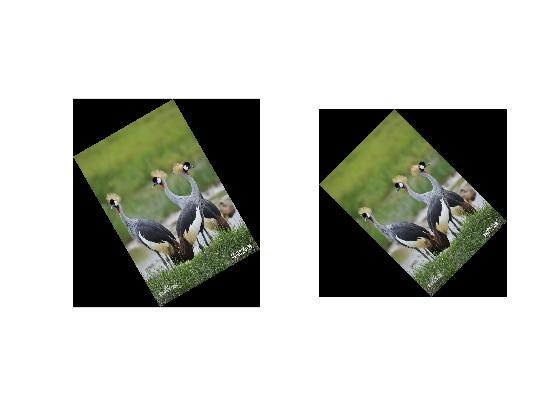

# 图像的几何变换

图像的几何变换是指不改变图像像素的前提下进行相对空间位置移动的一种处理方式。主要包括：平移变换，镜像变换，图像的转置，缩放和旋转等。

<!--truncate-->

## 图像几何变换基本理论

图像几何变换就是建立一种源图像像素与变换后的图像像素之间的映射关系。通过这种映射关系能够知道源图像任一像素变换后的坐标，或者变换后图像像素在原图像的坐标信息等。

变换公式可以是线性的，也可以是多项式的。只要给出图像任一像素的坐标，都可以通过映射关系获得几何变换后的像素坐标位置。这种输入到输出的过程称为`向前映射`。

+ *前向映射*

在使用向前映射处理图像的几何变换时还需要解决以下问题：

+ 浮点数坐标

  变换前，像素坐标是离散型非负整数表示的，变换后可能会产生浮点数坐标

+ 映射不完全和映射重叠

  + 映射不完全

    指输入图像的像素总数小于输出图像的像素总数，会使得输出图像的部分像素与原始图像没有映射关系。

  + 映射重叠

    图像缩小时会产生这个问题。

+ *后向映射*

解决了前向映射产生的问题。

由输出图像的坐标反过来推算该像素在源图像的坐标位置。在实际处理中运用后向映射来进行图像的几何变换。

后向映射的矩阵表示更好是向前映射的逆变换。


## 图像的平移变换

讨论dx、dy的值来确定复制关系：

+ dx>=width、dx<=-width、dy>=height或dy<=-height

  此时图像完全移出画布范围，不予处理。

+ dx<0

  此时左侧图像将被截去。一次从第|dx|个像素开始复制，复制图像宽度为width-|dx|

+ dx>0

  与上面相反

```
I = imread('2017-03-18-10.jpg');
I = double(I);
B = zeros(size(I));
H = size(I);
move_x = 100;
move_y = 150;
B(move_y +1:H(1),move_x+1:H(2),1:H(3))=I(1:H(1)-move_y,1:H(2)-move_x,1:H(3));
subplot(1,2,1),subimage(uint8(I))
title('原图像')
subplot(1,2,2),subimage(uint8(B));
title('平移变换')
```

> `...`操作符可以用来续写一行




图像形态学处理函数进行平移：
```
I = imread('2017-03-18-10.jpg');
se = translate(strel(1),[150 100]);
B = imdilate(I,se);
figure
subplot(1,2,1),subimage(I);
title('原图像');
subplot(1,2,2),subimage(B);
title('平移变换');
```
## 图像的镜像变换

分为两种：水平镜像和垂直镜像

1. 水平镜像变换

   x=width-x0-1

   y=y0

2. 垂直镜像变换

   x=x0

   y=height-y0-1

```
I = imread('2017-03-18-10.jpg');
[height,width,dim]=size(I);
%水平镜像变换
tform = maketform('affine',[-1 0 0;0 1 0;width 0 1]);
B = imtransform(I,tform,'nearest');
%垂直镜像变换
tform2 = maketform('affine',[1 0 0;0 -1 0;0 height 1]);
C = imtransform(I,tform2,'nearest');
subplot(1,3,1),imshow(I);
title('原图像');
subplot(1,3,2),imshow(B);
title('水平图像');
subplot(1,3,3),imshow(C);
title('垂直图像')
```



我们还可以参考图像平移中所使用的语法形式：

```
A = imread('2017-03-18-10.jpg');
A = double(A);
figure(1),imshow(uint8(A));
H = size(A);
figure(2),B(1:H(1),1:H(2),1:H(3))=A(H(1):-1:1,1:H(2),1:H(3));%垂直镜像
imshow(uint8(B));
figure(3),C(1:H(1),1:H(2),1:H(3))=A(1:H(1),H(2):-1:1,1:H(3));%水平镜像
imshow(uint8(C));
```

## 图像的转置

就是将图像像素的横坐标和纵坐标交换位置。可以看成水平镜像变换和旋转的组合，即陷阱性水平镜像变换，然后按逆时针旋转90°，转置操作会改变图像的大小，转之后图像的宽度和高度将互换。

```
I = imread('2017-03-18-10.jpg');
tform = maketform('affine',[0 1 0;1 0 0; 0 0 1));%定义转置矩阵
B = imtransform(I,tform,'nearest');
subplot(1,2,1),imshow(I)
title('原图像');
subplot(1,2,2),imshow(B)
title('转置图像');
```



## 图像的缩放

水平缩放系数和垂直缩放系数

实际运用缩放时，常常需要保持原始图像宽度和高度的比例，这种缩放不会使图像变性。

### 插值算法

主要用于处理几何变换中出现的浮点坐标像素。由于浮点数坐标是"插入"在整数坐标之间的，所以这种算法被称为"插值算法"。插值算法被广泛运用在图像的缩放、旋转、卷绕等变换中。

比较常见的插值算法有最临近插值法、双线性插值法和二次立方插值法等。一般，最邻近插值法效果最差。双线性插值法大大改善了放大图像的质量，避免了马赛克的产生，但是细节体现的同样不够；二次立方插值法效果最好，放大后的图像显得锐利清晰，图像细节较双线性插值法而言有了改善。

二次立方插值算法效果最好，运算时间最长；最邻近插值算法处理速度比后两者块上百倍甚至上千倍。

+ 最邻近插值算法

  也称零阶插值算法。浮点数坐标的像素等于离该点最近的输入图像像素值。

+ 双线性插值算法

  也称二次线性插值法。主要思想是计算出浮点坐标像素的近似值，从周围四个像素值入手，按照一定的比例混合，最终得到该浮点坐标的像素值。

  ```
  B = imread(A,scale,method);
  ```

  > A是待缩放的原始图像，scale是统一缩放的比例。可选参数method用于指定插值方法，在缺省时，使用最邻近插值法。

  ```
  I = imread('2017-03-18-10.jpg');
  A = imresize(I,1.5,'nearest');
  B = imresize(I,1.5,'bilinear');
  C = imresize(I,1.5,'bicubic');
  subplot(2,2,1),imshow(I),title('original');
  subplot(2,2,2),imshow(A),title('nearest');
  subplot(2,2,3),imshow(B),title('bilinear');
  subplot(2,2,4),imshow(C),title('bicubic');
  ```

  

  > 由于matlab显示图像时，会根据窗口进行缩放调整，可以在显示窗口单机"Data Cursor"按钮，在图像上选一点就可以显示出该点的详细信息。

  如果想要在水平垂直两个方向以不同比例进行缩放：

  ```
  B = imresize(A,[mrows nclos],method);
  ```

  > [mrows nclos]给出了变换后B的具体行高和列宽。


## 图像旋转


在MATLAB中可以调用函数`imtransform()`来实现图像旋转。但不是推荐的方法。推荐用专门的图像旋转函数`imrotate()`.


```
B = imrotate(A,angle,method,bbox);
```
> 其中A代表待旋转的原始图像，angle为旋转的角度，单位为度，如果指定一个正数，将按逆时针方向旋转图像。可选参数method为要使用的插值方法，在缺省时使用最邻近插值法。bbox也是可选的，缺省为`loose`,表示旋转后图像不会被截取，如果选择`crop`表示选择后图像大小将不会改变，超出边界部分会被截取。

```
I = imread('2017-03-18-10.jpg');
A = imrotate(I,30,'nearest');%旋转30°，最邻近插值
figure(1),imshow(A)
B = imrotate(I,45,'bilinear','loose');%旋转45°，二次线性插值，不截取
figure(2),imshow(B)
```




