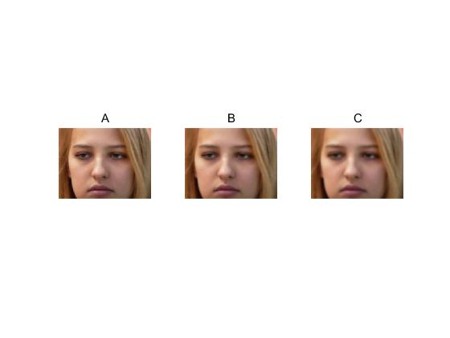
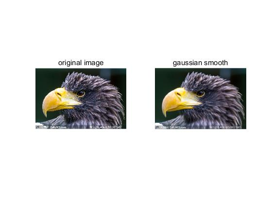
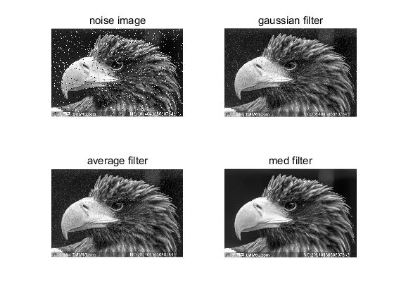
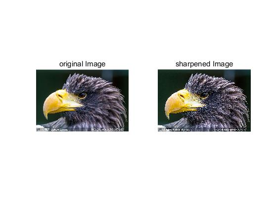
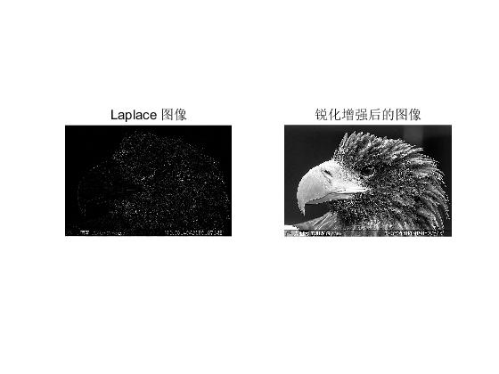

# MATLAB04图像的增强处理

两函数的傅里叶变换的乘积等于它们卷积后的傅里叶变换。

<!--truncate-->

图像增强的基本方法有空域处理和频域处理两种。图像的平滑处理是图像增强的典型应用，其主要任务是既平滑掉噪声，又尽量保持图像的细节；在频域处理中，噪声和图像的细节部分都位于高频，所以如何在低通滤波的同时保持高频细节是处理时要考虑的问题。

## 卷积积分与邻域处理

### 邻点和邻域

1. 图像是由像素构成的，图像中的相邻像素构成邻域，邻域中的像素点互为邻点。对于任意像素，处于上下左右四个方向的像素点称为它的4邻点；加上角里的4个像素，就称为它的8邻点。同样的也能定义它的24邻点。

   像素的邻域可以看做是像素邻点的集合，在图像处理中也将中心像素和它的特定邻点合称为邻域。一般划定使用正方形。如3x3邻域、5x5邻域等。

2. 邻域处理

   以包含中心像素的邻域为分析对象，处理得到的像素灰度来源于对邻域内像素灰度的计算。常用的邻域处理包括图像的平滑、图像的锐化、边缘检测。

3. 卷积和模板

   在对图像进行卷积运算时，原始数据与结果数据分开保存，对原始数据分块处理，在处理过程中保持原始数据不变，最终得到完整的结果数据。用卷积对图像进行处理时，改变对原始图像各部分的处理顺序不会对处理结果造成影响。

4. 卷积运算在处理中的使用

   图像的卷积运算实际上是通过模板在图像上的移动完成的。在图像处理中，不断在图像上移动模板的位置，每当模板中心对准一个像素时，就对此像素所在邻域内的像素灰度根据模板进行加权求和，得到的结果通常远大于原像素灰度，这就需要将球和结果除以一个比例因子(衰减因子)。最后将结果限制在0~255之间作为中心像素的灰度保存在结果中。

### 运用模板实现邻域处理

在图像处理中，使用模板进行邻域处理，本质上就是执行二维卷积计算。MATLAB中已经提供了执行二维卷积计算的函数`conv2()`,还有基于卷积的图像滤波函数`filter()`，两者是等价的。还有一个`imfilter()`直接对多维矩阵(RGB图像)进行空间滤波，而`filter2`只能处理二维矩阵(灰度图像)。另外`conv2`所得图像大小将会发生改变，`imfilter()`系统会自动执行对于图像四边像素的处理而保持大小不变。

```
g=imfilter(f,w,option1,option2,...)
```

> f是要进行滤波操作的图像，w是滤波操作所使用的模板。

+ 参数表

1、边界选项

| 合法值             | 含义                                     |
| --------------- | -------------------------------------- |
| `X`(X代表一个具体的数值) | 用固定数值X填充虚拟边界，在默认情况下用0填充                |
| `'symmetric'`   | 填充虚拟边界的内容是通过对靠近原始图像边缘的像素相对于原始图像边缘镜像得到的 |
| `'replicate'`   | 填充虚拟边界的内容总是重复它最近的边缘像素                  |
| `'circular'`    | 认为原始图像模式具有周期性，从而周期性地填充虚拟边界的内容          |

2、尺寸选项

| 合法取值     | 含义                     |
| -------- | ---------------------- |
| `'same'` | 输出图像g与输入图像f尺寸相同        |
| `'full'` | 输出图像g的尺寸为填充虚拟边界后图像f的尺寸 |

3、模式选项

| 合法取值     | 含义      |
| -------- | ------- |
| `'corr'` | 滤波过程为相关 |
| `'conv'` | 滤波过程为卷积 |

> 用于滤波的模板可以自定义，也可以使用系统预设的模板。此时与imfilter()相配合的另一个函数是`fspecial()`	,该函数用于创建一些预定义的二维滤波器(模板)来供imfilter()使用语法如下：


```
h = fspecial(type,parameters)
```

>type用于指定模板的类型，合法取值如下

参数取值表：

| 合法取值          | 功能描述             |
| ------------- | ---------------- |
| `'average'`   | 平均模板             |
| `'disk'`      | 圆形邻域的平均模板        |
| `'gaussian'`  | 高斯模板             |
| `'laplacian'` | 拉普拉斯模板           |
| `'log'`       | 高斯-拉普拉斯模板        |
| `'prewitt'`   | prewitt水平边缘检测滤波器 |
| `'sobel'`     | sobel水平边缘检测滤波器   |
| `'unsharp'`   | unsharp对比度增强滤波器  |

> 参数parameters为可选选项，是和指定的模板相关的配置参数，如尺寸大小或者标准差等。该函数的返回值h为一个特定的模板。

## 图像的简单平滑

图像的简单平滑是指通过邻域简单平均对图像进行平滑处理的方法，可以在一定程度上消除原始图像中的噪声、降低原始图像对比度的作用。

简单平滑模板：

| 1    | 1    | 1    |
| ---- | ---- | ---- |
| 1    | 1    | 1    |
| 1    | 1    | 1    |

> 选取9作为衰减因子，就可以很容易的实现图像的简单平滑。

```
i = imread('2017-03-20-1.jpg')
%注意w和h1这两个模板是等价的
w = [1 1 1;1 1 1;1 1 1]/9;
h1 = fspecial('average',[3,3]);
h2 = fspecial('average',[5,5]);
h3 = fspecial('average',[7,7]);
%执行图像的简单平滑
g1 = imfilter(i,w,'conv','replicate');
g2 = imfilter(i,h2,'conv','replicate');
g3 = imfilter(i,h3,'conv','replicate');

subplot(1,3,1),imshow(g1),title('A');
subplot(1,3,2),imshow(g2),title('B');
subplot(1,3,3),imshow(g3),title('C');
```



> 增大平滑临边长的方法可以消除更多的噪声影响，同时图像的对比度也下降很多。使用简单平滑的方法进行噪声下消除往往以大幅降低图像清晰度为代价。
>
> 简单平滑处理实质上并不能真正消除噪点，只是尽可能使人眼不易察觉到噪声的影响。

## 图像的高斯平滑

在图像的高斯平滑中，在对图像邻域进行平均时，不同位置的像素被赋予了不同的权值。

在图像处理中把对邻域像素逐一处理的算法过程称为滤波器。

平滑线性滤波器的工作原理是利用模板对邻域内像素灰度进行加权平均，因此平滑线性滤波器也被称为均值滤波器。平滑线性滤波器的衰减因子一般选用模板中所有权值的和，这样可以避免处理对图像整体属性的影响。

高斯模板上的权值是由高斯分布函数确定的。

```
i = imread('2017-03-20-3.jpg');
h = fspecial('gaussian',7,2);
g = imfilter(i,h,'conv');
subplot(121),imshow(i),title('original image');
subplot(122),imshow(g),title('gaussian smooth');
```



> 图像进行了7X7邻域高斯平滑处理的效果。标准差为2

## 图像的中值滤波

是一种非线性的图像处理方法，通过对邻域内像素按灰度排序的结果决定中心像素的灰度。

通过对采样窗口内的`奇数个像素`的灰度数值进行排序，并取出序列中位于中间位置的灰度作为中心像素的灰度。

简单平滑和高斯平滑都是讲噪声分摊到整个邻域中的每个像素，以此来减小噪声点的影响，然而代价是图像清晰度的大量损失。

中值滤波对消除离散型噪声点效果显著。

MATLAB中提供了用以实现中值滤波的函数medfilt2(),该函数 **只适用于处理灰度图片**

```
I2 = medfilt2(I1,[m n])
```

> I1是待处理图像的像素矩阵，m和n给出了中值滤波处理模板的大小，默认3x3。
>
> 中值滤波在处理某些噪声有很大优势：如椒盐噪声(脉冲噪声)，常由图像传感器、传输信道、解码处理产生的黑白相间的亮暗点噪声。

函数`imnoise()`来模拟图像受到噪声污染的过程：

```
J = imnoise(I,type,parameters);
```

> I 是原始图像，type指定了噪声的类型，合法取值是`gaussian` (高斯白噪声)或者`salt & papper`（椒盐噪声）.
>
> 高斯白噪声：如果噪声幅度服从高斯分布，就是高斯噪声，如果噪声功率谱密度是均匀分布的，则它是高斯白噪声。
>
> parameters控制噪声被加入的程度。如
>
> ```
> J = imnoise(I,'gaussian',m,v)
> ```
>
> > 表示对原始图像中每个像素叠加一个服从均值为m方差为v的高斯分布产生的随机噪声。

```
i = rgb2gray(imread('2017-03-20-3.jpg'));
i_noise = imnoise(i,'salt & pepper');
w1 = [1 2 1;2 4 2;1 2 1]/16;
output1 = imfilter(i_noise,w1,'conv','replicate');
w2 = [1 1 1;1 1 1;1 1 1]/9;
output2 = imfilter(i_noise,w2,'conv','replicate');
output3 = medfilt2(i_noise,[3,3]);

subplot(2,2,1),imshow(i_noise),title('noise image');
subplot(2,2,2),imshow(output1),title('gaussian filter');
subplot(2,2,3),imshow(output2),title('average filter');
subplot(2,2,4),imshow(output3),title('med filter');
```



> 中值滤波很好的解决了图像降噪的问题，然而对于细节较多的图像，中值滤波处理常常导致图像信息丢失。

## 图像的双边滤波

双边滤波是一种非线性滤波方法，是结合图像的空间邻近度和像素值相似度的一种折中处理，同时考虑了空域信息和灰度相似性，从而力求在保持图像中边缘信息的同时，又实现降噪效果。

在像素灰度过度和缓的区域，双边滤波有类似于高斯滤波的效果，而在图像边缘等梯度较大的地方，则有保持效果。

对彩色图像和灰色图像在计算灰度差距时计算方法不同。

```
function B = bfilter2(A,w,sigma)

%针对灰度图像或彩色图像选择应用不同的处理函数
if size(A,3) == 1
	B = bfltGray(A,w,sigma(1),sigma(2));
else
	B = bfltColor(A,w,sigma(1),sigma(2));
end

%对灰度图像进行双边滤波处理的函数

function B = bfltGray(A,w,sigma_d,sigma_r)

%计算高斯模板
[X,Y] = meshgrid(-w:w,-w:w);
G = exp(-(X.^2+Y.^2)/(2*sigma_d^2));

%进行双边滤波
dim = size(A);
B = zeros(dim);
for i = 1:dim(1)
	for j = 1:dim(2)
		%抽取一块局部区域，这与值域的大小相对应
		iMin = max(i-w,1);
		iMax = min(i+w,dim(1));
		jMin = max(j-w,1);
		jMax = min(j+w,dim(2));
		I = A(iMin:iMax,jMin:jMax);
		%计算该值域核，也就是灰度值的权值模板
		H = exp(-(I-A(i,j)).^2/(2*sigma_r^2));

		%计算双边滤波响应
		F = H.*G((iMin:iMax)-i+w+1,(jMin:jMax)-j+w+1);
		B(i,j) = sum(F(:).*I(:))/sum(F(:));
	end
end

%对彩色图像进行双边滤波处理的函数
function B = bfltColor(A,w,sigma_d,sigma_r)

%将输入的RGB图像转换到CIE颜色空间中
if exist('applycform','file')
	A = applycform(A,makecform('srgb2lab'));
else
	A = colorspace('Lab<-RGB',A);
end

[X,Y] = meshgrid(-w:w,-w:w);
G = exp(-(X.^2+Y.^2)/(2*sigma_d^2));
sigma_r = 100*sigma_r;

%进行滤波处理
dim = size(A);
B = zeros(dim);
for i = 1:dim(1)
	for j = 1:dim(2)
		iMin = max(i-w,1);
		iMax = min(i+w,dim(1));
		jMin = max(j-w,1);
		jMax = min(j+w,dim(2))
		I = A(iMin:iMax,jMin:jMax,:);

		dL = I(:,:,1)-A(i,j,1);
		da = I(:,:,2)-A(i,j,2);
		db = I(:,:,3)-A(i,j,3);
		H = exp(-(dL.^2+da.^2+db.^2)/(2*sigma_r^2));

		F = H.*G((iMin:iMax)-i+w+1,(jMin:jMax)-j+w+1);
		norm_F = sum(F(:));
		B(i,j,1) = sum(sum(F.*I(:,:,1)))/norm_F;
		B(i,j,2) = sum(sum(F.*I(:,:,2)))/norm_F;
		B(i,j,2) = sum(sum(F.*I(:,:,3)))/norm_F;

	end
end

% 将滤波结果转回RGB色彩空间
if exist('applycform','file')
	B = applycform(B,makecform('lab2srgb'));
else
	B = colorspace('RGB<-Lab',B);
end
```

调用上面的函数，对一副灰度图像进行双边滤波处理：

```
I = imread('2017-03-20-3.jpg');
I = double(I)/255;

w = 5;
sigma = [3 0.1];
B = bfilter2(I,w,sigma);
```

## 图像的拉普拉斯锐化

图像增强中，平滑是为了消除图像中的噪声干扰或降低图像对比度，与之相反的是为了增强图像的边缘和细节，需要对图像进行锐化以提高对比度。

图形的锐化：目的是提高图像的对比度。可以提高邻域内像素的会督查来提高图像的对比度。

像素锐化处理中，被增强的像素点应该是与邻域内其他像素有较大差异的，因此原始图像中灰度相同的区域不应受锐化处理的影响。

基本思想：当邻域的中心像素灰度值低于它所在邻域内其他像素的灰度的平均值时，此中心像素的灰度应被进一步降低；当邻域的中心像素灰度值高于它所在邻域内其他像素的平均灰度值时，此中心像素的灰度应被进一步提高，以此实现图像的锐化处理。

```
h = fspecial('unsharp',alpha)
```

> 以上代码返回一个3x3的unsharp对比度增强滤波器，其实就是一个Laplacian锐化模板。参数alpha用来控制拉普拉斯模板的形状，它的取值范围介于0.0和1.0之间。缺省时，alpha默认值是`0.2`.
>
> unsharp滤波器是一个用来锐化图像的算子。

```
I = imread('2017-03-20-3.jpg');
H = fspecial('unsharp');
sharpened = imfilter(I,H,'replicate');
subplot(121),imshow(I),title('original Image')
subplot(122),imshow(sharpened);title('sharpened Image')
```



> 拉普拉斯锐化还是噪声敏感的，任何细小的噪声点都会在处理结果中清晰地显示出来。

> 如果不使用unsharp 算子：imfilter()在识别所采用的的模板是unsharp算子时，其实所执行的操作并不仅仅是卷积，为了完成特普拉斯锐化，还需要与原始图像进行叠加，以下代码演示了其中的细小差别：

```
I = imread('2017-03-20-3.jpg');
I = rgb2gray(I);
Laplace=[0 -1 0;-1 4 -1;0 -1 0];
Data = double(I);
LaplaceImage=conv2(Data,Laplace,'same');
%上面这句也可以携程下面这种形式，作用是相同的。
%LaplaceImage=imfilter(Data,Laplace,'conv','same');
subplot(1,2,1);imshow(uint8(LaplaceImage));title('Laplace 图像');

%原始图像与拉普拉斯图像的叠加
DataLap = imadd(Data,LaplaceImage);
subplot(1,2,2),imshow(uint8(DataLap));
title('锐化增强后的图像');
```



> 图像的锐化是与平滑处理恰好相反的一种图像增强手段。

