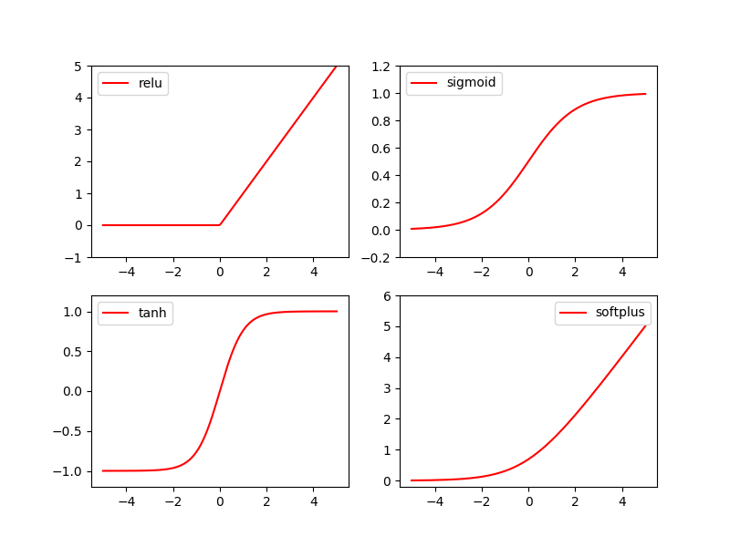

# 激励函数

$Y = AF(MX)$ ：AF即是激励函数。MX是线性函数，通过激励函数将线性函数转成非线性函数。

常用的激励函数有`relu`,`sigmoid`,`tanh`,`softplus`

下面画出激励函数。

<!--truncate-->


```python
import torch
import torch.nn.functional as F     # 激励函数都在这
from torch.autograd import Variable

# 做一些假数据来观看图像
x = torch.linspace(-5, 5, 200)  # x data (tensor), shape=(100, 1)
x = Variable(x)
```

> `torch.linspac(a,b,n)`: 分成`n-1`份，

接着就是做生成不同的激励函数数据:

```python
x_np = x.data.numpy()   # 换成 numpy array, 出图时用

# 几种常用的 激励函数
y_relu = F.relu(x).data.numpy()
y_sigmoid = F.sigmoid(x).data.numpy()
y_tanh = F.tanh(x).data.numpy()
y_softplus = F.softplus(x).data.numpy()
# y_softmax = F.softmax(x)  softmax 比较特殊, 不能直接显示, 不过他是关于概率的, 用于分类
```

接着我们开始画图, 画图的代码也在下面:

```python
import matplotlib.pyplot as plt  # python 的可视化模块, 我有教程 (https://morvanzhou.github.io/tutorials/data-manipulation/plt/)

plt.figure(1, figsize=(8, 6))
plt.subplot(221)
plt.plot(x_np, y_relu, c='red', label='relu')
plt.ylim((-1, 5))
plt.legend(loc='best')

plt.subplot(222)
plt.plot(x_np, y_sigmoid, c='red', label='sigmoid')
plt.ylim((-0.2, 1.2))
plt.legend(loc='best')

plt.subplot(223)
plt.plot(x_np, y_tanh, c='red', label='tanh')
plt.ylim((-1.2, 1.2))
plt.legend(loc='best')

plt.subplot(224)
plt.plot(x_np, y_softplus, c='red', label='softplus')
plt.ylim((-0.2, 6))
plt.legend(loc='best')

plt.show()
```

> `plt.figure()`作用新建绘画窗口,独立显示绘画的图片
>
> `plt.plot()`这个函数比较常用，就是默认一个参数下,就是y的坐标
>
> `plt.subplot()`这个比较重要,需要重点掌握,参数有r,c,n三个参数
>
> r            表示行数
>
> c            表示列行
>
> n            表示第几个
>
> `plt.show()`显示绘画的图像




> 参考:
>
> [莫烦python](https://morvanzhou.github.io/tutorials/machine-learning/torch/2-03-activation/)
