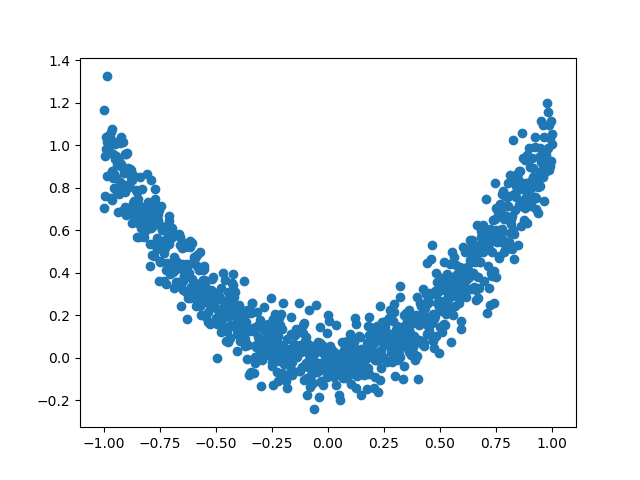
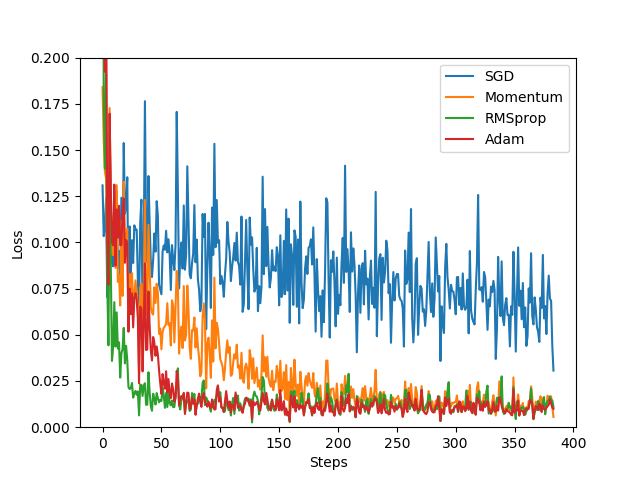

# Optimizer 优化器

这节内容主要是用Torch的几种优化器查看优化器效果。



<!--truncate-->


## 创建伪数据

```python
import torch
import torch.utils.data as Data
import torch.nn.functional as F
from torch.autograd import Variable
import matplotlib.pyplot as plt

torch.manual_seed(1)    # reproducible

LR = 0.01
BATCH_SIZE = 32
EPOCH = 12

# fake dataset
x = torch.unsqueeze(torch.linspace(-1, 1, 1000), dim=1)
y = x.pow(2) + 0.1*torch.normal(torch.zeros(*x.size()))

# plot dataset
plt.scatter(x.numpy(), y.numpy())
plt.show()

# 使用上节内容提到的 data loader
torch_dataset = Data.TensorDataset(data_tensor=x, target_tensor=y)
loader = Data.DataLoader(dataset=torch_dataset, batch_size=BATCH_SIZE, shuffle=True, num_workers=2,)
```


## 每个优化器优化一个神经网络

接下来在创建不同的优化器, 用来训练不同的网络. 并创建一个 `loss_func` 用来计算误差. 我们用几种常见的优化器, `SGD`, `Momentum`, `RMSprop`, `Adam`.

```Python
# 默认的 network 形式
class Net(torch.nn.Module):
    def __init__(self):
        super(Net, self).__init__()
        self.hidden = torch.nn.Linear(1, 20)   # hidden layer
        self.predict = torch.nn.Linear(20, 1)   # output layer

    def forward(self, x):
        x = F.relu(self.hidden(x))      # activation function for hidden layer
        x = self.predict(x)             # linear output
        return x

# 为每个优化器创建一个 net
net_SGD         = Net()
net_Momentum    = Net()
net_RMSprop     = Net()
net_Adam        = Net()
nets = [net_SGD, net_Momentum, net_RMSprop, net_Adam]
```

## 优化器Optimizer

``` python
# different optimizers
opt_SGD         = torch.optim.SGD(net_SGD.parameters(), lr=LR)
opt_Momentum    = torch.optim.SGD(net_Momentum.parameters(), lr=LR, momentum=0.8)
opt_RMSprop     = torch.optim.RMSprop(net_RMSprop.parameters(), lr=LR, alpha=0.9)
opt_Adam        = torch.optim.Adam(net_Adam.parameters(), lr=LR, betas=(0.9, 0.99))
optimizers = [opt_SGD, opt_Momentum, opt_RMSprop, opt_Adam]

loss_func = torch.nn.MSELoss()
losses_his = [[], [], [], []]   # 记录 training 时不同神经网络的 loss
```


## 训练/出图

```python
for epoch in range(EPOCH):
    print('Epoch: ', epoch)
    for step, (batch_x, batch_y) in enumerate(loader):
        b_x = Variable(batch_x)  # 务必要用 Variable 包一下
        b_y = Variable(batch_y)

        # 对每个优化器, 优化属于他的神经网络
        for net, opt, l_his in zip(nets, optimizers, losses_his):
            output = net(b_x)              # get output for every net
            loss = loss_func(output, b_y)  # compute loss for every net
            opt.zero_grad()                # clear gradients for next train
            loss.backward()                # backpropagation, compute gradients
            opt.step()                     # apply gradients
            l_his.append(loss.data[0])     # loss recoder
```


## 画图代码
``` python
labels = ['SGD', 'Momentum', 'RMSprop', 'Adam']
for i, l_his in enumerate(losses_his):
    plt.plot(l_his, label=labels[i])
plt.legend(loc='best')
plt.xlabel('Steps')
plt.ylabel('Loss')
plt.ylim((0, 0.2))
plt.show()
```




`SGD` 是最普通的优化器, 也可以说没有加速效果, 而 `Momentum` 是 `SGD` 的改良版, 它加入了动量原则. 后面的 `RMSprop` 又是 `Momentum` 的升级版. 而 `Adam` 又是 `RMSprop` 的升级版. 不过从这个结果中我们看到, `Adam` 的效果似乎比 `RMSprop` 要差一点. 所以说并不是越先进的优化器, 结果越佳. 我们在自己的试验中可以尝试不同的优化器, 找到那个最适合你数据/网络的优化器.

参考:[莫烦python](https://morvanzhou.github.io/tutorials/machine-learning/torch/3-06-optimizer/)
