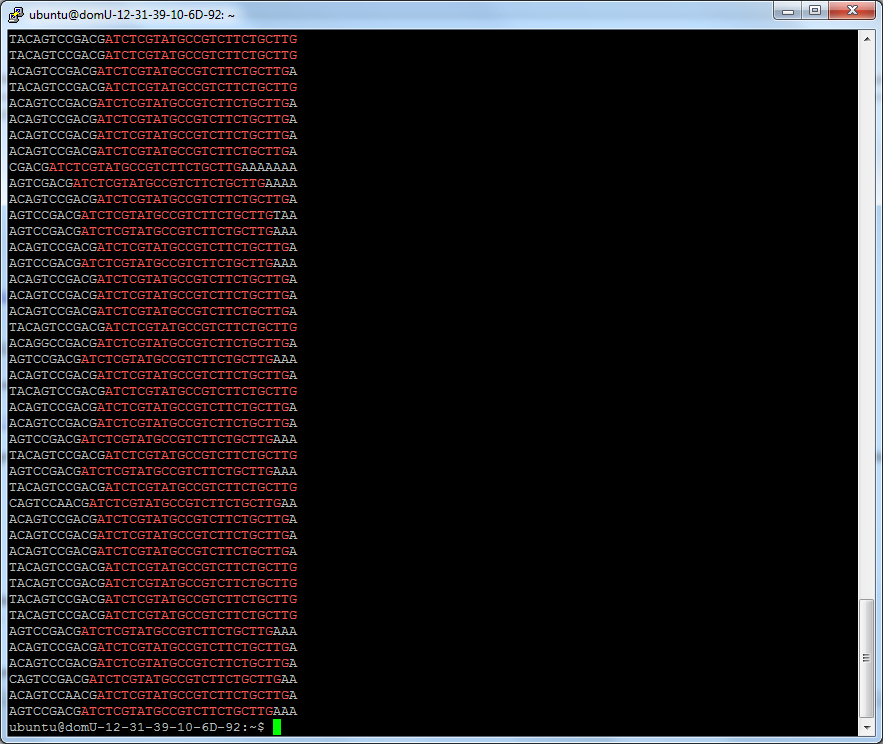

闲着翻译一个[文章]
FastQC报告的adapter
更深入了解一下adapter
究竟何去除掉adapter污染呢？
<!--truncate-->

# Adapter and quality trimming of illumina data

闲着翻译一个[文章](http://www.ark-genomics.org/events-online-training-eu-training-course/adapter-and-quality-trimming-illumina-data)

## part1 : FastQC报告的adapter

> 从之前的结果，查看过表达的序列，可以看到`fastqc`认为我们数据中存在下面的：

+ Illumina PCR Primer Index 1
+ RNA PCR Primer, Index 47
+ Illumina Single End Adapter 2
+ Illumina Paired End PCR Primer 2

这些序列是啥？Illumina 以PDF文件的形式提供这些序列，你必须注册www.illumina.com并获取它。我在这里提供如下：

```
>PCRPrimerIndex1
CAAGCAGAAGACGGCATACGAGATCGTGATGTGACTGGAGTTC
>RNAPCRPrimerIndex47
CAAGCAGAAGACGGCATACGAGATCTTCGAGTGACTGGAGTTCCTTGGCACCCGAGAATTCCA
>IlluminaSingleEndAdapter2
CAAGCAGAAGACGGCATACGAGCTCTTCCGATCT
>PEPCRPrimer2.0
CAAGCAGAAGACGGCATACGAGATCGGTCTCGGCATTCCTGCTGAACCGCTCTTCCGATCT
```

可以看到，这些序列之间有很多共同点。

FastQC实际使用的列表存放在**`/usr/share/java/fastqc-0.10.1/Contaminants/contaminant_list.txt`**

我们也应该考虑反向互补的序列，因为FastQC会同样查找它们。

```
>PCRPrimerIndex1_RC
GAACTCCAGTCACATCACGATCTCGTATGCCGTCTTCTGCTTG
>RNAPCRPrimerIndex47_RC
TGGAATTCTCGGGTGCCAAGGAACTCCAGTCACTCGAAGATCTCGTATGCCGTCTTCTGCTTG
>IlluminaSingleEndAdapter2_RC
AGATCGGAAGAGCTCGTATGCCGTCTTCTGCTTG
>PEPCRPrimer2.0_RC
AGATCGGAAGAGCGGTTCAGCAGGAATGCCGAGACCGATCTCGTATGCCGTCTTCTGCTTG
```

现在我透露给你一个小秘密——

> 这个数据集**实际**使用的adapter 是：

```
>SmallRNA3pAdapter_1.5
ATCTCGTATGCCGTCTTCTGCTTG
```

如果我们再看FastQ报的反向互补的adapter,我们可以看到(空格分开的后面是adapter)：

```
>PCRPrimerIndex1_RC
GAACTCCAGTCACATCACG   ATCTCGTATGCCGTCTTCTGCTTG
>RNAPCRPrimerIndex47_RC
TGGAATTCTCGGGTGCCAAGGAACTCCAGTCACTCGAAG   ATCTCGTATGCCGTCTTCTGCTTG
>IlluminaSingleEndAdapter2_RC
AGATCGGAAGAGCTCGTATGCCGTCTTCTGCTTG
>PEPCRPrimer2.0_RC
AGATCGGAAGAGCGGTTCAGCAGGAATGCCGAGACCG   ATCTCGTATGCCGTCTTCTGCTTG
```

所以，我们需要了解：

+ FastQC可以告诉我们adapter 的污染，但 可能不会告诉我们正确的adapter
+ 确定我们数据中出现的adapter可能需要更深入的工作

一个策略即是问产生这些数据的科学家，但有时他们也不知道。


---

## 更深入了解一下adapter：

我们看一下adapter:

```shell
cd

zcat SRR026762.fastq.gz | head -n 20000 | grep ATCTCGTATGCCGTCTTCTGCTTG
```



如果你够敏感，你将会注意到，我们adapter 边上也是一个重复序列：

```
TACAGTCCGACG   ATCTCGTATGCCGTCTTCTGCTTG
TACAGTCCGACG   ATCTCGTATGCCGTCTTCTGCTTG
TACAGTCCGACG   ATCTCGTATGCCGTCTTCTGCTTG
TACAGTCCGACG   ATCTCGTATGCCGTCTTCTGCTTG
```

结果证明是这事Small RNA sequencing primmer 的一部分：

```
>SmallRNASequencingPrimer
CGACAGGTTCAGAGTTCTACAGTCCGACGATC
```

我们把两个结合起来，得到：

```
CGACAGGTTCAGAGTTCTACAGTCCGACGATC                             <- Small RNA Primer
                 TACAGTCCGACGATCTCGTATGCCGTCTTCTGCTTG        <- Our read(s)
                             ATCTCGTATGCCGTCTTCTGCTTG        <- Small RNA 5' adapter
```

(原文解释很清楚)Essentially, what is happening here, is that **during the small RNA library prep stage, small RNA fragments are selected. ** This inevitable ends up with a huge amount of "primer-dimer" i.e. where the Illumina primers/adapters have no actual product between them.

## 究竟何去除掉adapter污染呢？

### 1）使用cutadapt 去除adapter

cutadapt 是一个专门去除NGS数据adapter的工具。查看详细帮组，输入`cutadapt -h`

因为我们数据中有很多接头，我们运行cutadapt 来去除它们。命令是：

```shell
cutadapt -a CGACAGGTTCAGAGTTCTACAGTCCGACGATC \
         -a TACAGTCCGACGATC \
         -a ATCTCGTATGCCGTCTTCTGCTTG \
         -e 0.1 -O 5 -m 15 \
         -o SRR026762_adaprm.fastq SRR026762.fastq.gz 
```

参数意义：

+ `-a CGACAGGTTCAGAGTTCTACAGTCCGACGATC`  : 第一个去除的adapter , 这是一个small RNA primer.
+ `-a TACAGTCCGACGATC `: 第二个去除的adapter，这是我们观察到的Small RNA primer 
+ `-a ATCTCGTATGCCGTCTTCTGCTTG`: 第三个去除的adapter, 这是全长的Small RNA 5' adapter
+ `-e 0.1`: 允许read 和 adapter之间，每10个允许一个错配。
+ `-O 5`:  至少有5个碱基的重叠
+ `-m 15`: trimming 之后，小于15bp的reads将被扔掉
+ `-o SRR026762_adaprm.fastq `： 把trimmer data 放到这个文件里。

程序的输出是这样的：

```
Maximum error rate: 10.00%
   Processed reads: 5677631
     Trimmed reads: 1927223 ( 33.9%)
   Total basepairs:    204394716 (204.4 Mbp)
 Trimmed basepairs:     41594144 (41.6 Mbp) (20.35% of total)
   Too short reads: 1016544 ( 17.9% of processed reads)
    Too long reads: 0 (  0.0% of processed reads)
        Total time:    287.36 s
     Time per read:      0.05 ms

=== Adapter 1 ===

Adapter 'CGACAGGTTCAGAGTTCTACAGTCCGACGATC', length 32, was trimmed 333 times.

Lengths of removed sequences
length  count   expected
5       331     5544.6
7       1       346.5
10      1       5.4

=== Adapter 2 ===

Adapter 'TACAGTCCGACGATC', length 15, was trimmed 52873 times.

Lengths of removed sequences
length  count   expected
5       93      5544.6
6       1121    1386.1
7       1082    346.5
8       7       86.6
9       2       21.7
10      3       5.4
11      2       1.4
>=17    50563   0.1

=== Adapter 3 ===

Adapter 'ATCTCGTATGCCGTCTTCTGCTTG', length 24, was trimmed 1874017 times.

Lengths of removed sequences
length  count   expected
5       322     5544.6
6       90      1386.1
7       162     346.5
8       20      86.6
9       132     21.7
10      384     5.4
11      1257    1.4
12      4026    0.3
13      10585   0.1
14      33836   0.0
15      84695   0.0
16      104889  0.0
17      86715   0.0
18      77590   0.0
19      121253  0.0
20      199881  0.0
21      182110  0.0
22      205659  0.0
23      184010  0.0
24      232069  0.0
25      137080  0.0
>=26    207252  0.0
```

可以看到，超过33% 的reads有某种形式的adapter.  之后超过17% 的reads 小于15bp被丢弃了。结果在**SRR026762_adaprm.fastq**中。

> 作业问题：

How many reads are in SRR026762_adaprm.fastq?

Can you think of a combination of **cat**, **paste **and **awk **that would print out a column of sequence lengths?

Can you think of how you might add **sort**, and **uniq -c** to count how many there are of each length?


### 2）使用sickle 基于quality 来trim reads

如我们所见，Illumina reads (别的其他技术同样如此)的质量到reads结束逐渐下降。当我们错误的把它们组装进基因组，或者用它们call SNP， 将需要将这些低质量的bases 去除。我们推荐使用`sickle`，一个quality trimmer, 并支持paired-end 模式。

> 支持paired-end 模式是什么意思

双端测序是我们对一个长的DNA片段进行从两端进行测序。所以我们知道这些paired-reads 来自同一个片段，另外他们应该离得多远，这当我们来比对和组装它们时非常有用。最常见的表现是是有两个区域，第一个包含`read 1`, 第二个包含`read 2`. 因此，第一个文件中的第一个read 和 第二个文件中的第一个read 是成对的，第二个reads 和 第二个成对等。

> 这有什么用

需要维持在每个文件中的reads 的顺序。如果我们从一个文件中去除了一个read，因为它低质量或者包含adapter, 我们也必须去除另一个文件中对应的read. `Sickle`这样做的很好，但不幸的是`cutadapt`不这样干。

> 输入

`sickle`

`sickle se`

`sickle pe`

这将显示每个命令的帮助信息。 我们trimmed adapters 的这个microRNA 数据是单端的测序文件，因此我们可以通过下面命令trim:

```shell
sickle se -f SRR026762_adaprm.fastq -t sanger -o SRR026762_adaprm_trim.fastq -q 30 -l 15
```

> 参数的含义

+ `se`: 使用单端模式
+ `-f SRR026762_adaprm.fastq` : 这事输入的fastq文件
+ `-t sanger`: 质量编码方式。所有从EBI 或者 NCBI 下载的应该是`sanger`编码的。 可通过下面检查解释：<http://en.wikipedia.org/wiki/FASTQ_format#Encoding>
+ `-o SRR026762_adaprm_trim.fastq` : 输出文件
+ `-q 30` : 使用的质量值。低于这个分数的reads将会被trimmed 掉，使用一个滑动窗口
+ `-l 15`: 在trim之后允许的最小长度，这里我们去除小于15bp的reads

> 输出会像这个：

```
FastQ records kept: 2622021
FastQ records discarded: 2039066
```

如你所见，丢弃了很多reads. 

*Try trimming using a lower quality value (e.g. 20) - how many reads are kept then?*

*Try allowing shorter reads to be kept (e.g. 10bp) - how many reads are kept then?*

> 那trim paired reads 会怎么样？我们在**training**文件夹下有：

```shell
ubuntu@domU-12-31-39-10-6D-92:~$ ls -l training/rnaseq/*.fastq.gz
-rw-rw-r-- 1 ubuntu ubuntu 65721000 Oct  5  2011 training/rnaseq/ERR022486_chr22_read1.fastq.gz
-rw-rw-r-- 1 ubuntu ubuntu 62899231 Oct  5  2011 training/rnaseq/ERR022486_chr22_read2.fastq.gz
-rw-rw-r-- 1 ubuntu ubuntu 41417843 Oct  5  2011 training/rnaseq/ERR022488_chr22_read1.fastq.gz
-rw-rw-r-- 1 ubuntu ubuntu 39405527 Oct  5  2011 training/rnaseq/ERR022488_chr22_read2.fastq.gz
```

我们trim 这些reads的命令是：

```shell
sickle pe -f training/rnaseq/ERR022486_chr22_read1.fastq.gz \
          -r training/rnaseq/ERR022486_chr22_read2.fastq.gz \
          -t sanger \
          -o ERR022486_chr22_read1_trim.fastq \
          -p ERR022486_chr22_read2_trim.fastq \
          -s ERR022486_chr22_single_trim.fastq \
          -q 30 -l 15
```

> 参数的解释

+ `pe`: 使用双端模式
+ `-f training/rnaseq/ERR022486_chr22_read1.fastq.gz ` : read1 的fastq文件
+ `-r training/rnaseq/ERR022486_chr22_read2.fastq.gz`： read2 de fastq 文件
+ `-t sanger`：质量编码方式。所有从EBI 或者 NCBI 下载的应该是`sanger`编码的。 可通过下面检查解释：<http://en.wikipedia.org/wiki/FASTQ_format#Encoding>
+ `-o ERR022486_chr22_read1_trim.fastq`： 从read1 的文件中trimmed之后的输出文件
+ `-p ERR022486_chr22_read2_trim.fastq`：从read2 的文件中trimmed之后的输出文件
+ `-s ERR022486_chr22_single_trim.fastq`： 不符合质量检测或长度检测的成对的reads.
+ `-q 30`trimming 之后，小于15bp的reads将被扔掉
+ `-l 15`在trim之后允许的最小长度，这里我们去除小于15bp的reads

> 输出结果看起来是这样：

```
FastQ paired records kept: 1357006 (678503 pairs)
FastQ single records kept: 118391 (from PE1: 89173, from PE2: 29218)
FastQ paired records discarded: 106702 (53351 pairs)
FastQ single records discarded: 118391 (from PE1: 29218, from PE2: 89173)
```

*What happens if you set a quality threshold of 20?*

*What happens if you set the length threshold at 10?  At 0?*


现在我们完成了！现在你可以trim adapters 并评估单端或双端的Illumina data 的质量。

如果你有更多的空闲时间，你可以登录EBI European Nucleotide Archive, 下载并练习你的新技能(<http://www.ebi.ac.uk/ena/data/view/SRP008449>)