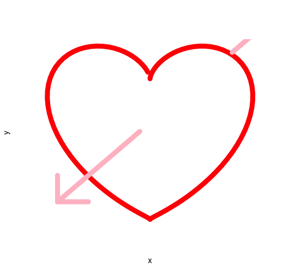

<!--truncate-->

```R
a <- seq(0,6,by=0.05)
x<- 10* (sin(a)^3)
y <- 10 * cos(a) - 3*cos(2*a) - 2*cos(3*a)
plot(x,y)

# suggested update from @jokereumers on Twitter:
plot(x,y, type = 'l', col = 'red', lwd = 10, axes = FALSE)

# more updates from @BioMickWatson
plot(x,y, type = 'l', col = 'red', lwd = 10, axes = FALSE)
lines(-9:-1, -9:-1, col="pink", lwd=10)
lines(8:10, 8:10, col="pink", lwd=10)
lines(rep(-9,4), -9:-6, col="pink", lwd=10)
lines(-9:-6, rep(-9,4), col="pink", lwd=10)
```

You're welcome ;)

转自 [here](http://www.ark-genomics.org/events-online-training/r-geeks-valentines-day)
