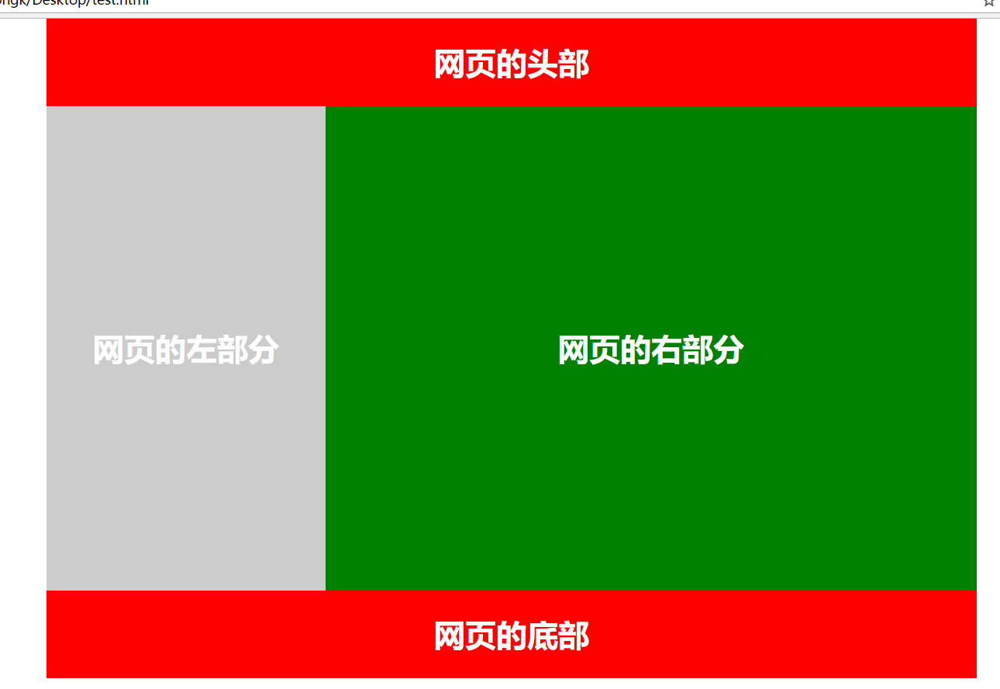

+ 图像标记
+ 超链接
+ 表格:可以用来进行简单网页布局

<!--truncate-->

# HTML与CSS02

## 图像标记

``图像标记:

``

**！注意**
+ `img`为单标记，不需要使用`</img>`闭合
+ 在加载图像文件的时候，文件的路径或者文件名格式错误，将无法加载图片。

### ``标记的几种属性
1. `src属性`:作用：指定我们要加载的路径和图片的名称以及图片格式。

2. `width属性`：指定图片的宽度，单位是`px,em,cm,mm`

   > px：像素
   >
   > em：通常1em=16px
   >
   > width="10%":可以用百分比表示宽度，表示占`富集容器`的宽度。也就是浏览器宽度的百分之十。

3. `height`属性：指定图片的高度，单位`px,em,cm,mm`

4. `border`属性：指定图片的边框宽度，单位`px,em,cm,mm`

5. `alt`属性：三个作用：
   + 当网页上的图片被加载完成后，鼠标移动到上面去，会显示这个图片指定的属性文字。
   + 如果图像没有下载或者加载失败，会用文字来代替图像显示
   + 搜索引擎可以通过这个属性的文字来抓取图片

## 超链接

### 1. 基本语法
`<a href="" target="打开方式" name="页面锚点名称">链接文字或者图片</a>`

### 2. 属性

1. href属性：链接的地址，链接的地址可以是一个网页，也可以是一个视频、图片、音乐等

2. target属性：定义超链接的打开方式

   + 在一个**新的窗口**中打开链接`_blank`
   + 在**当前窗口**中打开链接`_seif`（默认值）
   + 在**父窗口**中打开页面(框架中使用较多)`_parent`
   + 在**顶层窗口**中打开文件(框架中使用较多)`_top`

3. name属性：指定页面的锚点名称

   可以通过锚点，让网页跳转到指定位置。

   + 锚点的设定：`<a name="锚点名称1"></a>`
   + 跳转位置：`<a href="#锚点名称1">跳转到锚点名称1</a>`

#### 点图片跳转外链：
```
<a href="https://www.baidu/com">

</a>
```


## 表格:可以用来进行简单网页布局

### 1. `<table>`标记

1. 基本格式

   ```
   <table 属性1="属性值1" 属性2="属性值2"......>表格内容</table>
   ```

2. `table标记`的属性

   1. `width`属性：表示**表格的宽度**，其值可以使像素(px)也可以是父级元素的百分比(%)
   2. `height`属性：表示**表格的高度**，其值可以是像素(px)也可以是富集元素的百分比(%)
   3. `border`属性：表示**表格外边框的宽度**
   4. `align`属性：（默认是left）表示**表格的对齐**！而不是表格里面的内容的对齐。
      + `left`居左显示
      + `center`居中显示
      + `right`居右显示
   5. `cellspacing`属性：**单元格之间的间距**，默认是2px，单位是像素
   6. `cellpadding`属性：单元格**内容与单元格边框**的显示距离，单位是像素
   7. `frame`属性：控制表格边框**最外层的四条线框**
      + 属性值：
        1. `void`(默认值)：表示无边框
        2. `above`：表示仅顶部有边框
        3. `below`：表示仅有底部边框
        4. `hsides`：表示仅有顶部边框和底部边框
        5. `lhs`：表示仅有左侧边框
        6. `rhs`：表示仅有右侧边框
        7. `vsides`：表示仅有左右侧边框
        8. `box`：包含全部4个边框
        9. `border`：包含全部4个边框
   8. rules属性:**作用**：控制是否以及如何显示**单元格之间的分割线**
      1. none(默认值)：表示无分割线
      2. all：包括所有分割线
      3. rows：表示仅有行分割线
      4. clos：表示仅有列分割线
      5. groups：表示仅在行组和列组之间有分割线

### 2. `<caption>`标记：需要标题时使用

如何正确的使用：`<caption>`属性的插入位置，直接位于`<table>`属性之后，`<tr>`表格行之前。
`caption`的属性：`align`
`align`的值：

1. `top`：标题放在表格的上部
2. `bottom`：标题放在表格的下部
3. `left`：标题放在表格的左部
4. `right`：标题放在表格的右部

### 3. `<tr>`标记

**定义表格的一行**，对于每个表格行，都是由一对`<tr>...</tr>`标记表示，每一行`<tr>`标记内可以嵌套多个`<td>`或者`<th>`标记。

可选属性：

1. `bgcolor`属性：设置背景颜色

   `bgcolor`="颜色值",如`#ccc`是好看的灰色

2. `align`属性：设置垂直方向对齐方式

   `align="值"`

   + `bottom:`靠顶端对齐
   + `top`：靠底部对齐
   + `middle`：居中对齐

3. `valign`属性：设置水平方向对齐方式

   `valign`="值"

   + `left`：靠左对齐
   + `right`：靠右对齐
   + `center`：居中对齐

### 4. `<td>和<th>`

1. `<td>`和`<th>`都是单元格的标记，必须嵌套在`<tr>`标签内，是**成对出现**的。
2. 两者的区别：
   + `<th>`是**表头标记**，通常位于首行或者首列，<th>中的文字默认会被加粗，而<td>不会
   + `<td>`是**数据标记**，表示该单元格的具体数据
3. 共同之处：两者的标记属性都是一样的
4. 属性：
   + `bgcolor`：设置单元格背景
   + `align`：设置单元格对齐方式
   + `valign`：设置单元格垂直对齐方式
   + `width`：设置单元格宽度
   + `height`：设置单元格高度
   + `rowspan`：设置单元格所占行数
   + `colspan`：设置单元格所占列数

### 5. 课后实战：制作一个简单的网页布局

```
<!DOCTYPE html>
<html>
<head>
	<title>制作简单网页布局</title>
	<meta charset="utf-8">
</head>
<body topmargin="0">
	<table align="center" border="0" width="960" cellspacing="0" cellpadding="0">
	 <tr height="90" bgcolor="red" align="center"><td><font size="6" color="white"><b>网页的头部</b></font></td></tr>
    <tr><td>
	  <table bgcolor="yellow" height="500" width="30%" align="left">
	   <tr align="center"><td><font size="6" color="white"><b>网页的左部分</b></font></td></tr>
	  </table>
	  <table bgcolor="green" height="500" width="70%" align="right">
	   <tr align="center"><td><font size="6" color="white"><b>网页的右部分</b></font></td></tr>
	  </table>
	</td></tr>
    <tr height="90" bgcolor="red" align="center"><td><font size="6" color="white"><b>网页的底部</b></font></td></tr>
	</table>
</body>
</html>
```

> 注`topmargin="0"` 是为了让表格与页面最上方没有空白。
>
> 要是想让左边没有空白使用`leftmargin="0"`

效果展示：


