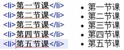
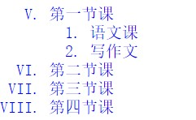
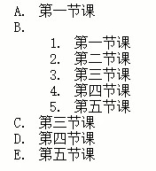
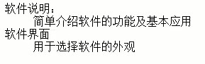

**目标**

1. HTML部分：掌握HTML的全部语法，它的`主体结构`，`超链接`及`常用标记`的使用
2. CSS部分:掌握`CSS三种选择器`的使用,明白如何使用`DIV+CSS`进行网页布局，搞清楚`浮动问题`.
3. HTML的语法、HTML的基本结构、文档设置标记

<!--truncate-->


# HTML和CSS基础01:HTML语法及基本结构、文档设置标记

from 麦子学院

## 一、HTML的语法

1. 什么是HTML标记语言：表示网页信息的符号标记语言。
+ 特点

>可以设置文本的格式，
>可以创建列表
>可以插入图像和媒体
>可以创建表格
>超链接可以使用鼠标点击超链接实现页面之间的跳转。

2.HTML的标记和其他属性：

+ HTML文档的保存格式：`html`,`htm`,`xhtml`
+ 标记和被标记的内容构建出HTML文档 

 **格式:**
 ```
 <标记>
 内容
 </标记>
 ```
+ **标记的属性：**
>标记的属性就是用来控制我们的内容（图像，文本等）如何显示

**格式 ：** 
```
<标记 属性1=属性值 属性2=属性值… …>
内容
</标记>
```

>如：`<body bgcolor="red">内容</body>`,控制网页背景颜色。

3. 语法不区分字母大小写

`<HTML>`,`<Html>`,`<html>`都是定义相同的标记，但是在编写时**尽量使用小写。**

4. 文档注释

注释一段内容时，使用:

```
<!--这几个字将不会在网页中显示-->
```

5. 代码格式

> 空格键和回车键在网页中都不会起到任何作用，为了让代码清晰易读，可以使用空格和回车键进行编排。

**！注意：**缩进时为了保持严格的规则，以“Tab”键进行缩进！
**!**无论有多少个回车，都会被替换成一个空格。

6. **字符实体**

*什么是字符实体？*比如我们想在网页上显示一个`<`,但`<`在HTML中是文档标记的开始标记。所以需要其他实体名称代替。

**注意！**：实体名称对大小写敏感！

| 显示结果 | 描述            | 实体名称            | 实体编号      |
| ---- | ------------- | --------------- | --------- |
|      | 空格            | `&nbsp;`        | `&#160;`  |
| <    | 小于号           | `&lt;`          | `&#60;`   |
| >    | 大于号           | `&gt;`          | `&#62;`   |
| &    | 和号            | `&amp;`         | `&#38;`   |
| "    | 引号            | `&quot;`        | `&#34;`   |
| '    | 撇号            | `&apos;`(IE不支持) | `&#39;`   |
| ￠    | 分（cent）       | `&cent;`        | `&#162;`  |
| £    | 镑（pound）      | `&pound;`       | `&#163;`  |
| ¥    | 元（yen）        | `&yen;`         | `&#165;`  |
| €    | 欧元（euro）      | `&euro;`        | `&#8364;` |
| §    | 小节            | `&sect;`        | `&#167;`  |
| ©    | 版权（copyright） | `copy;`         | `&#169;`  |
| ®    | 注册商标          | `&reg;`         | `&#174;`  |
| ™    | 商标            | `&trade;`       | `&#8482;` |
| ×    | 乘号            | `&times;`       | `&#215;`  |
| ÷    | 除号            | `&divide;`      | `&#247;`  |


## 二、HTML的基本结构

### 1. `<html>内容</html>`
+ 解释：HTML文档的文档标记，也称为HTML开始标记
+ 功能：这对标记分别位于网页的最前端和最后段：`<html>`在最前端表示`网页的开始`,`</html>`在最后端表示网页的结束。

### 2. `<head>内容</head>`
+ 解释：HTML文件头标记，也称为HTML头信息开始标记
+ 功能：用来包含文件的基本信息，比如网页的`标题`，`关键字`，在`<head></head>`内可以放`<title></title>`,`<meta></meta>`,`<style></style>`等标记
  **!注意：**在`<head></head>`标记内的内容不会再浏览器中显示.

### 3. `<title>内容</title>`
+ 解释：HTML文件标题标记
+ 功能：网页的“主题”，显示在浏览器的窗口的左上边
  **!注意：**网页的标题不能太长，要短小精悍，能具体反应页面的内容，`<title></title>`标记中不能包含其他标记。

### 4. `<body>内容</body>`
+ 解释：HTML文档的主题标记
+ 功能：`<body>内容</body>`是网页的主体部分，在此标记之间可以包含如`<p></p>`,`<h1></h1>`,`<br>`,`<hr>`等标记，正是由这些内容组成了我们所看见的网页。

+ body标记常见属性：

```
<!--bgcolor 设置背景颜色-->
<body bgcolor=”red”></body>

<!--text 设置文本颜色-->
<body text=”green”></body>

<!--link 设置链接颜色-->
<body link=”blue”></body>

<!--vlink 设置访问了的链接颜色-->
<body vlink=”yellow”></body>

<!--alink 正在被点击的链接颜色-->
<body alink=”red”></body>
```

### 5. `<meta>`属性
+ 解释：页面的元信息(meta-information)

+ 功能：提供有关页面的`元信息(meta-information)`,比如**针对搜索引擎和更新频度的描述和关键词**。

+ **必须的属性**：`content`. 值：some_text, 定义name属性相关的元信息
  常见的属性：`name`

+ 常用的name属性:

```
<!--author-->
<!--keywords-->
<!--description-->
<!--others-->

<meta name="keywords" content="这是一个学习笔记博客">
```

>**!注意：**`meta标记`必须放在`head元素`里面。

```
<html>
    <head>
        <title>第二节课</title>
        <meta charset="UTF-8">
        <meta name="keywords" content="这是学习笔记blog">
    </head>
  
    <body bgcolor="white" text="blue" link="red" vlink="gray" alink="blue">
      
    <!--这里是注释-->
        <h1>这是一个内容的标题</h1>
        <a href="http://www.baidu.com">百度</a>
    </body>
</html>
```

## 三、文档设置标记

### 1. 几种常见格式标记

1. `<br>`:`强制换行标记`：让后面的文字、图片、表格等显示在下一行。

 >`<br>`是`单标记`，只需要在后面加个斜线即可换行：`<br/>`

2. `<p>这是新的一段</p>`: `换段落标记`：换段落。

 >由于多个空格和回车在HTML会被等效为一个空格，所以HTML中换段落要用`<p>`,**`<p>`段落中也可以包含`<p>`段落！**

3. `<center>`:`居中对齐标记`，让段落或者是文字相对于父标记居中显示。

4. `<pre>一些  字符串</pr>`:`预格式化标记`，就是显示原始字符串.

5. `<li>`:`列表项目标记`，和ul或ol配合使用.单独用`<li>`效果如下：

 

6. `<ul>`:无序列表标记:列表前面为小圆点.效果类似上图。

 ```
 <ul>
 <li>第一节课</li>
 <li>第二节课</li>
 </ul>
 ```

7. `<ol>`:有序列表标记，可以显示特定的一些顺序.

* 最简单的用法：类似上图，只是小圆点变成了数字`1、2、3、4...`

```
<ol>
<li>第一节课</li>
<li>第二节课</li>
</ol>
```
+ `ol` 和`li `都可以跟符号类型。格式：

```
<ol type=”符号类型”>
<li type=”符号类型”></li>
<li type=”符号类型”></li>
</ol>
```

> 有序列表的`type属性值`
> `1:阿拉伯数字`1,2,3等，默认type属性值
> `A:大小写字母`A/B/C等
> `a:a/b/c`等
> `I:大写罗马数字`等
> `i:小写罗马数字`等

+ `value`：制定一个新的序列数字起始值.

如下显示编号从罗马5到9

```
<ol type="I">
<li value=5>第一节课</li>
<li>第二节课</li>
<li>第三节课</li>
<li>第四节课</li>
</ol>
```

 显示结果：
 

+ 列表可以进行嵌套

 

8. `<dl><dt><dd>`定义型列表：

 适用场合：**对列表条目进行简短的说明.**

 格式：`<dt>,<dd>`都是在`dl`里面的。
```
<dl>
	<dt>软件说明：</dt>
		<dd>简单介绍软件的功能及基本应用</dd>
	<dt>软件界面：</dt>
		<dd>用于选择软件的外观</dd>
</dl>
```
 

9. <hr>水平分割线标记，

10. <div>分区显示标记，也称为层标记。
  常用来编排一大段的HTML段落，也可以用于格式化表，和<p>很相似。
  层可以多层嵌套使用。用CSS渲染的时候就很方便了。


### 2. 文本标记

1. `hn` 标题标记：共有6个级别，n的范围1~6，不同级别对应大小不同的标题，h1最大。`<h2>标题</h2>`
2. `font`字体设置标记：设置字体的格式。
   三个常用属性：
+ size(字体大小) `<font size="3">`取值范围1~7,浏览器默认是3，
+ color(颜色) `<font color="red">`
+ face(字体) `<font face="微软雅黑">`

```
<font size=7 color="red" face="宋体">这是大字号<font>
```
3. `b`粗字体标记`<b>这是粗体</b>`
4. `i`斜体字
5. `sub`文字下标字体标记 `2<sub>2</sub>`
6. `sup`文字上标字体标记
7. `tt`打印机字体标记
8. `cite`引用方式的字体，通常是`斜体`。
9. `em`表示强调，通常显示为`斜体字`。
10. `strong`表示强调，通常显示为`粗斜体字`。
11. `small` 小型字体标记,会比正常字体小一号，可以嵌套。`<small><small>这是1号字体</small></small>`，但到了最小就不会再小了。
12. `big`同上。
13. `u`下划线字体标记。

