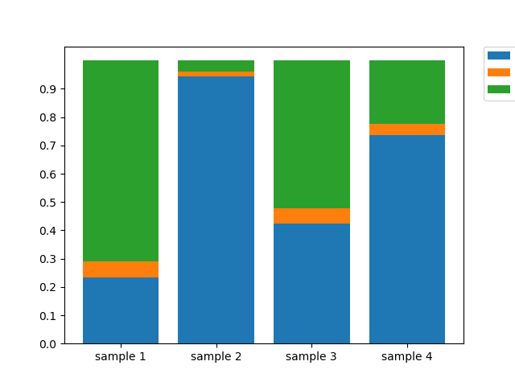

+ Python柱状图📊

<!--truncate-->


# python 数据可视化之柱状图


```python
#!/usr/bin/env python3
# -*- coding: utf-8 -*-
"""
Created on Mon Sep 18 17:30:04 2017

@author: kaigedong
"""

import numpy as np
import matplotlib.pyplot as plt


# x = np.array(["H9 stable","FB stable","H9 4sU 120min","FB 4sU 120min"])

x = np.arange(4)
a = np.array([2.12, 19.05, 4.4, 8.78])
b = np.array([0.51, 0.38, 0.56, 0.46])
c = np.array([6.42, 0.77, 5.4, 2.68])


plt.bar(x, a, label="A")
plt.bar(x, b, bottom=a, label="B2")
plt.bar(x, c, bottom=a + b,label="B1")

plt.xticks(x, ("sample 1","sample 2","sample 3","sample 4"))
plt.yticks(np.arange(0, 24, 2))
plt.legend(loc="best")
plt.show()

'''
for x,y in zip(x,a):
    plt.text(x , y/2 , '%.0f' % y, ha='center', va= 'bottom',fontsize=7)
'''

plt.bar(x, a/(a+b+c), label="A")
plt.bar(x, b/(a+b+c), bottom=a/(a+b+c), label="B2")
plt.bar(x, c/(a+b+c), bottom=(a + b)/(a+b+c),label="B1")

plt.xticks(x, ("sample 1","sample 2","sample 3","sample 4"))
plt.yticks(np.arange(0,1,0.1))
plt.legend(loc=2, bbox_to_anchor=(1.05,1.0),borderaxespad = 0.)
plt.show()
```

