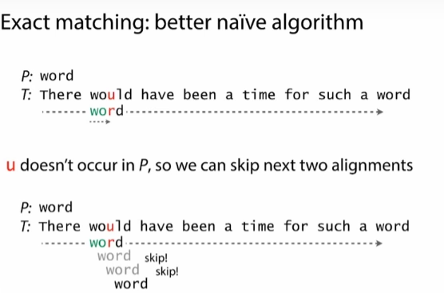
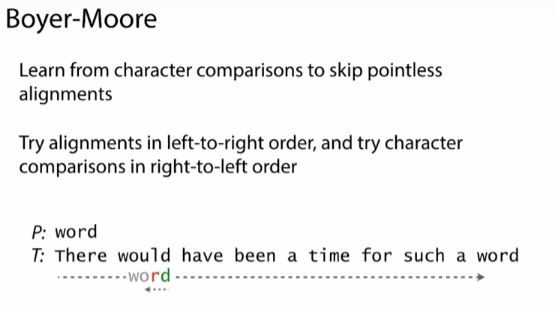
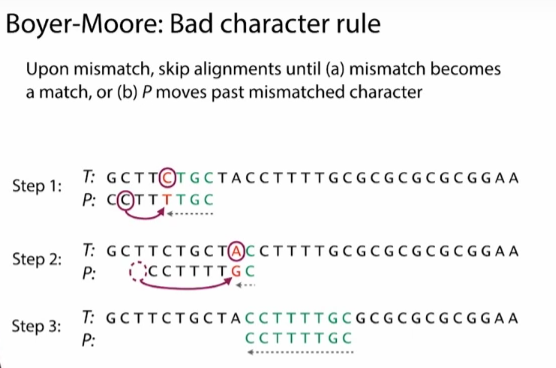
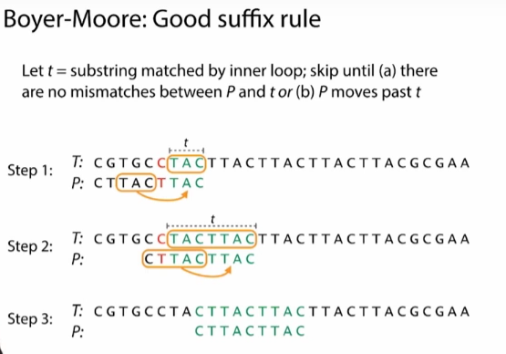

+ 简单序列比对
+ 基础Boyer-Moore算法

<!--truncate-->


# 陈巍学基因A04-A06

## A04 简单序列比对


在这个实践中，会写一个(碱基)完全匹配的算法，并用它把人工做出来的read比对到基因组上。

首先先下载一个PhiX生物体(PhiX是一种噬菌体)的基因组开始：

```
wget --no-check https://d28rh4a8wq0iu5.cloudfront.net/ads1/data/phix.fa
```


```
#encoding:utf-8
def readGenome(filename):
    genome = ''
    with open(filename,'r') as f:
        for line in f:
            if not line[0] == '>':
                genome += line.rstrip()
    return genome

genome = readGenome('phix.fa')

#p作为read，t作为基因组
def naive(p,t):
    occurrences = []
    for i in range(len(t) - len(p) + 1):
        match = True
        for j in range(len(p)):
            if not t[i+j] == p[j]:
                match = False
                break
        if match:
            occurrences.append(i)
    return occurrences
 
t = 'AGCTTAGAtAGC'
p = 'AG'
print(naive(p,t))
 
 
# 从genome中随机产生子序列
import random
def generateReads(genome,numReads,readLen):
    '''Generate reads from random positions in the given genome.'''

    reads = []
    for _ in range(numReads):
        start = random.randint(0,len(genome)-readLen) - 1
        reads.append(genome[start : start+readLen])
    return reads

reads = generateReads(genome,100,100)

numMatched = 0
for r in reads:
    matches = naive(r,genome)
    if len(matches)>0:
        numMatched +=1

print("%d / %d reads matched exactly!" % (numMatched,len(reads)))
```

## A05 简单序列比对法的效率

> 实际进行比较的次数与可能比较次数的最小值接近

## A06 基础Boyer-Moore算法

> 跟上面定义的naive算法接近，但可以跳过很多不必要的比较，是算是精确比较算法中的标杆了，应用十分广泛



> 由于u没有在`P`中出现过，所以，我们直接跳过U！
>
> 而Boyer-Moore算法将这个规则应用到最大限度。


1. Try alignments in left-to-right order,and try character comparisons in right-to-left order
   

2. Bad character rule：当我们遇到错配(mismatch)时,我们移动P，直到错配变成匹配
   用坏字规则有2步，这也是用Boyer-Moore算法的规则之一，
   

3. 好后缀规则：让`t`等于内部循环中，匹配的子字符串
   > 好字规则是针对我们能够匹配上的字符的，我们要移动P，移动的结果，是不会把匹配的，变成错配的

   

> 坏字符规则把不匹配的转到匹配的，好后缀规则试图把匹配上，保持匹配的状态，让它不要变成错配的。


