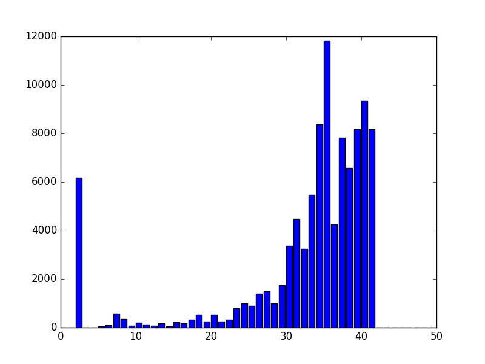
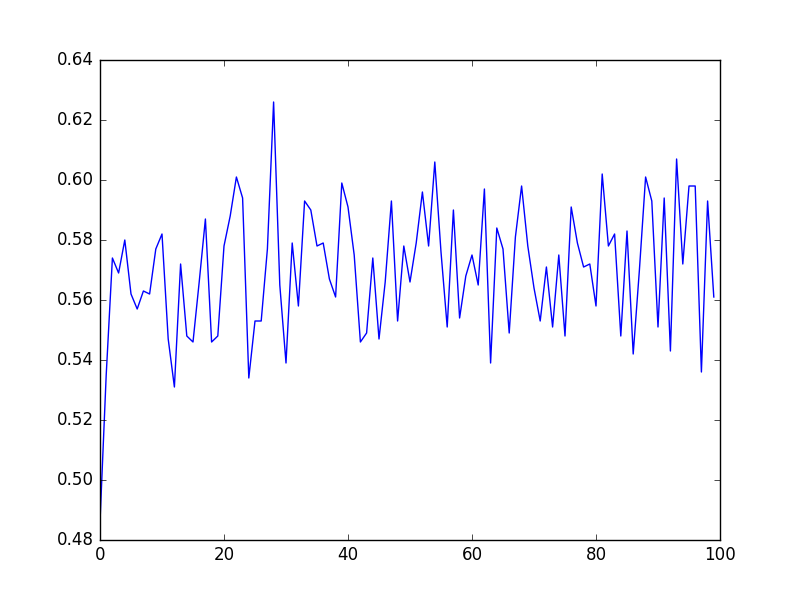

噬菌体基因组简单探究

<!--truncate-->

# 陈巍学基因A01-A03

## A01：查看基因组的信息


> 下载一个噬菌体的基因组


> wget --no-check https://d28rh4a8wq0iu5.cloudfront.net/ads1/data/lambda_virus.fa

```
#encoding:utf-8
def readGenome(filename):
    genome = ''
    with open(filename,'r') as f:
        for line in f:
            if not line[0] == '>':
                genome += line.rstrip()#rstrip是去除跟在字符串后面的空白
    return genome

genome = readGenome('lambda_virus.fa')

print("the length of 噬菌体genome is:\n")
print(len(genome))

#统计碱基个数

counts = {'A':0,'C':0,'T':0,'G':0}
for base in genome:
    counts[base] += 1

print(counts)

####使用模块计算####
#Counter会遍历字符串中的每个字符，并且对每个字符出现次数进行计数

import collections
t=collections.Counter(genome)

print(t)
```

## A02: 查看fastq 的信息

>对于fastq文件，可以看到以四行为单位，
>第一行以@符号开头，这是一个tag，是个哪个序列的名字。
>第二行是DNA碱基的字符串
>第三行是+号
>第四行是read的质量序列

>下载一个fastq：
>wget --no-check https://d28rh4a8wq0iu5.cloudfront.net/ads1/data/SRR835775_1.first1000.fastq

```
#encoding:utf-8

#将测序的结果及测序的质量分别放到俩数组里
def readFastq(filename):
    sequences = []
    qualities = []
    with open(filename) as fh:
        while True:
            fh.readline()
            seq = fh.readline().rstrip()
            fh.readline()
            qual = fh.readline().rstrip()
            if len(seq) == 0:
                break
            sequences.append(seq)
            qualities.append(qual)
    return sequences,qualities

seqs,quals = readFastq('SRR835775_1.first1000.fastq')

#将phred 33 编码转成数值的质量分数
def phred33ToQ(qual):
    return ord(qual) - 33

def createHist(qualities):
    hist = [0] * 50
    for qual in qualities:
        for phred in qual:
            q = phred33ToQ(phred)
            hist[q] += 1
    return hist

h = createHist(quals)

# 使用matplotlib(一个Python上的图形化工具)来做(可视化)

import matplotlib as mpl
mpl.use('Agg')
import matplotlib.pyplot as plt
plt.bar(range(len(h)),h)
plt.savefig('1.png')
```

> 将phred 33 编码的值转成质量分数,也就是测序质量,将ASCII字符转变成质量分数
> ord函数取一个字符，并把该字符的ASCII值编程数值
> print(phred33ToQ('#')) #得到2，说明测序质量很低。可信度比较低。
> 错误的可能性大概有30~32%,且'#'多出现在read的末尾，说明督导read的末尾时，确信度会下降
>
> 最低为2，最高为44



> 从图形结果来看，分值为2的很多，说明这一部分是质量比较差的，可能原因是这一部分的碱基发出的荧光是四种颜色的混合，比较难确认。

### matplotlib小代码
```
import matplotlib as mpl
mpl.use('Agg')
import matplotlib.pyplot as plt
plt.bar(range(len(h)),h)
plt.savefig('1.png')
```

> 必须关闭上个图形设备才能保存新画的图形：
```
fig = plt.figure(0) # 新图 0
plt.savefig() # 保存
plt. close(0) # 关闭图 0
```
或者
```
fig = plt.figure() # 新图 0
plt.savefig() # 保存
plt.close('all') # 关闭图 0
```


## A03：按碱基位置分析GC含量

不同的物种会有不同的GC含量，把整个read的GC做成图形，来看测序中是否有什么strange的事情发生。  



> 图的GC含量大概60~80% 

```
import collections
 count = collections.Counter()
 for seq in seqs:
     count.update(seq)
 print(count)
```

> Counter({'G': 28742, 'C': 28272, 'T': 21836, 'A': 21132, 'N': 18})
>
> 有一些N：当碱基判读程序对一个碱基的判读很不确定时，它就会读成"N"

