+ 应用Boyer-Moore的规则
+ 把参考基因组做成索引

<!--truncate-->

# 陈巍学基因A07-A09

## A07：应用Boyer-Moore 二规则

我们需要联合使用`坏字规则`和`好后缀规则`。只要碰到错配，我们就要同时使用这2个规则。两个规则都会告诉我们需要跳过的次数，我们只要选择最大的进行跳过就行了。

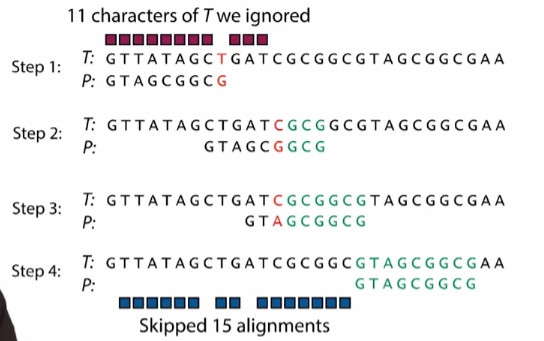

实际在实施Boyer-Moore算法时，要预先建一个查询表，这样每当我们要用任何一个规则时，就到这个表里去查找可以跳多少步。做这个表格只需要模式P而不需要文本T。好后缀，坏字都需要创建表格。

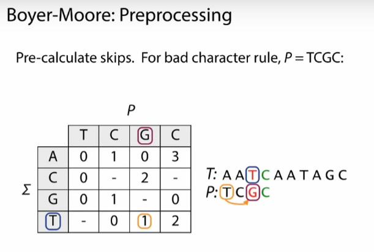

## A08：

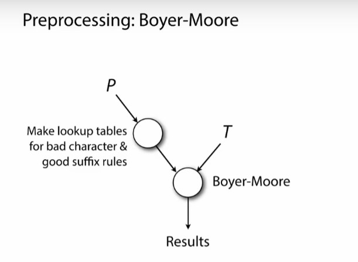

预处理可能会花费较多的时间，但均摊到每次比对，消耗就比较少了。

同样的，我们可以`预处理T`，解决重复比对的问题。

把文本`T`进行预处理版本的算法，叫做`离线算法(offline algorithm)`，而不处理文本的算法，被称为`online`。在线算法还是离线算法，与我们是否预处理P无关。区别在于，是否预处理文本T

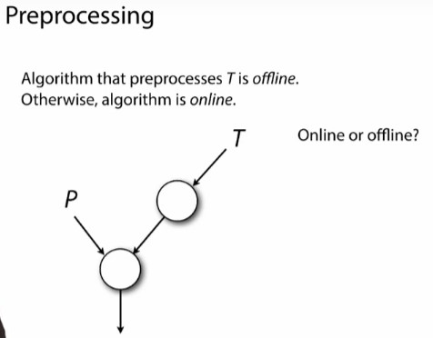

+ naive算法是在线算法，还是离线算法？在线。naive算法完全不做任何预处理。
+ Boyer-Moore算法是在线还是离线？在线。只对P进行了预处理。
+ Web search engine？离线算法。
+ Read alignment 基因序列比对问题？离线算法

## A09：把参考基因组做成索引

把参考基因组看成是一本书，我们可以给书加上索引。当想查找某个单词，直接看索引就行了。是根据字母进行排序的。

另一个例子：到杂货店买牛奶，找到奶制品，再找牛奶。是按照分类进行排序的。

+ 做一个长度为5的子字符串的偏移值串的索引。在一张表中，放下所有`K-mer`的偏移量。

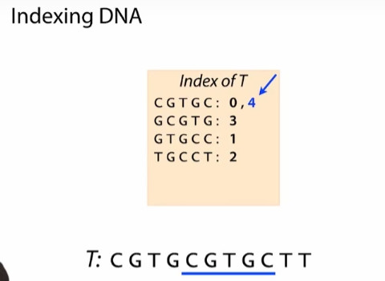

关于第二个3，是按照字典顺序，将第三个索引插到了0和1之间。

关于第一行的4，是添加一个新的值。

做好索引：

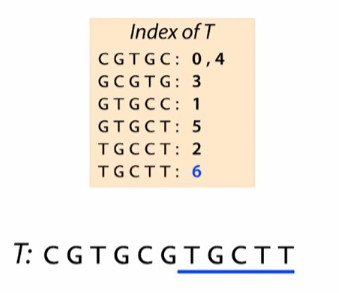

我们用`K-mer:substring of length K`用`K-mer`来指代长度为`K`的子字符串。对于长度为5的子字符串，我们说`5-mer`。

+ 如何查询这个索引？query the index

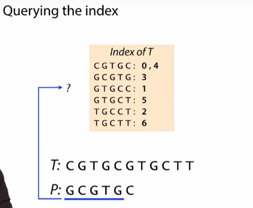

> 我们找到了3

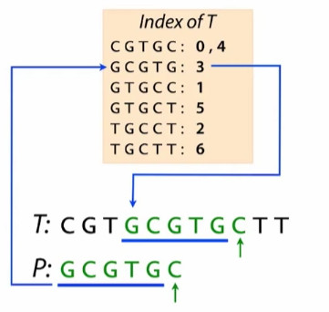

> 下一步验证第六个碱基是否与T相同。相同，我们可以得出结论，P在T偏移3个碱基的位置。

+ 同样的，我们也可以从右边开始进行查询：

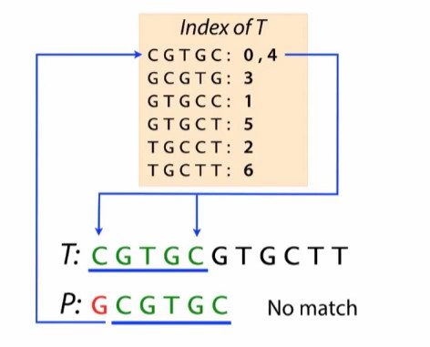

> 当查询到偏移为0的时候，由于0左边没有碱基，不能与P的第一位match，所以查询失败。
>
> 在查询偏移值为4：match！

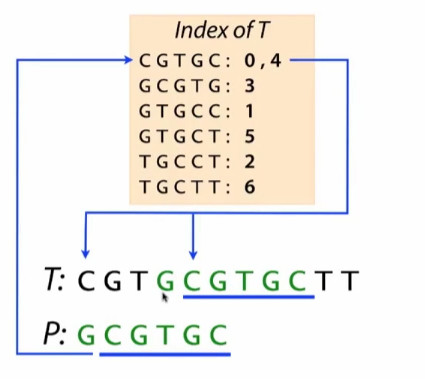

> 说明在使用该模式时，用哪个`5-mer`并不重要，它们中的任何一个都会引导出正确的P和T匹配的偏移值。

+ 一个修改的例子：修改后P不再match T。

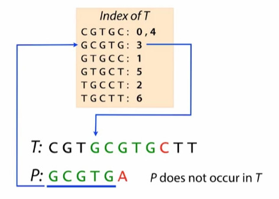

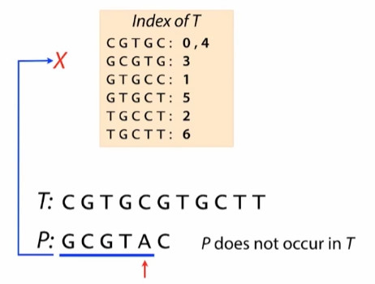

定义index 相匹配为`hit`，`hit`说明有可能match ，也有可能不match。

