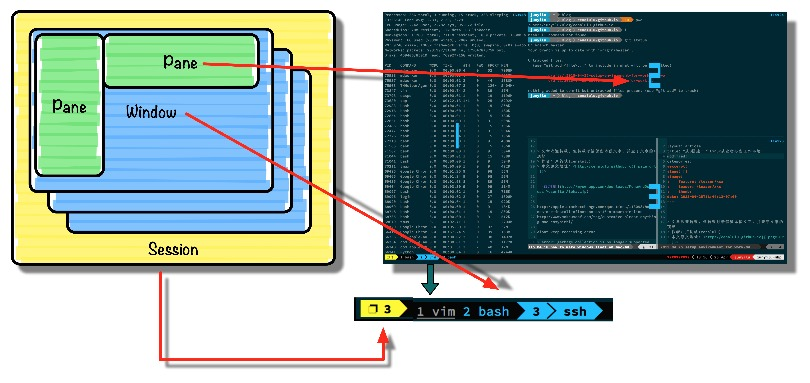
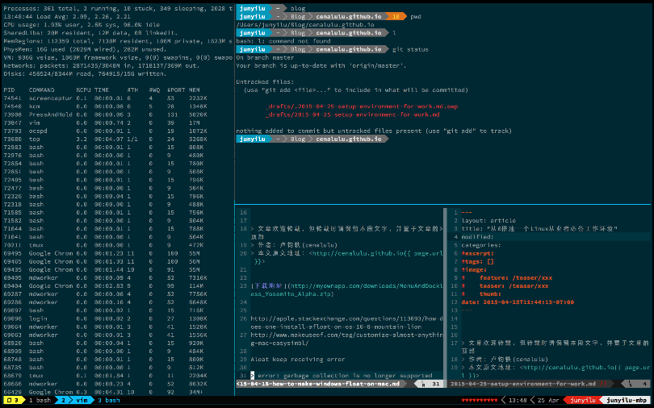

tmux的基本操作

在 tmux 之外如何进行控制

在 tmux 中直接控制

高效的结对编程

调整 Tmux 以增强其同 Vim 的集成度

<!--truncate-->


## tmux基本概念

tmux的主要元素分为三层：




- Session 一组窗口的集合，通常用来概括同一个任务。session可以有自己的名字便于任务之间的切换。
- Window 单个可见窗口。Windows有自己的编号，也可以认为和ITerm2中的Tab类似。
- Pane 窗格，被划分成小块的窗口，类似于Vim中 C-w +v 后的效果。


可以看到Session总在tmux的左下角显示, 而Window也会在最下方以一种Tab的形式展现。每个window都有自己的需要，也会以当前活动进程的名字命名。而Pane就比较好理解，即把单个窗口分割成若干个小块后的元素。

## tmux的基本操作

Prefix-Command前置操作：所有下面介绍的快捷键，都必须以前置操作开始。tmux默认的前置操作是`CTRL+b`。例如，我们想要新建一个窗体，就需要先在键盘上摁下`CTRL+b`(有些电脑是`CTRL+A`)，松开后再摁下n键。

> 建议修改为`ctrl + a` 更好按。若要将快捷键前缀变更为 Ctrl-a ，请将以下配置加入到 Tmux 的配置文件 `~/.tmux.conf` 中：
> ```
> unbind C-b
> set -g prefix C-a
> ```


只列出**常用重要命令**


### 在 tmux 之外如何进行控制

+ `session ` 会话： session是一个特定的终端组合。输入`tmux`就可以打开一个新的session.
  - `tmux new -s blog` : 创建一个叫做blog的tmux session
  - `tmux ls` : 列出所有的 session
  - `tmux attach -t blog` ：重新开启叫做`blog`的 tmux session


### 在 tmux 中直接控制

直接通过默认前缀` CTRL + b` 之后输入对应命令来操作，具体如下（这里只列出输入默认前缀之后需要输入的操作）：

>  会话基本操作

- `d`  脱离当前会话,可暂时返回Shell界面
- `s`  选择并切换会话；在同时开启了多个会话时使用
- `$`  重命名当前Session

> 窗口操作

- `c` 创建新窗口
- `&` 关闭当前窗口
- `[0-9]` 数字键切换到指定窗口

> 面板操作

- `"` 将当前面板上下分屏
- `%` 将当前面板左右分屏
- `x` 关闭当前分屏
- `o` 选择当前窗口中下一个面板
- `方向键` 移动光标选择对应面板
- `z` 最大化当前所在面板

因为 iTerm2 的支持，很多切换的操作可以直接用鼠标进行，非常方便。具体大家可以自己尝试一下。

## tmux的一些个性化定制

如果希望做一些美化和个性化配置的话，建议使用[gpakosz的tmux配置](https://github.com/gpakosz/.tmux)。它的本质是一个tmux配置文件，实现了以下功能：

- 基于powerline的美化
- 显示笔记本电池电量
- 和Mac互通的剪切板
- 和vim更相近的快捷键

安装方式也很简单如下 (注意：如果想使用powerline美化需要先安装powerline。

可达到如图效果：



```shell
# 安装美化
pip install powerline
$ cd
$ rm -rf .tmux
$ git clone https://github.com/gpakosz/.tmux.git
$ ln -s .tmux/.tmux.conf
$ cp .tmux/.tmux.conf.local .
```

## 高效的结对编程

你可以将 Tmux 会话的地址分享给他人，这样他们就可以通过 SSH 接入这个会话了。由于会话是建立在 SSH 之上的，所以不会产生额外的开销。通过使用高速的互联网，对于那些连接到远程会话上的用户而言，他们会觉得这个会话就是运行在本地的。

### 在Tmux 中使用 Tmate

Tmate 是一个 Tmux 的管理工具，使用它不但能够轻松地创建 Tmux 会话而且还能够通过互联网把该会话共享给其他人。若要使用 Tmate 共享 Tmux 会话，请按照以下步骤操作：

```shell
# 安装 Homebrew

> $ ruby -e "$(curl -fsSL https://raw.githubusercontent.com/Homebrew/install/master/install)"

# 安装 Tmate

brew update &&brew tap nviennot/tmate &&
brew install mate

# 使用 Tmate 开启一个新的会话

tmate
```

从 Tmux 的会话中复制由 Tmate 产生的 SSH URL。请注意屏幕下方的信息`“[tmate] Remote session: ssh …”：`

利用刚刚复制下来的 URL 就可以邀请其他人通过 SSH 访问你的会话了。

了解了如何利用 Tmux 的结对编程功能之后，还可以再利用您所喜爱的运营商提供的语音服务进一步加强会话交互性。

### 调整 Tmux 以增强其同 Vim 的集成度

#### 调整背景的配色方案

当我第一次通过 Tmux 打开 Vim 时，我发现 Vim 的颜色没有正确显示。只有有字符的地方才有背景色。

这个问题是因为通过 Tmux 运行 Vim 需要配置一个特殊的终端参数（term parameter）。请将下面这行配置添加以你的 ~/.vim 文件中。

```shell
if exists('$TMUX')
set term=screen-256color
endif
```

> 在更新了配置文件 ~/.vimrc 以后，颜色应该就可以正确显示了。

#### 调整光标的形状

在默认情况下，当通过 Tmux 运行 Vim 时，无论当前 Vim 是处于插入模式、可视模式还是其他模式，光标的形状都是一样的。这样就很难判断当前的 Vim 模式是什么。若要避免这个问题，就需要让 Tmux 通知 iTerm 更新光标的形状。为此，需要将以下配置加入到文件 ~/.vimrc 中。


```shell
if exists('$ITERM_PROFILE')
if exists('$TMUX')
let &amp;t_SI = "<Esc>[3 q"
let &amp;t_EI = "<Esc>[0 q"
else
let &amp;t_SI = "<Esc>]50;CursorShape=1x7"
let &amp;t_EI = "<Esc>]50;CursorShape=0x7"
endif
end

```

#### 调整粘贴时的文本缩进

在 Vim 中粘贴文本时可能会遇到这样的问题，有时文本的缩进会发生变化，特别是在粘贴大量的文本时，这个问题会更加明显。虽然可以通过在粘贴前执行 :set nopaste 来解决这个问题，但是这里还有一种更好的解决方法。就是把下面这段配置加入到配置文件 ~/.vimrc 中，这样 Vim 就会自动地阻止粘贴文本时的自动缩进。

```shell
" for tmux to automatically set paste and nopaste mode at the time pasting (as happens in VIM UI)

function! WrapForTmux(s)

if !exists('$TMUX')

return a:s

endif

let tmux_start = "<Esc>Ptmux;"

let tmux_end = "<Esc>"

return tmux_start . substitute(a:s, "<Esc>", "<Esc><Esc>", 'g') . tmux_end

endfunction

let &amp;t_SI .= WrapForTmux("<Esc>[?2004h")

let &amp;t_EI .= WrapForTmux("<Esc>[?2004l")

function! XTermPasteBegin()

set pastetoggle=<Esc>[201~

set paste

return ""

endfunction

inoremap <special> <expr> <Esc>[200~ XTermPasteBegin()
```


