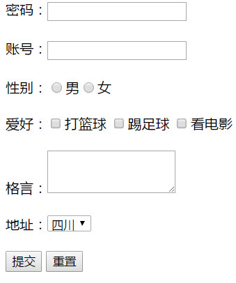

+ 框架将浏览器划分为不同的部分，每一部分加载不同的网页，实现在同一浏览器窗口中加载多个页面的效果。

<!--truncate-->


# WEB框架与表单


## `<frameset>`划分框架标记:

1. 语法格式

   <frameset>...</frameset>

2. 属性：

   1. `cols` ：使用“像素数”和%分隔左右窗口，“*”表示剩余部分

      如果使用`"*","*"`表示框架平均分成2个

      如果使用`"*","*","*"`表示框架平均分成3个

   2. `rows`:使用像素数和%分隔上下窗口，`"*"`表示剩余部分
   3. `frameborder`:指定是否显示边框，0不显示，1显示 
   4. `border`：设置边框的大小，默认值5像素

3. `<frame>`子窗口标记，**单标记**，该标记必须放在`<frameset>`中使用，在`<frameset>`中设置了几个窗口，就必须对应使用几个`<frame>`框架，而且还必须使用`src属性`指定一个网页

      1. `src`：加载网页文件的URL地址
      2. `name`：框架名称，是链接标记的target所要参数
      3. noresize：表示不能调整框架大小，没有设置时就可以调整
      4. scrolling：是否需要滚动条：加在顶层`"frameset"`不管用，必须要加在每一个`<frame>`进行控制。
         + auto：根据需要自动出现
         + yes：
         + no：无
      5. frameborder：是否需要边框
         + `(1)`显示边框
         + (0)不显示边框

```
<!DOCTYPE html>
<html>
<head>
  <title>HTML框架</title>
  <meta charset="utf-8">
</head>

<frameset rows="90,*,90" frameborder="1" border="1">
  <frame name="top" src="top.html" />
  <frameset cols="20%,80%">
    <frame name="left" src="left.html"/>
    <!-- 其中几个框架的html代码没有显示。 -->
    <frameset cols="50%,50%" frameborder="1" border="1">
      <frame name="right1" src="http://bai.com"></frame>
      <frame name="right2" src="https://kaigedong.github.io" scrolling="no"></frame>
    </frameset>
  </frameset>
  <frame name="bottom" src="bottom.html" />
</frameset>>
</html>
```
效果：


# 表单

比如百度的搜索框就是表单。

## 1. 表单标记
**`<form>...</form>`**
基本格式：`<form></form>定义表单的开始位置和结束位置，表单提交的内容就是<form>表单中的内容`
```
<form action="服务器端地址(接受表单内容的地址)" name="表单名称" method="post|get">...</form>
```

**常用属性**
1. `name`表单名称

2. `method`：传送数据的方式，分为post和get两种方式

   > get方式提交时，会讲表单的内容附加在URL地址的后面，所以限制了提交的内容的长度，不超过8192个字符，且不具备保密性
   > post方式：post方式提交时，将表单中的数据一并包含在表单主体中，一起传送到服务器中处理，没有数据大小限制。

3. action：表单数据的处理程序的URL地址，如果为空则使用当前文档的URL地址，如果表单中不需要使用action属性也要指定其属性为`“no”`

4. enctype:设置表单的资料的编码方式 

5. target：何超链接的属性类似，用来指定目标窗口


## 2. 文本域和密码

`<input>`标记，**没有结束标记。**
基本语法：`<input type="" name="" value="" size="" maxlength="">`
属性介绍：
1. `type`属性：两个值
   + `text`：当`type="text"`时，`<input>`表示一个文本输入域
      + `password`：当`type="password"`时，`<input>`表示一个密码输入域

      2. `name`属性：定义控件的名称
      3. `value`属性：初始值，打开浏览器时，文本框中的内容
      4. `size`属性：设置控件的长度
      5. `maxlength`属性：输入框中最大允许输入的字符数


## 3. 提交、重置、普通按钮

1. 提交按钮：当`<input type="submit">` 时，为提交按钮
2. 重置按钮：当`<input type="reset">`时，为重置按钮
3. 普通按钮：当`<input type="botton">`时，为普通按钮

## 4. 单选框和复选框

1. 单选按钮：当`<input type="radio">`时，为单选按钮
2. 复选框：当`<input type="checkbox">`时，为复选框
3. 注意：单选框和复选框都可以使用`"cheked"`属性来**设置默认选中项**

## 5. 隐藏域
当`<input type="hidden">`时，为隐藏表单域，实际上也是被传送出去的。

## 6. 多行文本域
**语法格式**
`<textarea name="name" rows="value" cols="value" value="value">...<textarea>`
rows 属性和cols属性分别用来指定，显示的行数和列数。

## 7. 菜单下拉列表域

1. 语法格式：
```
<select name="" size="value" multiple>
<option value="value" selected>选项1</option>
<option value="value">选项2</option>
<option value="value">选项3</option>
... ...
</select>
```
2. 属性


3. option属性
   `<option>`标记用来指定列表中的一个选项，需要放在<select></select>之间
      + value ：给选项复制，指定传送到服务器上面的值
         + selected：指定默认的选项

## 8. 实战《会员登录表单》

```
<!DOCTYPE html>
<html>
<head>
 <title>会员登记表</title>
 <meta charset="utf-8">
</head>
<body>
 <form name="VIP-form">
  密码：<input type="text" name="usrname">
  <br><br>
  账号：<input type="password" name="passwd">
  <br><br>
  性别：<input type="radio" name="sex">男<input type="radio" name="sex">女
  <br><br>
  爱好：<input type="checkbox" name="">打篮球
  <input type="checkbox" name="">踢足球
  <input type="checkbox" name="">看电影
  <br><br>
  格言：<textarea name="name" rows="3" cols="20"></textarea>
  <br><br>
  地址：<select name="">
  <option value="sichuan">四川</option>
  <option value="beijing">北京</option>
  <option value="nanjing">南京</option>
  </select>
  <br><br>
  <input type="submit" name="submit">
  <input type="reset" name="reset">
 </form>
</body>
</html>
```



