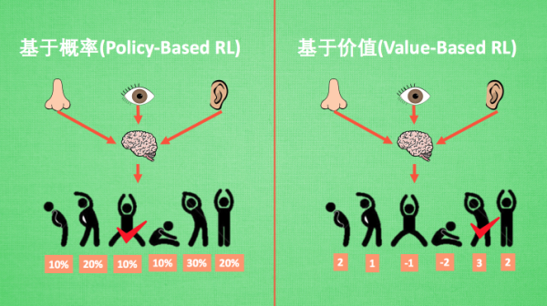

+ 强化学习概念
+ 分类

<!--truncate-->

## 概念
当前的机器学习算法可以分为3种：有监督的学习（Supervised Learning）、无监督的学习（Unsupervised Learning）和强化学习（Reinforcement Learning）

强化学习的关键要素有：**environment**，**reward**，**action** 和 **state**。有了这些要素我们就能建立一个强化学习模型。

> 强化学习的分类

| 通过价值选行为        | 直接选行为            | 想象环境并从中学习      |
| -------------- | ---------------- | -------------- |
| Q learning     | Policy Gradients | Model based RL |
| Sarsa          |                  |                |
| Deep Q Network |                  |                |

## 分类

> 强化学习有很多不同的方法，有多种不同的分类方式：

### Model-free 和 Model-based

> 根据强化学习方法**是否理解环境**(Model)，可分为Model-free 和 Model-based 方法。

**Model-free** 一直在每一步中取尝试学习最优的策略，在多次迭代后就得到了整个环境最优的策略(`Q-learning`，`Sarasa`，`Policy Gradients`). 

**Model-based** 尝试model这个环境(先根据真实情况学习一个model)，最终基于这个环境选择最优的策略。

### 基于概率(Policy-Based RL) 和 基于价值(Value-Based RL)

基于概率是强化学习中最直接的一种，能通过感官分析所处的环境, 直接输出下一步要采取的各种动作的概率, 然后根据概率采取行动, 所以**每种动作都有可能被选中, 只是可能性不同**. 而基于价值的方法输出则是所有动作的价值, 我们会根据最高价值来选择动作, 相比基于概率的方法, 基于价值的决策部分更为铁定, 毫不留情, 就选价值最高的, 而基于概率的, 即使某个动作的概率最高, 但是还是不一定会选到他.

比如在基于概率这边, 有 [Policy Gradients](https://morvanzhou.github.io/tutorials/machine-learning/ML-intro/4-07-PG/), 在基于价值这边有 [Q learning](https://morvanzhou.github.io/tutorials/machine-learning/ML-intro/4-03-q-learning/), [Sarsa](https://morvanzhou.github.io/tutorials/machine-learning/ML-intro/4-04-sarsa/) 等. 而且我们还能结合这两类方法的优势之处, 创造更牛逼的一种方法, 叫做 [Actor-Critic](https://morvanzhou.github.io/tutorials/machine-learning/ML-intro/4-08-AC/), actor 会基于概率做出动作, 而 critic 会对做出的动作给出动作的价值, 这样就在原有的 policy gradients 上加速了学习过程.

### 回合更新(Monte-Carlo update) 和 单步更新(Temporal-Difference update)

强化学习还能用另外一种方式分类, 回合更新和单步更新, 想象强化学习就是在玩游戏, 游戏回合有开始和结束. 回合更新指的是游戏开始后, 我们要等待游戏结束, 然后再总结这一回合中的所有转折点, 再更新我们的行为准则. 而单步更新则是在游戏进行中每一步都在更新, 不用等待游戏的结束, 这样我们就能边玩边学习了.

再来说说方法, Monte-carlo learning 和基础版的 policy gradients 等 都是回合更新制, Qlearning, Sarsa, 升级版的 policy gradients 等都是单步更新制. 因为单步更新更有效率, 所以现在大多方法都是基于单步更新. 比如有的强化学习问题并不属于回合问题.

> 在未达到终止之前，某个状态S时，第一次执行行动a的概率是p1; 回合更新在下一次状态S执行a的概率就等于p2了。

### 在线学习(On-Policy) 和 离线学习(Off-Policy)

这两者的主要区别就是在于更新值函数时的策略。**on-policy**，只使用了当前策略产生的样本，而**off-policy**，并不一定使用当前策略产生的样本。

这两者各自用的算法：

`on-policy`：Sarsa; 还有一种优化 Sarsa 的算法, 叫做 Sarsa lambda

`off-policy`：Q-learning、DQN(Deep-Q-Network)

## 参考
+ [强化学习（Reinforcement Learning, RL）初步介绍](https://blog.csdn.net/coffee_cream/article/details/57085729)
+ [什么是强化学习](https://morvanzhou.github.io/tutorials/machine-learning/reinforcement-learning/1-1-A-RL/)
+ [强化学习方法汇总 (Reinforcement Learning)](https://morvanzhou.github.io/tutorials/machine-learning/reinforcement-learning/1-1-B-RL-methods/)