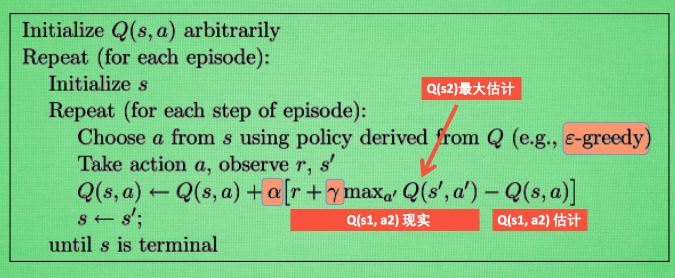

+ Q-learning 的概念
+ Q-learning 例子

<!--truncate-->

## 什么是Q learning

Q-learning 算法是解决`马尔科夫决策`问题的算法。Q-learning的突出特点是其**在即刻的奖励和未来的奖励之间权衡的能力**。在每次决策时，代理(agent)观察自身的状态 X~t~, 然后选择并采用一种行为u~t~.  这时移动到状态X~t+1~, 代理收到一个反馈(reinforcement r(X~t~,u~t~)) . 其目标是为了找到动作的顺序，来使得未来的反馈的和最大，进而导致从开始到结束最短的路径。

Q learning 的更新法则非常简单：

```Q(state, action) = R(state, action) + gamma * Max[Q(next state, all actions)]```

gamma 参数范围是（0 ≤ gamma < 1）,以确保sum是收敛的。如果gamma接近0，则代理更倾向于即刻的奖励；如果代理趋向于1，代理更倾向于考虑未来的奖励。


## Q learning 算法步骤





## 强烈推荐阅读

[A Painless Q-learning Tutorial (一个 Q-learning 算法的简明教程)](https://blog.csdn.net/itplus/article/details/9361915)


## 参考

+ [Q-Learning Introduction](http://mnemstudio.org/path-finding-q-learning.htm)
+ [什么是Q-learning](https://morvanzhou.github.io/tutorials/machine-learning/reinforcement-learning/2-2-A-q-learning/)
+ [A Painless Q-learning Tutorial (一个 Q-learning 算法的简明教程)](https://blog.csdn.net/itplus/article/details/9361915)

