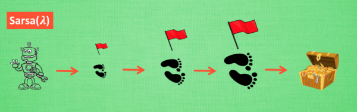
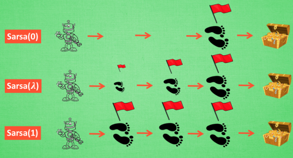

+ 基于Sarsa的一种提速方法
+ 回合更新的优势
+ Lambda 参数
+ Sarsa 算法步骤

<!--truncate-->
莫凡教程讲的很好，看[参考](https://morvanzhou.github.io/tutorials/machine-learning/reinforcement-learning/3-3-A-sarsa-lambda/)。

## 单步更新 and 回合更新

虽然Sarsa 每一步都在更新, 但是在没有达到终点的时候, 现在站着的这一步也没有得到任何更新, 也就是直到终点时, 我们才为上一步更新为；而上一步之前的所有步都被认为和终点无关。回合更新虽然我要等到这回合结束, 才开始对本回合所经历的所有步都添加更新, 但是这所有的步都是和终点有关系的, 都是为了到终点要学习的步, 所以每一个步骤在下回合被选则的几率又高了一些. 在这种角度来看, 回合更新似乎会有效率一些.

## 有时迷茫

 还是使用单步更新的方法在每一步都进行更新, 但是同时记下之前的寻宝之路. 你可以想像, 每走一步, 插上一个小旗子, 这样我们就能清楚的知道除了最近的一步, 找到宝物时还需要更新哪些步了. 不过, 有时候情况可能没有这么乐观. 开始的几次, 因为完全没有头绪, 我可能在原地打转了很久, 然后才找到宝藏, 那些重复的脚步真的对我拿到宝藏很有必要吗? 答案我们都知道. 所以Sarsa(lambda)就来拯救你啦.

## Lambda 的含义与取值

其实 lambda 就是一个衰变值, 他可以让你知道离奖励越远的步可能并不是让你最快拿到奖励的步, 所以我们想象我们站在宝藏的位置, 回头看看我们走过的寻宝之路, 离宝藏越近的脚印越看得清, 远处的脚印太渺小, 我们都很难看清, 那我们就索性记下离宝藏越近的脚印越重要, 越需要被好好的更新. 和之前我们提到过的 奖励衰减值 gamma 一样, lambda 是脚步衰减值, 都是一个在 0 和 1 之间的数.

当 lambda 取0, 就变成了 Sarsa 的单步更新, 当 lambda 取 1, 就变成了回合更新, 对所有步更新的力度都是一样. 当 lambda 在 0 和 1 之间, 取值越大, 离宝藏越近的步更新力度越大. 这样我们就不用受限于单步更新的每次只能更新最近的一步, 我们可以更有效率的更新所有相关步了.

## Sarsa Lambda 算法步骤

## 参考

+ [什么是 Sarsa(lambda)](https://morvanzhou.github.io/tutorials/machine-learning/reinforcement-learning/3-3-A-sarsa-lambda/)
+ [Sarsa-lambda](https://morvanzhou.github.io/tutorials/machine-learning/reinforcement-learning/3-3-tabular-sarsa-lambda/)
