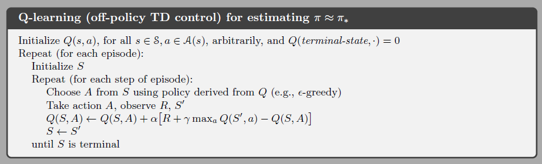

> Q-learning 与 Sarsa 区别

<!--truncate-->

Q-learning 与 Sarsa 算法：

> Sarsa   与 Q-learning  的区别仅仅在于，  更新Q-table 表里的某一项的时候， 是先走， 还是先计算更新而已。 没有大的区别。

> Temporal-Difference learning, TD learning **时间差分学习**

> "`on-policy`和`off-policy`是指评估和改进的策略是否一致，如不一致则是异策略，一致则为同策略，异策略就是指不是学此时此刻的的策略, 而是学有可能和此时此刻不一样的策略. 同策略就是学此时此刻的策略"

## 参考

+ [什么是 Sarsa](https://morvanzhou.github.io/tutorials/machine-learning/reinforcement-learning/3-1-A-sarsa/)
+ [强化学习 - Q-learning Sarsa 和 DQN 的理解](http://www.cnblogs.com/xiaoxuebiye/p/7753772.html)

