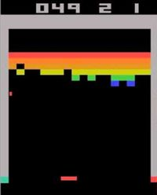
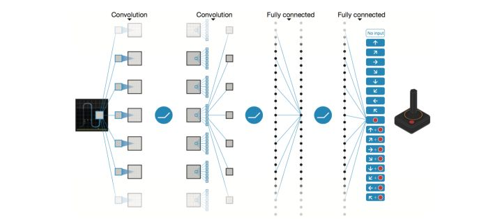
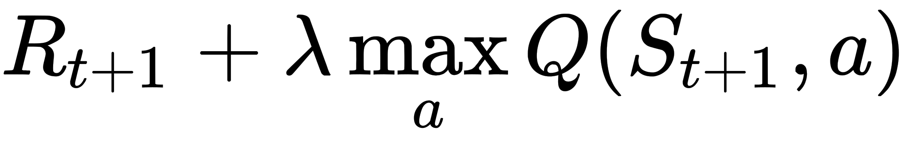
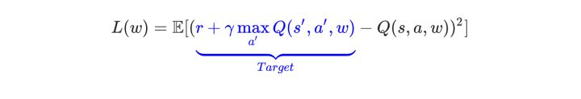

> DQN 是第一个成功地将深度学习和强化学习结合起来的模型，启发了后续一系列的工作。这些后续工作中比较有名的有 `Double DQN`, `Prioritized Replay` 和 `Dueling Network`。

<!--truncate-->

> DQN 算法的主要做法是 `Experience Replay`，其将系统探索环境得到的数据储存起来，然后随机采样样本更新深度神经网络的参数。(见上一篇)

+ 超级推荐[DQN从入门到放弃5 深度解读DQN算法](https://zhuanlan.zhihu.com/p/21421729?refer=intelligentunit)

## Q learning 的维数灾难

在上面的简单分析中，我们使用表格来表示Q(s,a)，但是这个在现实的很多问题上是几乎不可行的，因为状态实在是太多。使用表格的方式根本存不下。

举Atari为例子。

计算机玩Atari游戏的要求是输入原始图像数据，也就是210x160像素的图片，然后输出几个按键动作。总之就是和人类的要求一样，纯视觉输入，然后让计算机自己玩游戏。那么这种情况下，到底有多少种状态呢？有可能每一秒钟的状态都不一样。因为，从理论上看，如果每一个像素都有256种选择，那么就有：256^210x160^

这简直是天文数字。所以，我们是不可能通过表格来存储状态的。我们有必要对状态的维度进行压缩，解决办法就是 价值函数近似`Value Function Approximation`

## 价值函数近似 Value Function Approximation

什么是价值函数近似呢？说起来很简单，就是用一个函数来表示Q(s,a)。即 Q(s,a) = f(s,a)

f可以是任意类型的函数，比如线性函数：

Q(s, a) = w~1~s + w~2~s + b，其中w~1~，w~2~ ，b是函数f的参数。

大家看到了没有，通过函数表示，我们就可以无所谓s到底是多大的维度，反正最后都通过矩阵运算降维输出为单值的Q。

这就是价值函数近似的基本思路。

如果我们就用来统一表示函数f的参数，那么就有 Q(s, a) = f(s,a,w)

为什么叫近似，因为我们并不知道Q值的实际分布情况，本质上就是用一个函数来近似Q值的分布，所以，也可以说是

Q(s, a) ≈ f(s, a, w)

## 高维状态输入，低维动作输出的表示问题

对于Atari游戏而言，这是一个高维状态输入（原始图像），低维动作输出（只有几个离散的动作，比如上下左右）。那么怎么来表示这个函数f呢？

难道把高维s和低维a加在一起作为输入吗？

必须承认这样也是可以的。但总感觉有点别扭。特别是，其实我们只需要对高维状态进行降维，而不需要对动作也进行降维处理。

那么，有什么更好的表示方法吗？

当然有，怎么做呢？

其实就是，只把状态s作为输入，但是输出的时候输出每一个动作的Q值，也就是输出一个向量![[Q(s,a_1),Q(s,a_2),Q(s,a_3),...,Q(s,a_n)]](https://www.zhihu.com/equation?tex=%5BQ%28s%2Ca_1%29%2CQ%28s%2Ca_2%29%2CQ%28s%2Ca_3%29%2C...%2CQ%28s%2Ca_n%29%5D)，记住这里输出是一个值，只不过是包含了所有动作的Q值的向量而已。这样我们就只要输入状态s，而且还同时可以得到所有的动作Q值，也将更方便的进行Q-Learning中动作的选择与Q值更新（这一点后面大家会理解）。

## Q值神经网络化

终于到了和深度学习相结合的一步了！

意思很清楚，就是我们用一个深度神经网络来表示这个函数f。

以DQN为例，输入是经过处理的4个连续的84x84图像，然后经过两个卷积层，两个全连接层，最后输出包含每一个动作Q值的向量。

对于这个网络的结构，针对不同的问题可以有不同的设置。总之，用神经网络来表示Q值非常简单，Q值也就是变成用Q网络（Q-Network）来表示。接下来就到了很多人都会困惑的问题，那就是

> **怎么训练Q网络？？？**

## DQN算法

我们知道，神经网络的训练是一个最优化问题，最优化一个损失函数loss function，也就是标签和网络输出的偏差，目标是让损失函数最小化。为此，我们需要有样本，巨量的有标签数据，然后通过反向传播使用梯度下降的方法来更新神经网络的参数。

> 所以，要训练Q网络，我们要能够为`Q网络提供有标签的样本`。
>
> 那么如何为Q网络提供有标签的样本？

答案就是利用Q-Learning算法。

大家回想一下Q-Learning算法，Q值的更新依靠什么？依靠的是利用Reward和Q计算出来的目标Q值：

因此，我们把目标Q值作为标签不就完了？我们的目标不就是让Q值趋近于目标Q值吗？

因此，Q网络训练的损失函数就是

因此，我们把目标Q值作为标签不就完了？我们的目标不就是让Q值趋近于目标Q值吗？

因此，Q网络训练的损失函数就是

上面公式是s', a' 即下一个状态和动作。这里用了`David Silver`的表示方式，看起来比较清晰。

既然确定了损失函数，也就是cost，确定了获取样本的方式。那么DQN的整个算法也就成型了！

接下来就是具体如何训练的问题了！

## DQN训练

我们这里分析第一个版本的DQN，也就是NIPS 2013提出的DQN。

具体的算法主要涉及到`Experience Replay`，也就是**`经验池`**的技巧，就是`如何存储样本及采样`问题。

由于玩Atari采集的样本是一个时间序列，样本之间具有连续性，如果每次得到样本就更新Q值，受样本分布影响，效果会不好。因此，一个很直接的想法就是把样本先存起来，然后随机采样如何？这就是Experience Replay的意思。按照脑科学的观点，人的大脑也具有这样的机制，就是在回忆中学习。

那么上面的算法看起来那么长，其实就是反复试验，然后存储数据。接下来数据存到一定程度，就每次随机采用数据，进行梯度下降！

也就是

> 在DQN中增强学习Q-Learning算法和深度学习的SGD训练是同步进行的！

通过Q-Learning获取无限量的训练样本，然后对神经网络进行训练。

样本的获取关键是计算y，也就是标签。

## 参考

+ [DQN从入门到放弃5 深度解读DQN算法](https://zhuanlan.zhihu.com/p/21421729?refer=intelligentunit)