+ 强化学习和深度学习结合
+ 神经网络的作用
+ Deep Q Network(DQN算法)
+ 后续改进方法

<!--truncate-->

> 融合了神经网络和 Q learning 的方法, 名字叫做 Deep Q Network.

## 1. 强化学习和深度学习结合

> 机器学习=目标+表示+优化。

目标层面的工作关心应该学习到什么样的模型，强化学习应该学习到使得激励函数最大的模型。

表示方面的工作关心数据表示成什么样有利于学习，深度学习是最近几年兴起的表示方法，在图像和语音的表示方面有很好的效果。

深度强化学习则是两者结合在一起，深度学习负责表示马尔科夫决策过程的状态，强化学习负责把控学习方向。

> 深度强化学习有**三条线**：分别是基于价值的深度强化学习，基于策略的深度强化学习和基于模型的深度强化学习。

这三种不同类型的深度强化学习用深度神经网络替代了强化学习的不同部件。

基于价值的深度强化学习本质上是一个 Q Learning 算法，目标是估计最优策略的 Q 值。 不同的地方在于 Q Learning 中价值函数近似用了深度神经网络。比如 DQN 在 Atari 游戏任务中，输入是 Atari 的游戏画面，因此使用适合图像处理的卷积神经网络（Convolutional Neural Network，CNN）。下图就是 DQN 的框架图。

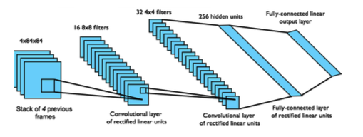

## 2. 神经网络的作用 

我们使用表格来存储每一个状态 state, 和在这个 state 每个行为 action 所拥有的 Q 值. 而当今问题是在太复杂, 状态可以多到比天上的星星还多(比如下围棋). 如果全用表格来存储它们, 恐怕我们的计算机有再大的内存都不够, 而且每次在这么大的表格中搜索对应的状态也是一件很耗时的事. 不过, 在机器学习中, 有一种方法对这种事情很在行, 那就是神经网络. **我们可以将状态和动作当成神经网络的输入, 然后经过神经网络分析后得到动作的 Q 值**, 这样我们就没必要在表格中记录 Q 值, 而是直接使用神经网络生成 Q 值. 还有一种形式的是这样, 我们**也能只输入状态值, 输出所有的动作值, 然后按照 Q learning 的原则, 直接选择拥有最大值的动作当做下一步要做的动作**. 我们可以想象, 神经网络接受外部的信息, 相当于眼睛鼻子耳朵收集信息, 然后通过大脑加工输出每种动作的值, 最后通过强化学习的方式选择动作.

## 3. Deep Q Network(DQN算法)

当然了基于价值的深度强化学习不仅仅是把 Q Learning 中的价值函数用深度神经网络近似，还做了其他改进。

这个算法就是著名的 DQN 算法，由 DeepMind 在 2013 年在 NIPS 提出。DQN 算法的主要做法是 `Experience Replay`，其将系统探索环境得到的数据储存起来，然后随机采样样本更新深度神经网络的参数。

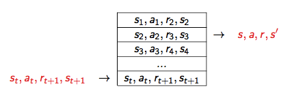

Experience Replay 的动机是：1）深度神经网络作为有监督学习模型，要求数据满足独立同分布，2）但 Q Learning 算法得到的样本前后是有关系的。为了打破数据之间的关联性，Experience Replay 方法通过`存储-采样`的方法将这个关联性打破了。

DeepMind 在 2015 年初在 Nature 上发布了文章，引入了 Target Q 的概念，进一步打破数据关联性。Target Q 的概念是用旧的深度神经网络 去得到目标值，下面是带有 Target Q 的 Q Learning 的优化目标。

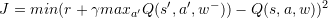

Nature 论文上的[结果](http://www.algorithmdog.com/drl)可以看到，打破数据关联性确实很大程度地提高了效果。

## 4. 后续改进方法

DQN 是第一个成功地将深度学习和强化学习结合起来的模型，启发了后续一系列的工作。这些后续工作中比较有名的有 Double DQN, Prioritized Replay 和 Dueling Network。

### 4.1 Double DQN

Thrun 和 Schwartz 在古老的 1993 年观察到 Q-Learning 的[过优化 (overoptimism)](S. Thrun and A. Schwartz. Issues in using function approximation for reinforcement learning. In M. Mozer, P. Smolensky, D. Touretzky, J. Elman, and A. Weigend, editors, Proceedings of the 1993 Connectionist Models Summer School, Hillsdale, NJ, 1993. Lawrence Erlbaum.) 现象 ，并且指出过优化现象是由于 Q-Learning 算法中的 max 操作造成的。令 (Q^{target}(s,a)) 是目标 Q 值；我们用了价值函数近似， 是近似 Q 值；令 Y 为近似值和目标之间的误差，即

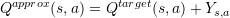

Q-learning 算法更新步骤将所有的 Q 值更新一遍，这个时候近似值和目标值之间的差值

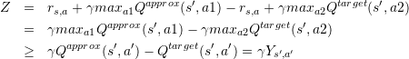

其中 。这时候我们发现，即使 也就是一开始是无偏的近似， Q Learning 中的 max 操作也会导致 E[Z] > 0。这就是过优化现象。为了解决这个问题，Thrun 和 Schwartz 提出了 Double Q 的想法。

Hasselt 等进一步分析了过优化的现象，并将 Double Q 的想法应用在 DQN 上，从而提出了 Double DQN。Double DQN 训练两个 Q 网络，一个负责选择动作，另一个负责计算。两个 Q 网络交替进行更新，具体算法如下所示。

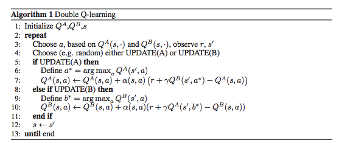

下图是 Hasselt 在论文中报告的实验结果。从[实验结果](http://www.algorithmdog.com/drl)来看，Double DQN 拥有比 DQN 好的效果。

### 4.2 Prioritized Replay

DQN 用了 `Experience Replay` 算法，将系统探索环境获得的样本保存起来，然后从中采样出样本以更新模型参数。对于采样，一个常见的改进是改变采样的概率。[Prioritized Replay](Schaul T, Quan J, Antonoglou I, et al. Prioritized experience replay[J]. arXiv preprint arXiv:1511.05952, 2015.)便是采取了这个策略，采用 TD-err 作为评判标准进行采样。

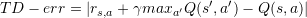

下图是论文中采用的例子。例子中有 n 个状态，在每个状态系统一半概率采取 “正确” 或者一半概率 “错误”，图中红色虚线是错误动作。一旦系统采取错误动作，游戏结束。只有第 n 个状态 “正确” 朝向第 1 个状态，系统获得奖励 1。在这个例子训练过程中，系统产生无效样本，导致训练效率底下。如果采用 TD-err 作为评判标准进行采样，能够缓解这个问题。

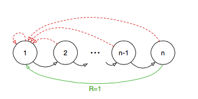

论文报告了 Prioritized Replay 算法效果。Prioritized Replay 效果很好。

### 4.3 Dueling Network

Baird 在 1993 年提出将 Q 值分解为价值 (Value) 和优势 (Advantage) [文章](Baird, L.C. Advantage updating. Technical Report WLTR-93-1146,Wright-Patterson Air Force Base, 1993.)。

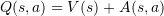

这个想法可以用下面的例子说明 [5]。上面两张图表示，前方无车时，选择什么动作并不会太影响行车状态。这个时候系统关注状态的价值，而对影响动作优势不是很关心。下面两张图表示，前方有车时，选择动作至关重要。这个时候系统需要关心优势了。这个例子说明，Q 值分解为价值和优势更能刻画强化学习的过程。

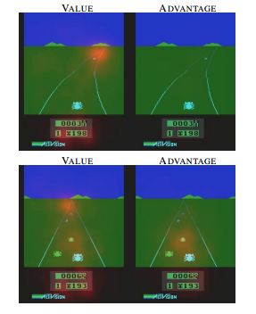

Wang Z 将这个 idea 应用在深度强化学习中，提出了下面的网络结构 [5](Wang Z, de Freitas N, Lanctot M. Dueling network architectures for deep reinforcement learning[J]. arXiv preprint arXiv:1511.06581, 2015.)。

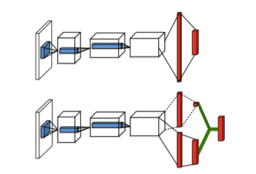

这种网络结构很简单，但获得了很好的效果。

Dueling Network 是一个深度学习的网络结构。它可以结合之前介绍的 `Experience Replay`、 `Double DQN` 和 `Prioritized Replay` 等方法。 作者在论文中报告 `Dueling Network` 和 `Prioritized Replay` 结合的效果最好。

## 参考

+ [强化学习系列之九:Deep Q Network (DQN)](http://www.algorithmdog.com/drl)
+ [什么是 DQN](https://morvanzhou.github.io/tutorials/machine-learning/reinforcement-learning/4-1-A-DQN/)

