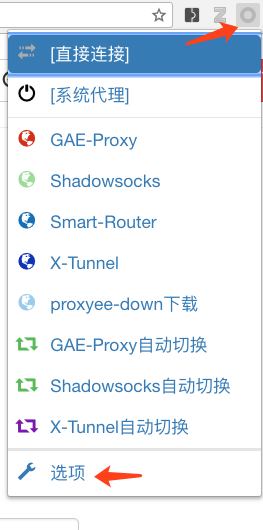
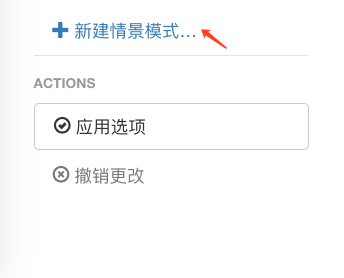
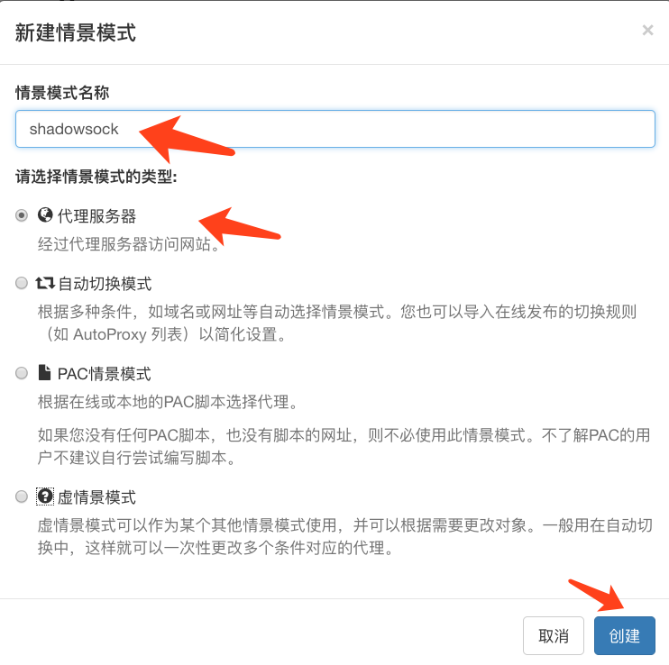
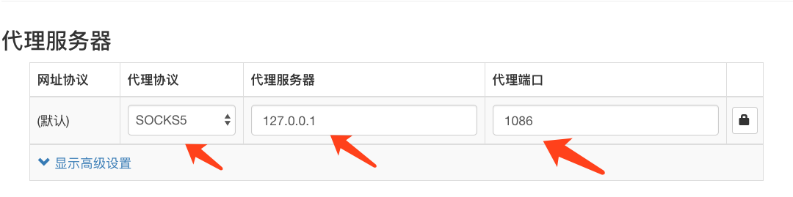
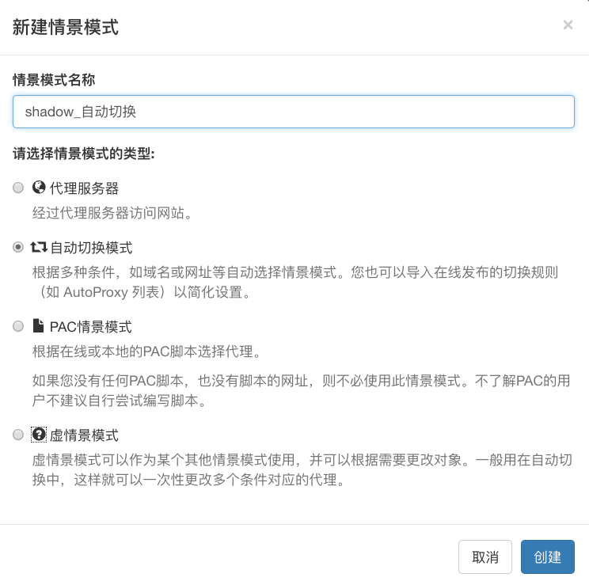
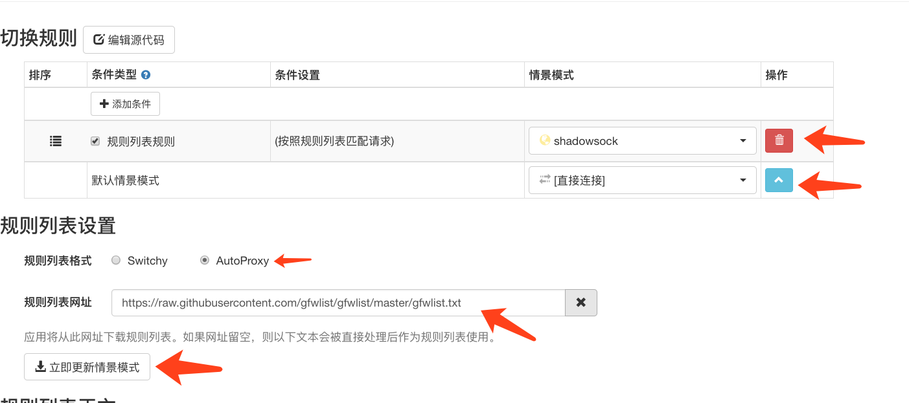
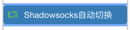
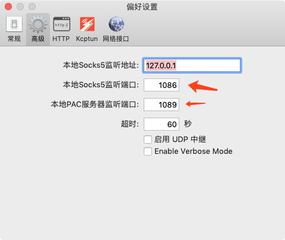

获取了shadowsocks账号之后的配置

<!--truncate-->

在获取了shadowsocks账号之后，会拥有: `IP地址`，`端口`，`加密方法`，`密码`的信息。

+ 安装Shadowsocks客户端

  + [Mac版本](https://github.com/shadowsocks/ShadowsocksX-NG/releases)
  + [Win版本](https://github.com/shadowsocks/shadowsocks-windows/releases)
  + [Android版本_直接下载链接](https://github.com/Jigsaw-Code/outline-releases/blob/master/client/Outline.apk?raw=true)
  + [Linux版本](https://github.com/shadowsocks/shadowsocks-qt5/wiki/Installation)
  + [ios版本_AppStore](https://itunes.apple.com/us/app/wingy-http-s-socks5-proxy-utility/id1178584911)

+ shadowsocks配置：

  `点击shadowsocks图标` —— `服务器-新服务器` —— `服务器设置`  —— `点击左下角添加` —— `填入获取的shadowskcks账号信息`

+ 浏览器代理插件设置

  + chrome 可以安装SwitchyOmega [chrome网上商店](<https://chrome.google.com/webstore/detail/proxy-switchyomega/padekgcemlokbadohgkifijomclgjgif> ) [crx格式离线安装](https://github.com/FelisCatus/SwitchyOmega/releases)

  + Firefox [SwitchyOmega地址](https://addons.mozilla.org/en-US/firefox/addon/switchyomega/)

  + 安装好之后，进行配置：

> 规则列表网址：`https://raw.githubusercontent.com/gfwlist/gfwlist/master/gfwlist.txt`

最后，启用shadowsocks自动代理：

> 为什么SwitchyOmega端口要设置成1086?

从shadowsocks `偏好设置` -- `高级` 中可以看到，监听IP是1086

