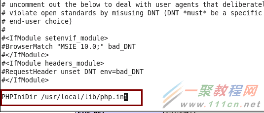

+ 革命尚未成功

<!--truncate-->

## Github 地址

https://github.com/Zhong-Lab-UCSD/Genomic-Interactive-Visualization-Engine

## 组件
+ 包含两个主要部分：
  + **GIVE Web Components**： 也就是网页部分
  + **GIVE server**： 服务器部分，包括**GIVE server-side**（主要由PHP实现） 和 **GIVE data source**

## 要求

1. 克隆源代码

   ```
   git clone https://github.com/Zhong-Lab-UCSD/Genomic-Interactive-Visualization-Engine.git
   ```

2. 安装Web Server

   1. 安装MySQL

   2. Apache 

   3. PHP + cURL

      ```
      https://curl.haxx.se/download.html 获取最新curl,并安装。
      # 编译PHP：
      ./configure --prefix=/picb/rnomics2/RBP_database/dbweb/Softwares/php_7.2.12 --with-apxs2=/picb/rnomics2/RBP_database/dbweb/Softwares/apache_2.4.37/bin/apxs --with-mysqli --with-curl=/home/dongkaige/rnomics2/RBP_database/dbweb/Softwares/curl_7.62 --with-config-file-path=/picb/rnomics2/RBP_database/dbweb/Softwares/php_7.2.12/php.ini
      /RBP_database/dbweb/Softwares/curl_7.62
      make test
      make -j 40
      make install
      # 然后把编译文件夹里的 php.ini-development 复制成 php.ini 上面的-with-config-file-path 指定的原来是dir路径。
      cp php.ini-development /picb/rnomics2/RBP_database/dbweb/Softwares/php_7.2.12
      # 测试：
      $ ./php -ini | grep Configuration
      Configuration File (php.ini) Path => /picb/rnomics2/RBP_database/dbweb/Softwares/php_7.2.12/php.ini
      Loaded Configuration File => /picb/rnomics2/RBP_database/dbweb/Softwares/php_7.2.12/php.ini/php.ini
      Configuration
      # 修改http.conf: 添加php.ini 位置
      ```

      

3. 安装GIVE Server


4. 使用`GIVE-toolbox`管理数据track

   > GIVE 支持`gene annotation`, `bed`, `bigWig`, `interaction` data track类型。
   >
   > `GIVE-toolbox`包含9个脚本，用来管理数据。

   - `config_host.sh`: 对 GIVE service 进行设置
   - `initial_ref.sh`: 初始化MySQL数据库结构并建立genome reference
   - `add_track_geneAnnot.sh`: 从UCSC gene table 文件添加基因注释
   - `add_trackGroup.sh`: 添加track组
   - `add_track_bed.sh`: 添加bed注释
   - `add_track_bigWig.sh`: 添加bigwig 注释
   - `add_track_interaction.sh`: 添加interaction注释
   - `list_tracks.sh`: 列出GIVE数据结构或特定的track组，或特定track的设置
   - `remove_data.sh`: 删除一个track，或track group，或整个参考基因组

4.1 演示：

文档太差了。Docker版的都跑不起来。暂时放弃了。