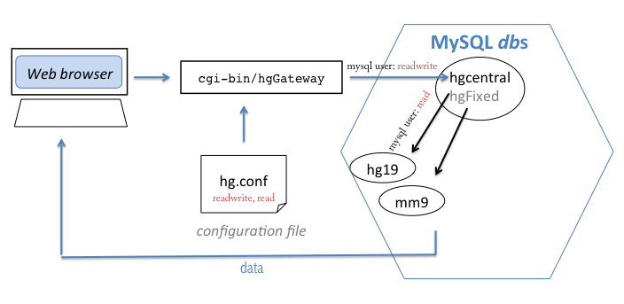
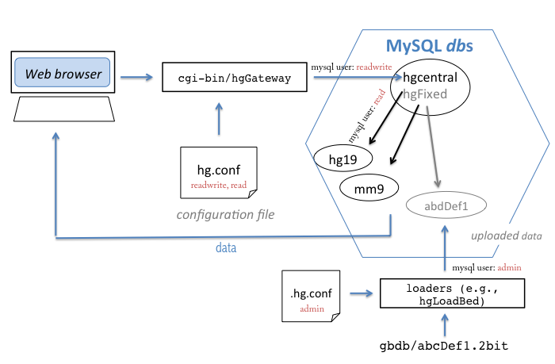

---
title: 无root安装UCSC genome browser
author: woobamboo
authorURL:
authorFBID: 
---


如何在本地实现一个定制化的UCSC genome browser?

<!--truncate-->


## 1. 安装必要的软件

需要安装Apache 及 MySQL (版本5.x)， 其中Apache可以更换成Nginx，MySQL后面直接同步UCSC的数据库到本地，因此不要更改。

MySQL有编译好的版本，Apache编译好的版本已经比较老了。两者的安装方法很简单，请看**前面的文章**。

另外，由于UCSC部分代码是C语言实现的，请***确保你的glibc版本！！！***至少大于等于``GLIBC_2.17`，你应该能通过下面的命令看到`GLIBC_2.17`：

#### 检查glibc版本

```
$strings /lib64/libc.so.6 |grep GLIBC
```

版本太低会报错：`/lib64/libc.so.6: version 'GLIBC_2.14' not found ` ,  `/lib64/libc.so.6: version 'GLIBC_2.17' not found`


## 2. 请确保一下事情已经做好：

+ `glibc` 大于等于2.17
+ `Apache` 已安装并正常运行
+ `MySQL(v5.x)` 已安装并正常运行，再次强调版本是`5.x`


## 3. 几个目录的说明：

```shell
# Apache 的安装目录
drwxr-xr-x.  2 dongkaige rnomics   39 Dec 11 10:10 logs
drwxr-xr-x.  9 dongkaige rnomics 4.0K Dec 10 20:43 htdocs
drwxr-xr-x.  4 dongkaige rnomics  145 Dec  8 20:31 conf
drwxr-xr-x.  2 dongkaige rnomics 4.0K Dec  8 02:28 modules
drwxr-xr-x.  2 dongkaige rnomics   74 Dec  7 16:50 cgi-bin
drwxr-xr-x.  2 dongkaige rnomics 4.0K Dec  2 23:02 bin
......
```

+ 几个重要目录
  + `htdocs` 这个目录就是你网站的默认根目录。安装好Apache之后，访问的第一个网页就在这里放着！
  + `conf` Apache的配置目录，前期要经常修改配置文件。
  + `cgi-bin` 存放的是可执行程序，由网页调用。这是安装好Apache之后的默认可执行程序存放路径，我们后面会修改。比如你写了个`helloWorld.py` ，正确的配置将使它显示执行结果而不是在网页显示你的代码。
  + `logs` 这个文件很有用！显示Apache执行日志以及错误日志；
  + `bin` 存放Apache主程序，后面可能经常用到 `./apachectl restart`
  + `modules`:存放MySQL默认编译好的模块，后面我们自己编译的模块也需要放到这里面。

```
# MySQL 的安装目录
-rw-r-----.  1 dongkaige rnomics 145K Dec 11 12:13 error.log
drwxr-x---. 11 dongkaige rnomics 4.0K Dec 10 14:45 data
-rw-r--r--.  1 dongkaige rnomics  552 Dec  9 14:19 my.cnf
drwxr-xr-x.  2 dongkaige rnomics 4.0K Dec  7 16:02 bin
...
```

+ 几个重要目录
  + ` my.cnf` MySQL配置文件，一般配置好了就不再修改了。
  + `data` MySQL 数据库文件，里面一个文件夹就是一个数据库！
  + `bin` MySQL 主程序，常用语法就那么几个，看前面博客。


## 4. 下载静态文件，让UCSC主页显示出来!

前面说过，Apache下的`htdocs` 目录存放的是网页信息，我们在其中下载静态网页：

```
cd htdocs && mkdir genomebrowser
rsync -avzP rsync://hgdownload.cse.ucsc.edu/htdocs/ genomebrowser/

# 然后，在htdocs目录下(一些网页引用资源的相对位置在其本身的上层目录)：
ln -s genomebrowser/js
ln -s genomebrowser/style
ln -s genomebrowser/images

# 下载完之后，浏览器打开http://your.url:port/genomebrowser 将能显示浏览器主页！

# 在genomebrowser文件夹 新建一个cgi-bin，并下载网页后台调用的程序：
mkdir genomebrowser/cgi-bin
rsync -avzP rsync://hgdownload.cse.ucsc.edu/cgi-bin/ genomebrowser/cgi-bin/
```

参考这个图，理解下面的内容：

#### 让Apache找到可执行程序

现在静态文件已经能显示出来了，但导航栏是用`cgi-bin`程序实现的，现在并不能看到。我们需要配置Apache，让它知道到**如何找到**这些可执行程序，这里需要配置`httpd.conf` (Apache 的配置文件)，添加下面内容：

```
ScriptAlias /genomebrowser/cgi-bin /your/path/to/apache_2.4.37/htdocs/genomebrowser/cgi-bin
<Directory "/your/path/to/apache_2.4.37/htdocs/genomebrowser/cgi-bin">
AllowOverride None
#Options +ExecCGI -MultiViews +SymLinksIfOwnerMatch
Options +ExecCGI
Order allow,deny
Allow from all
AddHandler cgi-script .cgi .pl .py
Require all granted
</Directory>
```

> 大意就是添加一个可执行程序的位置，并将几种后缀认为是可执行程序(`.cgi`, `.pi`, `.py` 没必要添加`.py`，我是为了测试用)，并允许这个文件夹下内容访问远程资源。

另外在`httpd.conf`中添加下面内容使得网页正确显示：
```
XBitHack on
<Directory /your/pach/to/genomebrowser>
AllowOverride AuthConfig
Options +Includes
</Directory>
```

现在，`Apache`已经知道如何找到UCSC的可执行程序了，还需要进一步配置，让可执行程序找到MySQL的数据：

#### 让可执行程序访问MySQL

***`hg.conf`*** 这个文件至关重要，应用程序通过它访问MySQL。可以下载个样本：`http://genome-test.cse.ucsc.edu/~kent/src/unzipped/product/ex.hg.conf` 看看。

在配置`hg.conf`之前，先进行MySQL的配置(按前面博客)，然后建立三个用户，使之拥有不同权限：


+ `ucsc_read`: 只读权限的用户:
+ `ucsc_readwrite`: 对一个数据库具有读写权限的用户，因为`cgi-bin`程序需要更新 `hgcentral` 来维护用户的cookie设置
+ `ucsc_admin`: 一个MySQL用户，具有所有browser和genome数据库的权限:

```
# 创建三个用户，并赋予不同权限
GRANT ALL PRIVILEGES ON *.* TO 'ucsc_admin'@'%';
GRANT SELECT ON *.* TO 'ucsc_read'@'%';
GRANT ALL PRIVILEGES ON hgcentral TO 'ucsc_readwrite'@'%';
flush PRIVILEGES;
```

`hg.conf`配置如下：

```
db.host=10.10.123.123 # 填你自己的。这里写localhost似乎不行，因为这样写会导致port(端口) 的设置无效！
db.socket=/picb/rnomics2/RBP_database/dbweb/Softwares/mysql_5/mysql.sock # MySQL运行时的sock文件！
db.port=7090 # 访问MySQL的端口

db.user=ucsc_read # 填你自己的MySQL用户名
db.password=PASSWORD

db.trackDb=trackDb # trackDb 是MySQL中 hgcentral 数据库的一个表，这个数据库后面再创建，这里主要是让UCSC能访问MySQL！
db.grp=grp
defaultGenome=Human

central.host=10.10.123.123
central.socket=/picb/rnomics2/RBP_database/dbweb/Softwares/mysql_5/mysql.sock # MySQL运行时的sock文件！
central.port=7090 # 访问MySQL的端口

central.user=ucsc_readwrite
central.password=PASSWORD
central.db=hgcentral # 我们后面会创建这个数据库：hgcentral
central.domain=
```

> ***重要说明：***
>
> 因为我们本地非root安装了MySQL，运行MySQL的端口和`sock`文件是自己指定的，所以`hg.conf`一定要指定端口和`sock`文件才能正确连接！
>
> 及时查看Apache的log文件，查看MySQL的连接状态。`central.socket` 与 `central.port` 虽然别的参考里都没有提，但是就是这里没有设置引起的错误困扰了我很久。参考`db.socket`与`db.port`于是新增了`central`的两个设置。

然后重启Apache，试试看能否显示`导航栏`！要是不能，需要检查前面的步骤，进行排错。(因为导航栏是由可执行程序进行显示的，如果上面没设置好，是看不到导航栏的。)

#### `~/.hg.conf`文件

UCSC 提供了一些程序来方便的管理MySQL数据库，这些程序通过访问`~/.hg.conf`来连接MySQL。这些程序可由源代码编译，或直接从`linux.x86_64`下载得到。位于`cgi-bin`不使用该配置文件。

`.hg.conf`配置如下：

```
db.host=10.10.123.123
db.socket=/path/to/your/mysql.sock
db.port=your_mysql_port

db.user=ucsc_admin
db.password=ucsc_admin_passwd
```

`.hg.conf`的权限应该是`-rw———`，否则报错。

现在服务器应该已经能访问MySQL了，但是MySQL里还没有任何数据，我们下载一些进行测试：

## 5. 配置MySQL服务器

#### UCSC需要的数据在两个位置进行存储

+ 大部分数据，如`注释` 存储在**MySQL**数据库中；
+ 有些数据，例如`参考基因组`是2bit 格式，直接存放在硬盘里，这个位置被编码进MySQL表，默认为`/gbdb`，且没有直接配置它位置的选项。后面我们可以通过更新MySQL表来修改，大部分是在`hgcentral.dbDB`中。

MySQL数据库中的`hgcentral`: 用来存储其他数据库的信息。请参考这个图理解`hgcentral`: 

```
# 建立关键数据库 hgcentral
wget http://hgdownload.cse.ucsc.edu/admin/hgcentral.sql
# 自己修改hgcentral.sql 将 /gbdb/ 替换成你自己的 /your/path/to/gbdb/ 路径
sed 's/\/gbdb\//\/your\/path\/to\/gbdb\//g' hgcentral.sql > hgcentral_new.sql
mysql  –u用户名 –p密码 -e "create database hgcentral"
mysql  –u用户名 –p密码 hgcentral < hgcentral_new.sql
# 给你自己的MySQL用户操作这个数据库的权限
```

> 这里通过修改`hgcentral.sql`，来解决它的`gbdb`设置都是在根目录的问题。


#### MySQL数据库的作用

+ hgcentral
+ hg19

数据库`hgcentral`包含其他数据库的信息，`hgcentral.dbDb.nibPath` (hgcentral的dbDb表的nibPath字段)，它相当于网关火地址簿；另一个表`hgcentral.genomeClade`控制基因组浏览器上一些信息。

`hgcentral`看起来像是这样：

```
+---------------------+
| Tables_in_hgcentral |
+---------------------+
| blatServers         |
| clade               |
| dbDb                |
| dbDbArch            |
| defaultDb           |
| gbMembers           |
| genomeClade         |
| hubPublic           |
| hubStatus           |
| liftOverChain       |
| namedSessionDb      |
| sessionDb           |
| targetDb            |
| userDb              |
+---------------------+
14 rows in set (0.01 sec)
```

MySQL 中每个参考基因组都有自己的数据库，在每个基因组数据库中，都有一些必要的特定名称的表格。`annotation`表是上传track创建的，后面讨论。对于你的基因组，数据库看起来应该像这样：

```
+------------------------+
| Tables_in_abcDef1      |
+------------------------+
| Custom_Annotation_1    |
| Custom_Annotation_2    |
| chromInfo              |
| gap                    |
| gc5Base                |
| gold                   |
| grp                    |
| hgFindSpec             |
| history                |
| trackDb                |
+------------------------+
```

`trackDb`包含`Custom_Annotation_1`, `Custom_Annotation_2`和其他你自己制作的track的信息。

上面简要说明了MySQL中的数据库，下面还需要`/gbdb/`后面再说。

#### 一个例子

为了节省时间出来进行排错，这里选取一个小数据集(dm3)，首先下载一些MySQL数据表：

```
cd /path/to/mysql/data
mkdir dm3
rsync -avzP  rsync://hgdownload.cse.ucsc.edu/mysql/dm3/chromInfo.MYD /home/mysql/dm3
rsync -avzP  rsync://hgdownload.cse.ucsc.edu/mysql/dm3/chromInfo.MYI /home/mysql/dm3
rsync -avzP  rsync://hgdownload.cse.ucsc.edu/mysql/dm3/chromInfo.frm /home/mysql/dm3

rsync -avzP  rsync://hgdownload.cse.ucsc.edu/mysql/dm3/cytoBandIdeo.MYD /home/mysql/dm3
rsync -avzP  rsync://hgdownload.cse.ucsc.edu/mysql/dm3/cytoBandIdeo.MYI /home/mysql/dm3
rsync -avzP  rsync://hgdownload.cse.ucsc.edu/mysql/dm3/cytoBandIdeo.frm /home/mysql/dm3

rsync -avzP  rsync://hgdownload.cse.ucsc.edu/mysql/dm3/grp.MYD /home/mysql/dm3
rsync -avzP  rsync://hgdownload.cse.ucsc.edu/mysql/dm3/grp.MYI /home/mysql/dm3
rsync -avzP  rsync://hgdownload.cse.ucsc.edu/mysql/dm3/grp.frm /home/mysql/dm3

rsync -avzP  rsync://hgdownload.cse.ucsc.edu/mysql/dm3/hgFindSpec.MYD /home/mysql/dm3
rsync -avzP  rsync://hgdownload.cse.ucsc.edu/mysql/dm3/hgFindSpec.MYI /home/mysql/dm3
rsync -avzP  rsync://hgdownload.cse.ucsc.edu/mysql/dm3/hgFindSpec.frm /home/mysql/dm3

rsync -avzP  rsync://hgdownload.cse.ucsc.edu/mysql/dm3/trackDb.MYD /home/mysql/dm3
rsync -avzP  rsync://hgdownload.cse.ucsc.edu/mysql/dm3/trackDb.MYI /home/mysql/dm3
rsync -avzP  rsync://hgdownload.cse.ucsc.edu/mysql/dm3/trackDb.frm /home/mysql/dm3

# dm3文件夹是个数据库，每三个文件是一个表，具体后缀的含义，自己查。
```

重启MySQL，你将能看到`dm3` 这个**数据库**已经存在在MySQL里了(我用Navicat软件可视化操作的)。


本来按照教程，我们应该准备`gbdb`文件了(是不能或者不适合保存在MySQL数据库的文件，如二进制的基因组、bigwig文件等。)：

```
# 下载gbdb数据: (大概6 G) 在这个位置创建的 /gbdb 无法直接在浏览器里显示，需要修改MySQL里的hgcentral数据库的相关表，其中存储的有比如基因组位置;默认是/gbdb/dm3/??.2bit 这样的格式，是在根目录的。因为是非Root，所以还是老实修改表吧。我上面创建 hgcentral 数据库时已经修改了表。
mkdir -p genomebrowser/gbdb/dm3
rsync -avzP --delete --max-delete=20 rsync://hgdownload.cse.ucsc.edu/gbdb/dm3/ /home/genomebrowser/gbdb/dm3/
```

> 建议下载之前看看有多大，命令在后面。

但是因为网速问题，这就不下了。但为了看看前面做的怎么样，还是看下效果：在你的浏览器里打开 http://your/url:port/genomebrows/cgi-bin/hgGateway?db=dm3

和 http://your/url:port/genomebrows/cgi-bin/hgTracks?db=dm3

> 这个URL 透漏了很多信息：就是执行cgi-bin下的hgGateway 文件，进行查询，看数据库里有没有dm3这个东西！

最后开始添加`Custom Track` !这个步骤，对于理解整个流程至关重要，如果前面一头雾水，这里要实际操作一下！

> `gbdb`文件夹 这个文件夹我花了很长时间才搞懂(主要是前面各种错误用了了很多时间)。这个文件夹是为了存储一些二进制文件，不方便存储在MySQL的文件。应用程序如何找到这些二进制文件呢？其实，这些文件的位置是作为数据存放在`hgcentral`数据库的表里的。对于默认的基因组，比如hg19，它们的位置(也就是MySQL表里存放的hg19基因组的位置)是`/gbdb/hg19/hg19.2bit`，是从根目录开始的，对于你自己的`custom track`来说，因为上传track时需要指定路径，则不需要修改MySQL表格，就能正确显示。
>
> 这个直接把数据位置写进到MySQL的做法，被下面一个引用称为猴子才会做的事情。这篇文章还被UCSC官方推荐为参考之一。。


## 6. trash 文件夹

这里主要用来存放临时数据、临时track的，对我来说没什么用，就没配置。同样需要在`hg.conf`中配置其位置。详细看后面的参考链接。


## 7. MySQL的SSL配置

UCSC教程里有，我没有做


## 8. 添加Custom Track

其实非常简单:最简单只需要三步，但前面还是要做很多事情：

首先下载一些程序：这些程序能读取`~/.hg.conf` 来访问我们的MySQL数据库，从而方便将track数据写到MySQL表中。其中大部分程序用不上，但是还是都下了吧：

```
git clone git://genome-source.cse.ucsc.edu/kent.git # 这个其实是cgi-bin的源代码，一会会用到里面的sql语句
rsync -azvP rsync://hgdownload.soe.ucsc.edu/genome/admin/exe/linux.x86_64/ ./
```

修改了配置文件，才能正确访问MySQL：(这个配置文件一定要在`~/ `也就是主目录下，没找到如何自定义它的位置的参数。)

`~/.hg.conf` 如下配置：

```
db.host=10.10.123.123
db.socket=/mysqlPath/mysql_5/mysql.sock
db.port=yourPort

db.user=your_mysql_user
db.password=your_mysql_password

central.host=10.10.123.123
central.socket=/mysqlPath/mysql_5/mysql.sock
central.port=your_port

central.user=your_mysql_user
central.password=your_mysql_password

central.db=hgcentral
```

这样，UCSC提前写好的程序就能通过`~/.hg.conf` 访问我们的数据库了。

> 本来按照教程，`linux.x86_64` 里有个`hgsql`，能让我们`hgsql -e "show databases;" mysql` 这样优雅的，不用输密码的访问MySQL数据的，但是我的有问题，只好把教程里的类似步骤都换成MySQL语法，手动去做了。


然后，比如有个bigwig文件，放在`gbd/hg38/bw/a.bw`这里，我们想把它上传上去，需要修改`/gbdb/hg38`下的`track.ra`文件，

`track.ra`

```
 track bw2
 shortLabel bw2_short
 longLabel bw2_long
 visibility dense
 group map
 autoScale on
 priority 20
 color 62, 62, 62
 type bigwig
```


```
linux.x86_64/hgTrackDb . hg38 trackDb kent/src/hg/lib/trackDb.sql /picb/rnomics2/RBP_database/dbweb/Softwares/apache_2.4.37/htdocs/genomebrowser/gbdb/hg38
linux.x86_64/hgBbiDbLink hg38 bw1 /picb/rnomics2/RBP_database/dbweb/Softwares/apache_2.4.37/htdocs/genomebrowser/gbdb/hg38/bw/test/ENCFF100HQU.bw
linux.x86_64/hgFindSpec . hg38 hgFindSpec kent/src/hg/lib/hgFindSpec.sql /picb/rnomics2/RBP_database/dbweb/Softwares/apache_2.4.37/htdocs/genomebrowser/gbdb/hg38
```

第一行意思是，从`gbdb/hg38`文件的`track.ra`读取track信息，并插入到hg38数据库的trackDB表格里。第二行是把`track.ra` 里的`bw2 `这个track的实际路径添加进表格，第三行大概是刷新一下。


其他类型的数据上传，如bed，如2bit，以后再写。


+ `rsync`查看大小

  ```
  rsync -hna --stats rsync://hgdownload.soe.ucsc.edu/gbdb/ | egrep "Number of files:|total size is"
  ```


> MySQL配置过程中，可能要加载很多的模块，后面补充。


## 参考

+ https://genome.ucsc.edu/goldenpath/help/mirrorManual.html
+ http://oliverelliott.org/article/bioinformatics/tut_genomebrowser/
+ http://blog.sciencenet.cn/blog-723745-569746.html
+ http://emb-bioinfo.fsaa.ulaval.ca/bioinfo/html/admin/mirror.html
+ file:///Users/kaigedong/Desktop/UCSC%20Genome%20Browser%E5%AE%89%E8%A3%85.pdf
+ [Installation of a UCSC Genome Browser on a local machine ("mirror")](http://genome.ucsc.edu/goldenPath/help/mirror.html#manual-installation-instructions)
+  [Genome Browser source code](https://genome-store.ucsc.edu/)